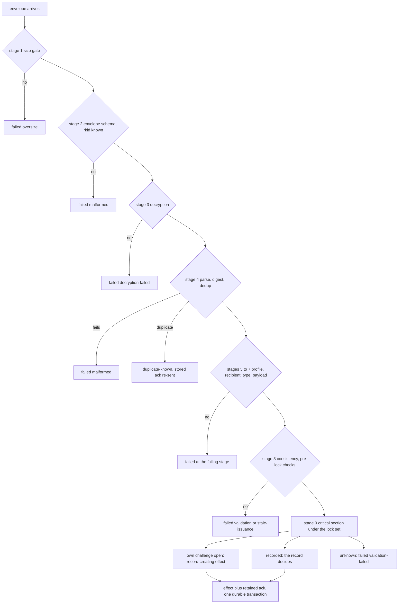

# RLTP Delivery Contract

**Real Life Trust Protocol — service contract: Delivery**

- **Status:** Editor's Draft
- **Version:** 0.69.0-draft (sixty-ninth casting — the answer to
  round 46, the fourth review of the scope re-cast, and the
  smallest round of the stage: only the carrier's
  `status-horizon` travels in the registry (a non-carrier adapter
  declares to its own principal, so nothing but a complete
  seven-constant declaration ever stands under the carrier role
  URI), and Identity §9.3 no longer claims the return priority
  *bounds* a capacity wait — it orders it, and the bound is the
  plural carrier world. Triage:
  `design/traeger-review46-2026-08.md`.)
- **Editors:** Anton Tranelis
- **Date:** 2026-08-27
- **Vocabulary namespace:** `https://real-life.org/rltp/v1`
- **Task-type namespace:** `https://real-life.org/trust-tasks/`
- **Target Trust Tasks framework version:** 0.4
- **Conformance profile:** `rltp-delivery@0.69` (draft)
- **Supersedes:** version 0.68 (archived as
  `archive/delivery-contract-0.68.md`) and versions 0.67–0.1,
  archived alongside it.
- **Supersedes on adoption:** `04-transport/001-sync-protokoll.md`
  (wot-spec v0.1, German) in its delivery aspects.

## Abstract

This document specifies how RLTP documents travel between people. The
delivery service moves **signed, anchor-encrypted, typed documents**
from one person to another — eventually, at least once, never silently
lost — and tells both sides honestly what it knows: the sender its
transport state, the receiver nothing the content does not prove
itself, and the sender **never** what the receiver decided.

Messages are **Trust Task documents** of private, versioned types under
`https://real-life.org/trust-tasks/` (ToIP DTGWG Trust Tasks framework
0.4, §6.5 private specifications). This casting registers four types
of its own — `encounter-bundle`, `delivery-ack`,
`encounter-credential-delivery`, `registry-declaration` — the RLTP
document profile all types
share, the sealed envelope they travel in, and the **task registry**
(4.4) through which companion layers register theirs: the membership
and access types (registered in their own documents), the
introduction and continuity types of the network-visibility layer,
and the member-mapping disclosure of the access layer.

Addressing is a **triple**, never an account (Section 5a): the
`rkid` a sender seals to, one per relationship; a queue locator
that is the carrier's own business and appears in no rule of this
contract; and a **control principal**, derived per (relationship ×
carrier) by Identity §7a, under which a recipient registers
addresses and collects what arrives. Submission needs no sender
identity, and abuse is answered with resources rather than
accounts. The point is a modest one, stated plainly: a carrier of a
relationship knows that relationship — but relationships must not
converge into a person at whoever carries them.

## Status of This Document

This is an **Editor's Draft** with no standing. It is the
sixty-ninth casting of the Delivery Contract, the fifth after
the **scope re-cast** of 2026-08-27: forty-two adversarial review
rounds had grown the document from a delivery contract into a
specification of a carrier's internal resource management, and
this casting reverses that. The rule of the cut is: **the promise
is protocol; the mechanism is carrier policy.** What a
counterpart can observe at the port line is specified and
vector-tested; how a carrier meets it internally is its own
affair. The carrier sections (4.4's role, 5a) are the youngest
part of the document and the most likely to change; the sealed
envelope, the delivery promises and the disposition machinery
(5, 6) have been stable across many castings. Review happens
against the converged companion documents; the convergence
criterion is a review round with no blocker-level findings.
Feedback belongs in the design journal of the private workshop
repository; the public mirror is
[`real-life-org/rltp-spec`](https://github.com/real-life-org/rltp-spec).


## 1. Introduction (informative)

### 1.1 Essence and principles

- **Eventually, at least once, never silently lost.** Delivery time is
  unbounded and never affects validity (Encounter 1.3). At-least-once
  makes duplicates and lost acknowledgements the *normal case*, so
  idempotency is law, not precaution. A document the service accepted
  is delivered or reported failed; silent loss is non-conformant.
- **Documents and promises, never pipes.** No normative statement
  mentions a relay, a broker, a socket, or a wire. Transport-internal
  signals never appear here.
- **Authenticity always has exactly one carrier.** Where a document's
  payload contains material signed under the Layer-1 binding rule
  (credentials, cards), that material is the carrier and the document
  needs no proof. Where it does not — the acknowledgement — the
  document itself carries a proof. Nothing is trusted because a
  channel said so.
- **The acknowledgement is arrival, and arrival only.** It is
  machine-generated at the durable recording of a document's defined
  effect, waits on no human, and carries no statement about any
  decision. The mutual-recognition moment of an encounter is carried
  by the counter-credential itself, not by any receipt.

### 1.2 The user experience this serves (informative)

After A scans and confirms, A's app shows a waiting state; the arrival
acknowledgement dissolves it ("nothing more to do on your side"), and
its absence within `ack-wait` flips A's screen to the optical
presentation of the sent card — the same enactment on another
carrier. When B's counter-credential later arrives, A sees the
relation confirmed; B's own view becomes mutual only when A's
credential reaches B (Encounter 4.2 — every view is local). Section 8
gives both state machines; a lost acknowledgement after B's commit
reconciles through redelivery and `duplicate-known`, never through a
second enactment (6.3).

## 2. Conventions and Terminology

The key words "MUST", "MUST NOT", "REQUIRED", "SHALL", "SHALL NOT",
"SHOULD", "SHOULD NOT", "RECOMMENDED", "NOT RECOMMENDED", "MAY", and
"OPTIONAL" are to be interpreted as described in BCP 14 [RFC2119]
[RFC8174] when, and only when, they appear in all capitals.

The **interim securing profile** of Encounter 2.3 applies (did:key
anchors, Ed25519/X25519 as Multikeys with decoded multicodec
verification, `eddsa-jcs-2022` embedded proofs, JCS, SHA-256,
multibase, RFC3339-UTC-`Z` timestamps).

**Document** — a Trust Task document conforming to the RLTP document
profile (Section 3). **Document digest** — the multibase-encoded
multihash (Encounter 2.3: emit `u`, accept `u`/`z`, SHA-256) over
`JCS(document)` of the plaintext document; the document's identity for
idempotency and acknowledgement reference, and format-identical to
DTGWG `digestMultibase` values. **Sealed
envelope** — the encrypted form in which a document travels
(Section 5). **Disposition** — the receiver's classification of a
processed envelope (Section 6).

**Carrier** — a party that holds delivery queues on behalf of
recipients: the adapter side of this contract, below the port
line, key-blind by construction (Section 5a). **Control
principal** — the carrier-relationship identity of Identity §7a,
the identity a recipient presents to one carrier for one
relationship. **Queue locator** — a carrier-local, opaque handle
for one queue (5a.1).

*Disambiguation, because the word does double duty in ordinary
English:* where 1.1 says authenticity "has exactly one carrier",
and where 1.2 and 6.3 speak of the **carrier switch** to the
optical leg (Encounter 5.8), the word means "that which carries"
and names no party. The role defined here is always the party of
Section 5a, and every normative sentence about it points there.

| Term | Fragment |
|---|---|
| Document digest | `#DocumentDigest` |
| Sealed envelope | `#SealedEnvelope` |
| Disposition | `#Disposition` |
| Delivery acknowledgement | `#DeliveryAck` |
| Carrier | `#Carrier` |
| Control principal | `#ControlPrincipal` |
| Queue locator | `#QueueLocator` |

## 3. The RLTP Document Profile

RLTP delivery documents are Trust Task documents [TT], target framework
version **0.4**, under the private task-type rules of TT §6.5. The
profile — normative wire form
`schemas/rltp-delivery-document.schema.json` — requires:

- `id` — REQUIRED; UUID v4.
- `type` — REQUIRED; a registered RLTP task type
  (`https://real-life.org/trust-tasks/<slug>/<MAJOR.MINOR>`). Slugs
  never match `^trust-task(-|/)?` (TT §6.1).
- `issuer`, `recipient` — REQUIRED, in-band, as anchors. A consumer
  MUST reject a document whose `recipient` is not its own anchor
  (TT §7.2 rule 5 — the receiver principle at the envelope level).
- `threadId` — REQUIRED: fresh (UUID v4) on thread-opening documents,
  equal to the answered document's `threadId` on responses.
- `ceremony` — OPTIONAL, and **entirely unconstrained by the task
  specifications**, per TT §4.11.1: a task specification declares
  nothing about ceremonies, absence is never grounds for rejection,
  and every framework-defined member (`enactment`, `step`, `round`,
  `terminal`, `prev`, …) passes through unrejected. One RLTP
  *profile-level* rule applies to consumers of this contract: **where
  the member is present and carries an `enactment`, that value MUST
  recompute** against the enclosed material or the document is
  `failed(validation-failed)`; a member that grants nothing can still
  not be allowed to lie. It grants no authority (TT §7.2 rule 9); the
  authoritative enactment binding always lives in the enclosed
  credential itself.
- `issuedAt` — REQUIRED.
- `expiresAt` — MUST be absent. Delivery time is unbounded; validity
  windows live in payloads and ceremonies, with issuance semantics.
- `proof` — REQUIRED on `delivery-ack` and on
  `registry-declaration` (4.4) — the two types whose authenticity
  has no other carrier (1.1); MUST be absent on the other types of
  this casting, whose authenticity is carried by the signed
  payloads inside. Where `proof` is present, TT §4.8.2 audience binding is
  satisfied by the in-band `recipient`.
- `payload` — REQUIRED; governed by the type's **payload schema**.
  For the types this document registers itself, the schema's `$id`
  is the Type URI (TT §6.3); companion-registered types dispatch
  through their registry entry (4.4), whose schema reference is
  authoritative — one dispatch rule, stated once. Payload schemas describe only
  the payload; the outer members are validated by the document-profile
  schema.

**Offline schema rule:** implementations MUST pre-register every
schema of this contract by its `$id` and MUST NOT resolve any `$ref`
over the network. The shipped `schemas/` directory is the complete
closure; a validator that cannot resolve a reference from its local
registry treats the document as `malformed`.

Unknown `type` → the document MUST be rejected with disposition
`failed(unknown-type)`; a document that would have an effect is never
silently ignored.

## 4. Registered Task Types

Each type below is a private Trust Task specification with: Type URI,
target framework 0.4, payload schema (shipped), proof declaration (per
Section 3), and the consistency rules stated here.

### 4.1 `encounter-bundle/0.1`

The transmission of the one-scan ceremony (Encounter 5.8): the
scanner's sent card and step credential.

- `payload`: `{ "card", "credential" }` per
  `schemas/payload-encounter-bundle.schema.json`.
- `threadId`: fresh (opens the exchange). `proof`: absent.
- **Declarations (TT §7.3):** side effects: *mutating* (creates the
  enactment record); exposure: recipient-only, never retained by
  third parties.
- **Outer/inner consistency (MUST, before any effect):**
  `issuer` = `card.anchor` = `credential.issuer`;
  `recipient` = `credential.credentialSubject.id`;
  the card carries a sent-challenge with `sentTo` = `recipient` and
  `boundTo` = `credential.credentialSubject.challenge`
  (Encounter 6); a present `ceremony.enactment` equals
  `credential.credentialSubject.enactmentBinding`. Under
  fresh-always enactment (Encounter §4.4) every anchor of these
  equalities is a **fresh pair anchor** of the enacting parties;
  the checks are anchor-class-neutral and stand unchanged.
- **Pre-lock validation (MUST, in order — validate, then consume:
  read-only against local state **except for Encounter 5.3's aging
  latch, which every resolution writes**, and consuming nothing;
  together with the authoritative in-lock resolution this implements
  the acceptance set of Encounter 5.6):**
  1. document profile + payload schema valid; timestamps
     calendar-valid; keys decode to correct multicodec + length;
  2. card proof verifies under `card.anchor`;
  3. credential proof verifies under its issuer anchor;
  4. `credential.credentialSubject.id` = the local anchor;
  5. the credential's bound challenge **resolves** (Encounter 5.3;
     the resolution itself latches any held aged value it observes —
     the latch is monotone and lock-free, so this provisional
     observation already stands) to `open` or `recorded` — an
     `unknown` resolution ends the pre-lock checks, but is **never
     final pre-lock**: the evaluation skips the remaining checks and
     proceeds directly to the serialization point (6.2 stage 9),
     where the authoritative resolution decides. If it is still
     `unknown`, the disposition is `failed(validation-failed)` — the
     one state-free outcome that covers garbage, foreign,
     rotated-away, and record-gone bundles alike, always produced
     under the lock. If it is **any other state** (the state moved —
     e.g. the optical record arrived between pre-lock and lock), the
     evaluation MUST NOT proceed on the skipped checks: it releases
     the lock and **re-enters at stage 4** (the waiter rule of 6.2),
     completing every check under the new state before any effect;
     **`credentialSubject.ceremony` equals this
     ceremony (`encounter-scan@0.25`)** — a credential labelled
     with any other ceremony is `failed(validation-failed)`, so the
     record's ceremony is grounded rather than copied from the
     sender's label; and the enactment binding recomputes per
     Encounter 5.4 from {the resolved own challenge, card's
     sent-challenge};
  6. **the issuance window (Encounter 5.6 step 6):** `validFrom` and
     `proof.created` inside the closed interval anchored at `t_ch`
     from the resolution — held with an `open` value by its owner,
     held in the record for a `recorded` one (Encounter 5.5/5.3) —
     and `proof.created ≥ validFrom − skew-tolerance`.

  This pre-lock resolution is **provisional**; the resolution
  repeated inside the critical section is authoritative and alone
  selects the effect.
  Only after 1–6 pass does evaluation reach the final stage (6.2
  stage 9), whose critical section is keyed for bundles on **both**
  the document digest and the credential's bound challenge — the
  **record key**, the same serialization point the optical input of
  Encounter 5.8 passes through. Inside that section, and only there,
  the bound challenge is **re-resolved authoritatively** (Encounter
  5.3), and the resolution selects the effect:

  **`open` → record-creating effect:** the explicit future check
  (Encounter 5.5) — an own challenge future-dated beyond
  `skew-tolerance` is `failed(gate-future)`; the expiry side is
  structural (an aged value never resolves `open`), so no
  `gate-expired` disposition exists — then the effect committed **as
  one durable transaction**: the enactment record, **the accepted
  credential itself with its direction and credential digest** (the
  state Encounter 4.2 needs to hold `received` across restarts), the
  completed-effect cache entry, **and the acknowledgement document
  itself, retained with the cache entry** (4.2). After commit the
  credential **is accepted**; no later check can fail it.

  **`recorded` → the record decides:** a record whose counterparty is
  **not** the document issuer means the challenge was consumed by a
  different enactment — `failed(consumed-challenge)`, the only way
  this disposition arises, and it is stable under waiter re-entry:
  the record survives, so re-resolution yields `recorded` again and
  the same disposition. Otherwise (the offline path completed first,
  Encounter 5.8) the enclosed card MUST be **JCS-identical to the
  counterparty card stored in that record** — a bundle combining a
  valid credential with any other card, however well signed, is
  `failed(validation-failed)`. The binding is verified against the
  record, and the credential MUST pass Encounter acceptance (5.6) in
  full, including uniqueness; `ERR_STALE_ISSUANCE` maps to
  `failed(stale-issuance)`, every other rejection to
  `failed(validation-failed)`, and nothing is consumed. On pass, the
  **record-aware effect** committed as one durable transaction: the
  accepted credential with direction and credential digest, the
  completed-effect cache entry, and the retained acknowledgement —
  **no gate, no record creation, no consumed-challenge conflict**.

  **`unknown` → `failed(validation-failed)`:** nothing exists to
  consume; a provisional pre-lock pass only means the state moved.

  Any failure before a committed effect consumes nothing and earns no
  acknowledgement (the poisoning rule). Documents with **distinct
  digests** competing for one challenge serialize on the record key:
  exactly one commits first; each later evaluation re-selects its
  branch against the new state — an identical enclosed credential
  (equal credential digest) lands idempotently via Encounter 5.6
  step 8 with its own effect and acknowledgement; a conflicting
  credential **from the record's counterparty** (it passed the
  counterparty check) is `failed(validation-failed)`; a foreign
  counterparty is always `failed(consumed-challenge)` (above) —
  never a second record.

### 4.2 `delivery-ack/0.1`

The arrival acknowledgement (DO-1).

- `payload`: `{ "ref": <document digest of the acknowledged document>,
  "meaning": "received" }` per
  `schemas/payload-delivery-ack.schema.json`.
- **Declarations (TT §7.3):** side effects: sender status update only;
  exposure: retained only by the acknowledged document's sender.
- `threadId`: = the acknowledged document's `threadId`.
- `proof`: **REQUIRED** — `eddsa-jcs-2022` under the ack's `issuer`
  anchor. An unsigned or foreign-signed acknowledgement is invalid.
- **Consistency (MUST, on receipt):** proof verifies under `issuer`;
  `issuer` = the acknowledged document's `recipient`; `recipient` =
  the acknowledged document's `issuer`; `threadId` matches; `ref`
  matches a document this sender actually sent on that thread. Any
  failure → the ack is discarded (`failed(validation-failed)`) and the
  sender's status is unchanged.
- Generation: **automatic at the durable recording of the referenced
  document's defined effect** (4.1: the committed bundle effect,
  record-creating or record-aware; 4.3: durable buffering). It MUST NOT wait for, depend on, or reveal any
  human decision, and MUST NOT be sent for a document rejected at
  document level. **The acknowledgement document is created inside
  the effect's transaction and retained together with the
  completed-effect cache entry it belongs to** — both persist at
  least `key-retention` after commit (Section 7), the bound that
  outlives every adapter's give-up horizon and therefore every live
  redelivery. Within that bound, redelivery of a `duplicate-known`
  document MUST re-send exactly this stored document, byte-identical
  — never a newly generated one. After the bound, entry and stored
  acknowledgement MAY be discarded together; a document redelivered
  later is re-evaluated as fresh, and byte-identity binds only within
  the retention bound. The re-evaluation is harmless in both possible
  states: a bundle whose enactment record still exists (records live
  for the life of the relation, Encounter 5.5) lands in the
  **record-aware effect** and is accepted idempotently (equal
  credential digest, Encounter 5.6 step 8), earning a **freshly
  generated** acknowledgement; a bundle whose record is gone fails
  **by derivation from the state model**: with the record deleted,
  the bound challenge resolves `unknown` (Encounter 5.3 — no
  challenge history exists beyond open values and records), so
  check 5 of 4.1 fails — `failed(validation-failed)` — and no gate
  is ever reached or needed. Its sender has long reported
  `failed` either way, and a late acknowledgement only transitions
  that status honestly (6.1).
- Meaning, normatively and honestly bounded: *the recipient's anchor
  **attests** that the document reached its authenticated device and
  that its defined effect is durably recorded.* It is an attestation,
  not a proof of causal receipt — a recipient who signs falsely harms
  only their own state, and the sender's `delivered` is exactly as
  strong as that attestation. Implementations MUST NOT present it as
  acceptance, verification beyond the recording gate, or any human
  act (Encounter 7.4). `meaning` is a closed one-value set in this
  version.
- **Terminal.** The acknowledgement is a **terminal document**: its
  defined effect (the sender-status update, idempotent by
  construction) earns a completed-effect cache entry like any other,
  retained at least `key-retention` after commit — the same bound as
  every cache entry — but it generates **no acknowledgement of its
  own**: there is no acknowledgement of an acknowledgement, and the
  chain ends here by rule, not by accident. A stage-4 duplicate of a
  terminal document is `duplicate-known` with **nothing to re-send**
  (6.2).

### 4.3 `encounter-credential-delivery/0.1`

Post-enactment delivery of a step credential: the counter-step of
`encounter-scan` (`"counter"`), or a standalone credential delivery
outside any bundle thread (`"deliver"`).

- `payload`: `{ "credential" }` per
  `schemas/payload-encounter-credential-delivery.schema.json`.
- **Declarations (TT §7.3):** side effects: buffering only; exposure:
  recipient-only.
- `threadId`: fresh for standalone deliveries (`ceremony.step` =
  `"deliver"` when the member is used); = the bundle's `threadId` for
  a one-scan counter-step (`"counter"`). `proof`: absent.
- **Outer/inner consistency (MUST, before any effect):**
  `issuer` = `credential.issuer`; `recipient` =
  `credential.credentialSubject.id`; if `ceremony` is present, its
  `enactment` = `credential.credentialSubject.enactmentBinding`.
  A document violating these is `failed(validation-failed)` and
  produces no acknowledgement — an acknowledgement never goes to a
  party other than the credential's own issuer.
- **Defined effect:** durable buffering of the enclosed credential for
  Encounter acceptance. The acknowledgement is sent at buffering;
  Encounter acceptance (5.6) runs separately, never acknowledges, and
  its outcome is never signaled to the issuer (Encounter 7.4).

### 4.4 The task registry — companion-registered types

Every type under the task-type namespace shares the document
profile (Section 3), the sealed envelope (Section 5), and the
disposition and acknowledgement rules (Section 6). Beyond the
four types this document registers itself, the registry's
members are registered **where their semantics live**, each as a
private Trust Task specification naming its type URI, payload
schema, proof declaration, and consistency rules:

- `membership-invite/0.2` · `membership-accept/0.2` ·
  `access-operation/0.1` · `membership-evidence/0.1` — Membership
  Tasks §3;
- `key-delivery/0.1` · `removal-notice/0.1` — Access §10;
- `introduction-request/0.1` · `introduction-forward/0.1` ·
  `introduction-reply/0.1` · `introduction-ack/0.1` ·
  `introduction-voucher/0.1` — Network Visibility §8.1; payload
  schemas `schemas/visibility-payload-introduction-request.schema.json`,
  `…-forward…`, `…-reply…`, `…-ack…`, `…-voucher….schema.json`;
  proofs per Visibility §2.1 (the artifacts carry their own MACs
  and signatures; the documents carry none — one carrier);
- `continuity-probe/0.1` · `continuity-mapping/0.1` — Network
  Visibility §6a.2/§6a.4; the payload is the artifact itself
  (`schemas/visibility-continuity-probe.schema.json`,
  `schemas/visibility-continuity-mapping.schema.json`), travelling
  on the enactment tuple's own channel (its §6a.3);
- `member-mapping/0.1` — Access §5.5; payload
  `schemas/member-mapping.schema.json`, travelling on the existing
  relationship channel between discloser and addressee, never a
  group space.

**The registry-entry form (normative):** a registry is a set of
entries, one per type, each carrying exactly: the **type URI**
(under the task-type namespace) · the **payload schema
reference** (the shipped schema file the receiver validates
against — dispatch resolves through the entry, so a companion
schema needs no `$id` equal to the type URI; §3's `$id` rule
binds the types this document registers itself) · the **proof
declaration** (proof present/absent and its carrier, per the
registering specification) · and optionally **operational
constants** of the role (below). A type absent from a receiver's
registry is `unknown-type` (6.2), exactly as for this document's
own types; registration creates no authority anywhere — every
type's effects are governed by its own specification, **under one
global rule no registration can waive: a registered type's
defined effect MUST NOT write replicated state directly. Where an
effect touches replicated state, it does so exclusively by
handing full entries with their closure to the Replication
Contract's ingest admission (Replication §7, I14) — the admission
verdict, not the delivery disposition, decides any replicated
effect.** A registry entry whose specification defines a direct
replicated write is not registrable.

**Operational constants and `registry-declaration/0.1`
(normative):** a party serving a role whose specification names a
published constant declares it **per party** — fixed,
non-adaptive — and its counterparts MUST hold it before they
depend on it. The carrier is this contract's own task type
`registry-declaration/0.1`: `payload`
`{ "declaration": { "role": <type URI of the served role>,
"revision": <int-string, ≥ 1>,
"constants": { <name>: <value string> } } }`
per `schemas/payload-registry-declaration.schema.json`;
`threadId` fresh; `proof` **REQUIRED**, verifying under the
document `issuer` (the declaring party — §3's proof rule names
this type). Defined effect: durable recording per (issuer,
role) under the **generic revision rule** (the pattern of
Visibility §6.4): a higher `revision` wins; an equal revision
with JCS-identical payload is idempotent; an equal revision with
a different payload is an equivocation error — reject, keep
state; a lower revision is rejected — so a delayed or redelivered
older declaration can never roll a value back. A replacement is
prospective, never retroactive for a running act. **Roles and
their constants are named by the registering specification**: the
role URI is the type URI of the task the party serves as
receiver — for the introduction mediator,
`https://real-life.org/trust-tasks/introduction-request/0.1` —
and the registering specification closes which constant names a
role admits and their domains; unknown constant names or
out-of-domain values reject the declaration. The first
registration: `ack-delay`, a duration in the grammar this section
fixes below, `PT1S ≤ ack-delay ≤ PT1H` (Visibility §8.4). **This declaration IS
the "task registration entry" Visibility §8.4 publishes from** —
that entry's per-party published form; one mechanism, two names.
**Act binding and revision skew, stated honestly:** each side of a
running act computes from the declaration it holds — the mediator
from its own current value at the act's arrival, the requester
from the highest revision it holds at send. A revision landing
between the two is safe by construction: the requester's early
`failed` is Visibility §8.4's named role divergence, converged by
the retry as a new act; a mediator that raises its `ack-delay`
SHOULD expect such retries until the new declaration reaches its
contacts. **A party MUST declare identical constants to all
counterparts** ("per party, fixed"); the declaration is
transferably signed for exactly this reason — two counterparts
comparing declarations hold attributable proof of an
equivocation. The first registered constant is the introduction
mediator's `ack-delay` (Visibility §8.4): a requester computes
its verdict window from the mediator's declared value and MUST
NOT send an `introduction-request` to a mediator whose
declaration it does not hold — asking first is the flow, not an
error path.

**The carrier role: what a carrier declares, and what it
guarantees (normative).** A **carrier** (Section 5a) serves no
task type — and its declaration therefore needs a role key that
is not one (round-44 B-1): **a carrier declares its constants in
a `registry-declaration/0.1` whose `role` is byte-equal to
`https://real-life.org/trust-tasks/delivery-carrier/0.1`.** That
URI names the carrier **role**, and only the role: used as a
document `type` it stays `failed(unknown-type)` (Section 11),
because a carrier is nobody's document counterparty. Constants
for this role declared under any other `role` URI are not a
carrier declaration, and a counterpart MUST NOT treat them as
one — without this rule, two counterparts could hold different
entries as authoritative and the first guarantee below would not
be byte-decidable. It is below the port line, it is nobody's document
counterparty, and **how it manages its own storage, its own rate
limiting and its own denial-of-service defence is its business,
not this contract's.** Nineteen review rounds were spent
specifying that machinery here, and the specification of it never
belonged in a protocol: every carrier that runs will do it
differently, and none of it is what a counterpart observes.

What a counterpart *does* observe, and what this contract
therefore fixes, is five things.

1. **A carrier publishes the constants a counterpart plans
   with**, in a transferably signed declaration (the form above).
   **For these seven, the declaration binds**: a carrier MUST NOT
   enforce a value stricter or looser than it published, and MUST
   NOT hold a counterpart to a constant it did not publish. Its
   remaining private limits reach the port line **only** as
   guarantee 2's retriable refusals — never as a terminal
   verdict, and never as a silently different value for a
   published constant (round-44 B-3: an earlier wording read as
   if no unpublished value could influence any outcome, which
   guarantees 2 and 3 plainly contradict). The seven are `orphan-horizon` and `give-up-horizon` (how long
   a holder may be away, and how long a deposit lives — 5a.9),
   `challenge-lifetime` (how long an issued challenge is good
   for — 5a.3), `queue-floor` and `max-queue-bytes` (guarantee 5),
   `max-binding-tombstones` (how many released addresses keep
   their anti-resurrection record — 5a.3), and `status-horizon`
   (below). Every other limit a carrier keeps
   is **unpublished by design**: publishing occupancy is
   publishing occupancy.
2. **Refusals for a carrier's own limits exist, are marked
   `retriable`, and say nothing about any party.** The family is
   closed and split across the two closed sets: on registration,
   `registration-refused(capacity)` and
   `refused(admission-resource)` (5a.3); on submission,
   `refused(admission-resource)`, `refused(queue-saturated)` and
   `refused(capacity)` (5a.5) — and **which member answers is not
   the carrier's choice**: the evaluation orders of 5a.3 (r1–r5)
   and 5a.5 (s1–s6) name it (round-45 B-2: an earlier wording
   listed two of the five, and a carrier could have read the
   other three as forbidden or as free variants). A carrier that
   refuses with a reason about *who* asked has left this
   contract, and a carrier that marks any of these terminal has
   misreported its own state.
3. **No asymmetric operation before the decision to spend on
   it.** A carrier MUST decide whether it will serve a request —
   against whatever budget it keeps — **before** performing any
   randomness, sealing, or asymmetric key operation for it. This
   is the one resource rule that is protocol-shaped rather than
   local: 5a.3 has the carrier seal a challenge before it knows
   anything about the requester, so a carrier that seals first and
   counts afterwards can be made to do unbounded work by an
   unauthenticated party. What it counts is its own affair; the
   **order** is not.
4. **Traffic for other addresses cannot starve a binding the
   carrier holds.** A request that names an `rkid` this carrier
   has a `live` or `closing` binding for MUST NOT be refused
   because requests for *unknown* addresses have exhausted
   something — **at any step of an evaluation order, r2 and r4
   alike** (round-44 B-2: an admission meter drained by
   unknown-address traffic that then refuses a held binding's
   rebind at r2 is exactly the starvation this guarantee
   forbids). Whatever a carrier reserves or meters, it arranges
   so that this holds; the guarantee is the requirement, the
   arrangement is its own.
5. **A queue below its declared `queue-floor` is beyond the
   reach of every other queue.** A submission whose post-admission
   occupancy stays within the floor MUST NOT be refused for
   global occupancy (s6) **and MUST NOT be refused because
   traffic for *other* queues drained a meter** (s4) — the same
   cross-traffic rule as guarantee 4, in the submission direction
   (round-45 B-1: an earlier wording said its admission "depends
   on nothing but itself", which overclaimed — the queue's **own**
   metering may refuse it, retriably, and that is the DO-6
   residual: the party spending a queue's own budget holds its
   address). Above the floor, a carrier may refuse with
   `capacity` like anywhere else. `queue-floor ≤ max-queue-bytes`
   and both are published, so a holder knows what it can rely on
   and what it is merely hoping for.

**What this contract deliberately does not answer**, and records
as open rather than half-building: nothing in it authenticates a
*depositor*, so anyone who learns an `rkid` may spend a queue's
own budget (Section 12, DO-6). Guarantees 4 and 5 bound what that costs
the rest of a carrier; they do not stop it, and no arrangement of
local limits will, because the gap is the absence of a
sender-side gate rather than the size of any limit.


- **`status-horizon`** — a duration in this section's grammar,
  `PT5S ≤ status-horizon ≤ PT5M`, within which an adapter that has
  been handed a submission MUST report **some** honest state for
  it to the party it serves. **Every** delivery adapter owes it,
  sending side included — but only the **carrier's** travels in
  the registry, as one of its seven under the carrier role. A
  non-carrier adapter serves its **own** principal, so its
  `status-horizon` is declared to that principal by whatever
  configuration surface the adapter has, and it appears in no
  registry (round-46 B-1: an earlier sentence parked every
  adapter's value "under the carrier role", which made identical
  declaration bytes acceptable as a complete non-carrier
  declaration and rejectable as an incomplete carrier one — a
  declaration under the carrier role URI either carries all
  seven constants or rejects, and nothing else ever stands under
  that URI).

  **Field provenance, because this constant exists for a
  reason.** A single-broker WebSocket adapter with no connect
  timeout left a socket in CONNECTING for roughly **forty
  minutes**, and for those forty minutes the sender received no
  status of any kind — not a failure, not a wait, nothing (field
  record wot#355/#357, follow-on wot#359). Nothing in this
  contract was violated, which was the problem: §7 says delivery
  time is unbounded, and no rule said anything about *statuslessness*.

  **The distinction this constant draws, stated so it cannot be
  read as a retreat:** *delivery* time stays unbounded and still
  never affects validity (§7, Encounter 1.3) — what is now bounded
  is the time a submission may spend with **no honest report at
  all**. A submission may legitimately be un-delivered for weeks;
  it may not be un-*described* for more than `status-horizon`.
- **An offline sender never violates this**, and the rule is built
  so that it cannot: what must be reached within the horizon is a
  **state**, not a success. `failed(…)` satisfies it, `accepted`
  satisfies it, and so does an honest **pre-transport report** —
  which is not a fourth status of the §6.1 trias but a statement
  about the adapter's own situation, from the closed set
  `awaiting-transport(offline)` ·
  `awaiting-transport(transport-unreachable)` ·
  `awaiting-transport(carrier-refused-retriable)` (the last is
  where 5a.5's retriable refusals surface). A device in a tunnel
  reports the first of these immediately and conforms; the forty
  silent minutes do not.


**How the published constants are written, and how they are read
(normative).** The values above travel as **value strings** in a
signed declaration, so two carriers must not be able to read one
declaration differently. Three rules, and none of them is new
work:

- **Integers** are canonical decimal in `[1, 2^53-1]`: no sign, no
  leading zero, no exponent, no fraction. A verifier compares the
  **received bytes**, not a parsed number — `1`, `1.0` and `1e0`
  parse alike and are not alike here, and Identity §7a.3 learned
  this for `generation` before this section learned it for these.
- **Durations** use the grammar of Access §7.3 — the day-and-time
  subset of ISO 8601, both parts optional, no fractional
  component — and this contract defines no second grammar. A
  value outside it is **rejected, never rounded**: an
  implementation that rounds a duration it cannot represent has
  made two carriers disagree about the same declaration.
- **Every decision these constants drive is atomic**: a
  counterpart sees the state before or the state after, never a
  carrier midway through its own bookkeeping. What the bookkeeping
  is remains the carrier's affair; that it is not observable
  half-done is not.


## 5. The Sealed Envelope

A document travels sealed to its recipient:

```
seal = { "rkid":       <recipient key-agreement key, Multikey z6LS…>,
         "epk":        <ephemeral X25519 public key, base64url, 32 bytes>,
         "nonce":      <96-bit nonce, base64url>,
         "ciphertext": <AES-256-GCM ciphertext || 128-bit tag, base64url> }
```

Normative construction, exactly one way:

- **Plaintext** is the JCS canonicalization of the document (UTF-8),
  at most **65 536 bytes**; larger documents are non-conformant and
  oversize envelopes MUST be rejected without decryption
  (`failed(oversize)`).
- **Ephemeral key:** a fresh X25519 key pair MUST be generated per
  envelope from a CSPRNG and MUST NOT be reused. **Nonce:** 96 bits
  from a CSPRNG per envelope.
- **Shared secret:** X25519(ephemeral private, recipient public),
  where the recipient public key is the one identified by `rkid` —
  the key-agreement Multikey from the recipient's card. (A derived
  service identity is **not** admissible here: Identity §7 defines
  it Ed25519-only, and no sealing-to-service exists in the 0.x
  stack; a future service-seal capability needs its own X25519
  key, binding artifact, and flow.) An all-zero shared secret MUST be
  rejected on both sides.
- **Key derivation:** AES-256 key = HKDF-SHA-256(ikm = shared secret,
  salt = empty, info = ASCII `rltp/v1/seal`), 32 bytes.
- **Encryption:** AES-256-GCM, 128-bit tag, **AAD = empty (exactly
  zero bytes; nothing is authenticated outside the ciphertext by
  design — all binding lives inside the document)**. Ciphertext of a
  zero-length plaintext is invalid.
- **The document digest is computed over the plaintext, never the
  ciphertext** — re-sealing on retry changes `epk`, `nonce` and
  `ciphertext`, never the document's identity.
- **Key retention (bounded by the delivery horizon):** recipients
  MUST retain every key-agreement private key that ever appeared in a
  displayed or sent card, addressable by `rkid`, for at least
  `key-retention` (Section 7) after the key last appeared in any
  card — **including keys displayed before any relation or record
  existed**, because a scanner may hold the card before the recipient
  knows them. `key-retention` MUST be at least the longest give-up
  horizon any adapter in the deployment declares (6.1), so a key can
  never retire while a delivery sealed to it is still live; adapters
  therefore declare their horizon. **A retired identifier remains
  known indefinitely as a tombstone** — the `rkid` value alone, its
  private key destroyed; tombstones are a few bytes per card ever
  issued, and they keep the disposition honest: stage 2's "known"
  includes tombstones (6.2), so an envelope sealed to a retired key
  reaches decryption and fails as `failed(decryption-failed)` —
  never `malformed`, which is reserved for identifiers this party
  never issued.

A **shipped test vector** (`vectors/seal.json`) fixes recipient key,
ephemeral key, nonce, plaintext, ciphertext, and document digest;
implementations MUST reproduce it byte-for-byte. The vector's
plaintext document is a **seal-only sample** (type
`…/seal-vector-sample/0.1`, never a wire type): it exercises this
section's construction, not the document profile, and MUST NOT be
processed as a delivery document.

No channel authentication is required or assumed **of a sender**:
confidentiality comes from the seal, authenticity from proofs and
signed payloads bound to anchors by the Layer-1 binding rule. This
is a decision, not an omission, and 5a.4 states it as one. The
**recipient** side is the exact opposite and always has been:
registering, collecting from, and concluding a queue are
authorized acts under a control principal, and 5a.3 fixes the
proofs they require. The two are not in tension — they are the
asymmetry the whole section rests on: anyone may put something
into a queue, and exactly one party may take it out.

## 5a. Addressing, registration, and collection

A **carrier** holds queues for other people. It never reads a
document — the seal of Section 5 sees to that, and no rule of this
contract asks a carrier to be trusted with content. What it does
see is who registers which addresses and who comes to collect
them, and that is a social fact even when every byte is opaque.

This section fixes the identities involved. Its aim is bounded and
worth stating before the rules, so that nobody reads more into
them: **it is not a goal to hide from a carrier the relationship
it carries.** The carrier of a relationship knows the
relationship. The goal is that a person's relationships **do not
converge into a person** at whoever carries them — that a carrier
holding six of someone's relationships holds six relationships,
not a directory of one life.

### 5a.1 The addressing triple (normative)

Addressing is three identifiers with three different owners, and
conflating any two of them is where the previous generation went
wrong:

| Identifier | Owned by | Seen by | Governed in |
|---|---|---|---|
| `rkid` | the recipient | sender and carrier | Section 5, 5a.2 |
| queue locator | the carrier | the carrier, and whoever it hands it to | 5a.1 (below the port line) |
| **control principal** | the recipient | the carrier | Identity §7a, 5a.3–5a.10 |

- The **`rkid`** is the end-to-end address: the recipient's
  key-agreement Multikey, the only thing a sender needs, and the
  only one of the three a sender ever sees. Senders MUST use it and
  MUST NOT be required to know anything else about the carrier
  arrangement of the recipient.
- The **queue locator** is a carrier-local, opaque handle for one
  queue. It is **below the port line**: no rule of this contract
  constrains its form, lifetime, or allocation, and no document
  field carries it. It is named here only so that it is not
  silently fused with either of the other two — a locator that is
  the `rkid`, or that is the principal, is not a third identifier
  but a leak.
- The **control principal** is the identity a recipient presents
  to **one carrier** for **one relationship**, derived per
  (relationship × carrier) by **Identity §7a**. Registration,
  query, collection, and conclusion happen under it. It is
  Ed25519-only: it signs and authenticates, and nothing is ever
  sealed to it.

**The binding rule (MUST):** a principal registers, queries, and
collects **only the `rkid`s of its own relationship**. A carrier
MUST NOT expose any operation that answers, for one principal,
about another principal's registrations, and a conforming
recipient MUST NOT ask for one. A convenience query returning
"every key of this person" is the whole failure this section
exists to prevent, wearing a helpful face. **What makes this rule
enforceable rather than merely stated is 5a.3**: the carrier does
not take the claim "this is my relationship's address" on trust,
because it cannot check it by computation — it requires it to be
proved.

### 5a.2 The recipient address is per relationship (normative)

An `rkid` MUST NOT be reused across relationships. This is less a
new rule than a rule finally written down: under fresh-always
enactment (Encounter §4.4) every relationship-creation act derives
its own pair context with its own key-agreement key (Identity
§5.2), so encounter relationships already address differently by
construction. What this section adds is that the property is
**required**, not incidental: a `persona/` or `group/` context that
shows one card to many counterparts makes those counterparts
neighbours of one node at the carrier, and a recipient MUST NOT
register such a shared `rkid` at a carrier as if it were a
relationship address.

A recipient MAY hold arbitrarily many `rkid`s (this is the
recipient-managed property the contract has always allowed), and
Section 5's `key-retention` rule applies to every one of them
unchanged.

### 5a.3 Registration proves possession, of both halves (normative)

5a.1 states the binding rule — a principal registers only the
`rkid`s of **its own** relationship — as a duty of honest
behaviour. Duty is not enough here: an `rkid` is a **public**
value. A sender sees it, a carrier sees it on every envelope, and
anyone who holds a contact card holds one. If registration were a
mere assertion, whoever observed an `rkid` could register it under
a principal of their own — a perfectly well-formed principal,
since principals are derived, not issued — and the carrier could
not tell the two claims apart, **because 7a.5's first prohibition
deliberately removed every computable relation between a principal
and the addresses it registers**. The consequence is not
confidentiality loss (sealing is to the `rkid`; the attacker
decrypts nothing) but queue hijack: collecting, concluding, and
thereby discarding another person's deliveries.

The binding cannot be **computed** — that is the privacy
property — so it MUST be **proved**:

> **A carrier MUST NOT bind an `rkid` to a principal without,
> in one exchange, a valid proof of possession of the
> principal's Ed25519 private key and a valid proof of possession
> of the `rkid`'s key-agreement private key.** A registration
> presenting one proof, or neither, is refused.

- **Principal possession** is a signature under the principal over
  a carrier-issued challenge — Access §7.3's proof of possession,
  adopted unchanged.
- **`rkid` possession** cannot be a signature: an `rkid` is an
  X25519 key-agreement key and signs nothing (Section 5, Identity
  §7a.1). It is proved by **decryption instead**: the carrier
  seals a second challenge to the `rkid` using exactly the
  envelope construction of Section 5, and the registrant returns
  the opened challenge value. Only a party holding that `rkid`'s
  private key can open it, and no observer of the wire, past or
  present, can.

**The proof exchange, byte-precisely.** The signed object is a
**versioned artifact whose `v` constant is inside the signed
bytes**, in the shape Access §7.3 already uses:

```json
{ "v": "rltp-carrier-proof/0.3",
  "type": "carrier-registration-proof",
  "purpose": "register",
  "carrier": "did:web:carrier.example",
  "principal": "did:key:z6Mk…",
  "rkid": "z6LS…",
  "generation": 1,
  "principalChallenge": "…43 base64url characters…",
  "addressChallenge": "…43 base64url characters…",
  "sig": "…" }
```

- **The signature input is the JCS serialization (RFC 8785) of
  this object with `sig` omitted**, and the signature is Ed25519
  under `principal`. JCS fixes field order, escaping, and number
  form, so the bytes are a function of the values and of nothing
  else. `sig` itself is canonical base58btc with the `z` multibase
  prefix, exactly 64 signature bytes, by the rule Encounter §2.3
  imposes on every signature of this stack: a shortened or
  non-canonical rendering is not a signature.
- **`v` is the domain tag and it is inside the signed bytes.**
  `rltp-carrier-proof/0.3` appears in no other signed artifact of
  this stack, so a signature made here verifies as nothing else,
  and no signature made elsewhere verifies as this. A verifier
  MUST reject an object whose `v` is not byte-equal to the
  constant.
- **`purpose`** is a closed set: `register` · `rebind` ·
  `collect` · `conclude`. It is part of the signed bytes, so a
  proof made for one purpose is not a proof for another — a
  collection authorization can never be replayed as a
  registration. For `register` and `rebind` every field above is
  REQUIRED. For `collect` and `conclude`, **`rkid` is REQUIRED
  too** — it names the queue the act works on, inside the signed
  bytes, because a relationship may hold several addresses at one
  carrier and a proof that named none would let two conformant
  carriers answer identical bytes differently. What stays
  **absent** in those two purposes is `generation` and
  `addressChallenge` — those acts are authorized per session
  against a binding that already exists and change no
  succession — and their absence is part of the JCS bytes like
  everything else.
- **`generation` carries the register's succession to the
  carrier, and the carrier enforces it.** It is the `generation`
  of the holder's carrier-nonce entry (Identity §7a.3), an integer
  in that section's domain `[1, 2^53 − 1]`. Without it, possession
  alone would decide which principal holds an address — and
  possession is **not** monotone: a device restored from an older
  backup still holds the root IKM, the older nonce and the
  `rkid`'s private key, so it could prove everything a rebind
  requires and roll the binding **back** to a principal the
  register had already superseded. So:

  > **A rebind binds only with a `generation` strictly greater
  > than the one recorded for the current binding** — the
  > `live`/`closing`/`released` rows of the outcome table below
  > carry the equal and lower cases. The carrier cannot decide a
  > tie the register decides by nonce bytes, and fails closed
  > rather than guessing.

  This contract carries **no tie-breaker**: a tie value that
  travelled would have to be derivable identically by both
  devices, authentically bound to its derivation, and analysed
  for what it leaks to a carrier that also sees the principal and
  the address. No such construction is designed here; whether a
  safe one exists is Section 12's DO-7, and the refusal rule does
  not depend on the answer.

  **`refused(stale-generation)` carries the generation the
  carrier holds for that `rkid`.** This is a disclosure and it is
  stated as one: the verdict is reachable only by a request that
  has **already** cleared both possession proofs. What the number
  is for is **ordering**, not access — a party who can open the
  sealed challenge may rebind at any higher generation whether or
  not it knows the current one, so the generation was never a
  barrier — while *withholding* it would break Identity §9.3's
  promise, because a holder who lost their carrier entry has no
  other way to learn what to exceed. A carrier MUST include it;
  it discloses nothing to anyone who has not already proven they
  may take the binding.

  **A refusal at an equal generation is a wait state, not an end
  state.** Two partitioned devices can honestly create nonces at
  the same generation; the register converges deterministically
  on one (Identity §7a.3), the canonical device is refused at the
  carrier — same generation, different principal — and **it
  rotates**: `generation + 1` wins the register by construction
  and binds by strict monotonicity. One extra rotation, no new
  instrument. At the very top of the generation domain, where
  Identity §7a.3 forbids further rotation, the incumbent binding
  simply **stands and stays collectable** — entries are
  superseded, never deleted, so every device retains the losing
  entry and can derive its principal. What the tie costs there is
  only the ability to change *which* of two principals holds the
  binding, and at that point there is nothing left to change it
  for. (A corner on the order of a hundred million years of
  per-second rotation away — written down so the domain has no
  undefined cell, not because anyone will stand in it.)

  **A superseded generation buys no new authorization — and no
  less than it has.** A principal whose generation the register
  has superseded but which the carrier is still bound to keeps
  working: it collects, it concludes, and it holds its queue
  until a proof carrying a strictly greater generation rebinds
  the address. What it cannot do is **register, rebind, or
  resurrect**: it cannot take an address it does not already
  hold, cannot displace a higher generation, and cannot re-enter
  after release. Supersession is a statement about succession,
  not about a live binding's ability to serve.

  **And the memory outlives the binding.** On releasing a binding
  (5a.9), a carrier MUST retain, per `rkid`, the **highest
  generation it ever accepted** for it — the **binding
  tombstone** `(rkid, generation)` — and MUST refuse any later
  registration for that `rkid` whose `generation` is not strictly
  greater. Without it, a superseded generation could return by
  waiting for the release: resurrection by patience rather than
  by force. A tombstone has **no expiry in time**; it leaves in
  exactly two ways — a registration carrying a strictly greater
  generation **consumes** it, or the store's declared bound
  **evicts** it. The first draft of this casting made eviction a
  free storage decision, and that re-opened a divergence this
  loop had closed long before (round-43 B-2, rounds 15/19): with
  the bound private and the order a SHOULD, two carriers with
  identical observable histories could answer the same old proof
  `refused(stale-generation)` and `registered` — an authority
  difference, not a bookkeeping one. So both halves are
  promise-shaped and normative again, **without** prescribing the
  mechanism that implements them:

  > **`max-binding-tombstones`** is a declared constant (4.4
  > guarantee 1) — an integer in `[1, 2^53 − 1]`: how many
  > binding tombstones this carrier retains. Whenever the store
  > exceeds the declared bound, the carrier MUST evict **the
  > longest-released** tombstone, ties broken by ascending
  > unsigned bytewise order of the decoded `rkid` key bytes — a
  > total order over facts the carrier already holds — until the
  > store is within it. That covers both ways the bound can be
  > exceeded: admitting a new tombstone at the bound, and **a
  > declaration revision that lowers the bound**, which trims the
  > store **in one linearized transition at the instant the
  > revision takes effect** (round-45 B-3: "prospective, never
  > retroactive" governs running *acts*, and a store is standing
  > state, not a running act — leaving the trim to the next
  > release would let two carriers hold different stores after
  > identical histories, the divergence this order exists to
  > remove). How an implementation realizes the order across
  > restarts is its own affair; that it holds is not.

  The consequence stays stated honestly: **for an evicted `rkid`
  the anti-resurrection guarantee ends**, and the only party that
  can use that is the holder — re-installing a superseded
  generation still needs both possession proofs, which no third
  party ever has. Eviction is reported to no one and is an input
  to no verdict about any party.

- **Both challenges are exactly 32 bytes** from a
  cryptographically secure source, carried as canonical unpadded
  base64url — exactly 43 characters, the same canonicity rule
  Section 5 applies to envelope fields. Challenges MUST be
  **single-use** — a challenge is **consumed by the first
  response attempt, before that response is verified**, so one
  challenge buys at most one verification and a failed attempt
  buys a fresh challenge, never a retry — and MUST expire on the
  carrier's declared `challenge-lifetime` (4.4): an unexpiring
  challenge is a standing forgery target.
- Issuing a challenge is work, and 4.4's guarantee 3 orders it:
  syntactic checks, then the carrier's own admission decision,
  then — only for a request the carrier has decided to serve —
  any randomness, sealing, or asymmetric operation at all. A
  carrier MUST reject a proof whose `carrier` field is not
  byte-equal to its own configured identifier (Identity §7a.2),
  whose `principalChallenge` it did not issue for this exchange,
  or whose `addressChallenge` is not the value it sealed to
  exactly this `rkid`. **And it MUST reject —
  `refused(malformed)` — a proof whose `generation` is not in the
  canonical decimal form Identity §7a.3 requires, checked on the
  received bytes and not on the parsed number**: `1.0` and `1e0`
  parse to the same number, JCS canonicalizes both to `1`, and
  the shipped signature verifies over them — nothing later in the
  exchange can catch a non-canonical spelling, and the shipped
  schema cannot express the check either. Section 11 ships the
  negatives.
- **What stays below the port line is the carriage, not the
  bytes.** How the object travels — HTTP body, DIDComm message,
  socket frame — is deliberately unspecified. What it contains,
  how it is serialized, and what is signed are fixed here.

**Outcomes are a closed, deterministic set**, in the manner of the
Replication Contract's §7.4 verdicts — a function of the proofs,
the carrier's declared constants, and its held state, and of
**nothing about the party presenting them**:

**Verdicts** — what a presenter is told:

`registered` · `registered(idempotent)` · `rebound` · `served` ·
`refused(no-such-queue)` · `refused(possession-failed)` ·
`refused(malformed)` · `refused(stale-generation)` ·
`registration-refused(capacity)` *(retriable)* ·
`refused(admission-resource)` *(retriable)*

**Internal transitions** — cells with no presenter and no
verdict, listed so that the table draws every cell from **one**
closed set and Section 11 can require exactly that:

`wind-up begins` · `obligations discharged + released` (one
transition, 5a.9) · `evicted` · `cannot arise`

**And the machine that produces them is one total table.** One
`rkid` at one carrier is in **exactly one** state:

`unbound` (no binding, no tombstone) · `live(g, P)` ·
`closing(g, P)` (5a.9's wind-up) · `released(t)` (no binding; a
binding tombstone recording the highest generation `t` ever
accepted). The tombstone store holds exactly the `rkid`s in
`released`.

**`release` is not an input of this table at all**: a release
happens only *inside* the deadline transition, so "no release
before the deadline" is enforced by the domain rather than by a
row (round-43 B-1, round-45 M-2 — a pseudo-row for a
non-existent input made the totality proof lie about its
domain). The table is entered only by a request that has already
passed both possession proofs; `refused(malformed)`,
`refused(possession-failed)` and `refused(admission-resource)` are
decided **before** the state is consulted and are therefore not
cells; a **submission** is not an input here either — it runs
5a.5's own outcome set. `g′`/`P′` are the generation and principal
the proof carries. `registration-refused(capacity)` is a carrier
resource answer (4.4 guarantee 2) and may meet any
`register`/`rebind` request; two rules bound it rather than a
formula: **a request for a binding the carrier already holds is
never refused because traffic for *other* addresses exhausted
something** (4.4 guarantee 4), and **a return outranks an
arrival** (5a.9) — at its limits a carrier refuses the
registration that would create a new binding before the one that
resumes a binding it already holds.

**The registration-side checks run in one normative order too**
(round-43 B-3): **r1** syntax and canonical encodings →
`refused(malformed)` · **r2** the carrier's own admission
metering → `refused(admission-resource)` (before any asymmetric
work, 4.4 guarantee 3 — **and subject to guarantee 4**: a
request naming an `rkid` the carrier holds a binding for is not
refused here because unknown-address traffic drained the meter,
round-44 B-2) · **r3** both possession proofs →
`refused(possession-failed)` · **r4** capacity, under the two
rules above → `registration-refused(capacity)` · **r5** the
state table. The first condition that holds names the verdict.
An implementation free to pick among simultaneously true refusals
would be observably divergent from one that picked differently;
this order removes the choice.

| state | input | precondition | outcome | next state |
|---|---|---|---|---|
| `unbound` | register / rebind | — | `registered` | `live(g′, P′)` |
| `unbound` | collect / conclude | — | `refused(no-such-queue)` (5a.5) | `unbound` |
| `unbound` | orphan-expiry · deadline · eviction | — | `cannot arise` (no binding, no tombstone) | `unbound` |
| `live(g, P)` | register / rebind | `g′ > g` | `rebound` | `live(g′, P′)` |
| `live(g, P)` | register / rebind | `g′ = g`, `P′ = P` | `registered(idempotent)` | `live(g, P)` |
| `live(g, P)` | register / rebind | `g′ = g`, `P′ ≠ P` | `refused(stale-generation)` | `live(g, P)` |
| `live(g, P)` | register / rebind | `g′ < g` | `refused(stale-generation)` | `live(g, P)` |
| `live(g, P)` | collect / conclude | proof under `P` | `served` (5a.7, 5a.8) | `live(g, P)` |
| `live(g, P)` | orphan-expiry | no collection within `orphan-horizon` | `wind-up begins` (5a.9) | `closing(g, P)` |
| `live(g, P)` | deadline · eviction | — | `cannot arise` (the wind-up has not begun) | `live(g, P)` |
| `closing(g, P)` | register / rebind | as the four `live` rows above, verbatim | same outcome | on `rebound` / `registered(idempotent)`: **`live`**, the wind-up ends (5a.9); on a refusal: `closing(g, P)` |
| `closing(g, P)` | collect / conclude | proof under the bound principal | `served` — concluding is what `closing` is for | `closing(g, P)` |
| `closing(g, P)` | orphan-expiry · eviction | — | `cannot arise` (the wind-up has begun; only `released` is evictable) | `closing(g, P)` |
| `closing(g, P)` | **deadline** | the wind-up deadline arrives (5a.9) | `obligations discharged` **and** `released` — **one linearized transition**: every held deposit's inherited life has ended at or before this instant, so all are given up, and queue and binding release in the same step; **one** tombstone created, `t := g`. A submission or return linearized before this transition is served by the `closing` rows; one linearized after it meets `released(t)` | `released(g)` |
| `released(t)` | register / rebind | `g′ > t` | `registered` | `live(g′, P′)`, and the tombstone is **consumed** |
| `released(t)` | register / rebind | `g′ ≤ t` | `refused(stale-generation)` | `released(t)` |
| `released(t)` | collect / conclude | — | `refused(no-such-queue)` (5a.5) | `released(t)` |
| `released(t)` | eviction | the store exceeds the declared `max-binding-tombstones` — a new tombstone at the bound, or a revision that lowered it — and this is the longest-released tombstone (ties by ascending `rkid` key bytes) | `evicted` — the anti-resurrection guarantee for this `rkid` ends | `unbound` |
| `released(t)` | orphan-expiry · deadline | — | `cannot arise` (no binding exists) | `released(t)` |

**Consumption** weakens nothing: the only proof that consumes a
tombstone is one the tombstone already permits, and an `rkid`
never holds both a binding and a tombstone. **`rebound` names the
succession, not a change of person**: with `g′ > g` the recorded
generation MUST advance, `P′ = P` or not. And **`purpose` does
not select a cell** — `register` and `rebind` are distinct in the
signed bytes and equivalent in effect, because a holder
recovering from a partial loss cannot know which state the
carrier is in, and 5a.9's return path depends on its guess not
mattering; what purpose separation buys is transplantation
resistance, not intent.

- `refused(possession-failed)` — one or both proofs failed. The
  challenge is already consumed at this point, so this outcome is
  not retriable in the strongest sense available: the same
  response cannot be presented again against anything live, and
  another attempt begins with a fresh challenge.
- `registration-refused(capacity)` and
  `refused(admission-resource)` — the carrier's own limits (4.4
  guarantee 2): **retriable**, deterministic in the carrier's
  state, and never about the presenter. They are named here so
  that a registration cannot be refused for a reason outside the
  closed set.

**Rebind, and the exact condition under which it exists.** A
rebind is the ordinary path, not an incident: the holder comes
back with a **new** principal for an address it already
registered, because its carrier nonce changed while the address
did not (Identity §7a.3, §9.3). Three situations produce it — a
carrier entry lost or corrupted, a deliberate rotation of `N`,
and the convergence of two concurrently created nonces in a
multi-device register — and all three share the one property the
proof rule needs:

> **A rebind requires the `rkid`'s private key, so it exists
> exactly where the pair context survived.** That key is the pair
> context's key-agreement half (Section 5, Identity §5.2); it
> does not live in the carrier entry and is not reconstructible
> from anything a counterpart holds — a counterpart holds the
> **public** address. **After a total register loss with no state
> copy there is therefore no rebind at all**: the pair contexts
> are gone with everything else, the sealed challenge cannot be
> opened by anyone, and the relationship re-addresses instead
> (5a.9). Which loss took the pair contexts with it is decided in
> Identity §9.3.

An attacker never holds that key in **any** of these cases, so no
loss on the holder's side ever becomes an opportunity on the
attacker's. Two rules complete the mechanism:

1. **Possession is the authority; incumbency is not.** A live
   binding does not outrank a fresh valid pair of proofs. Any
   other rule would let a hijack that once succeeded become
   permanent, and would leave the honest holder with no way back
   short of abandoning the address.
2. **A rebind is one durable commit** — the linearizable
   compare-and-swap of Access §7.3's acceptance rule, for the
   same reason: verification, the displacement of the old
   binding, and the installation of the new one either all take
   effect or none do. Two concurrent valid registrations for one
   `rkid` yield one binding, never two, and never a queue with no
   authorized collector.

**The residual this creates, named.** A carrier that observes a
rebind learns that two principals successively controlled one
`rkid` — a link **within one relationship at one carrier**, which
is precisely what that carrier already carries and is not a join
across relationships (the same argument Identity §7a.3 makes for
one principal across a relationship chain). A holder who does not
want even that link rotates the `rkid` as well — the ordinary
Section 5 tombstone path, one card exchange. And a rebind is only
ever available to a party that can open a challenge sealed to the
address, so the rule buys the honest holder a return path without
buying an attacker anything.

**Collection is the same proof, without the sealed half.** Every
collection and every conclusion (5a.8) under a principal MUST be
authorized by a fresh proof of possession of that principal's
key — a signature over a carrier-issued challenge, Access §7.3
again. A carrier MUST NOT grant standing to a bearer token that
outlives the session, and MUST NOT accept a collection for one
principal inside a session authorized for another.

**Three things have been called "session" here, and they are kept
apart:**

| Term | What it is | Rule |
|---|---|---|
| **Authorization session** | the scope of one proof of possession: what a carrier has been shown the right to act on | **MUST** carry exactly one principal. A collection or conclusion for a second principal inside it is nonconformant, full stop. |
| **Mediation connection** | the neighbouring protocol's long-lived relationship (a DIDComm connection, a TSP relationship) | **MUST** be one per principal (5a.10). |
| **Transport socket** | TCP, TLS, WebSocket, an HTTP connection | **below the port line**; it carries whatever the transport carries, and this contract says nothing about it. |

The MUST of the first row is what this section owns. What 5a.7
discusses is none of the three: it is the **timing** of separate
authorization sessions, and that is a SHOULD because it is a
scheduling cost, not an authorization question.


### 5a.4 Submission is principal-free (normative)

**This contract carries no submitter identifier.** A submission
consists of an `rkid`, a size, and the sealed bytes — that is the
whole of what this contract puts on the wire — and no rule of it
requires a sender principal, a sender account, or channel
authentication of the submitter. **No field at or above this
contract's port line identifies a submitter or links two
submissions to one.**

**What the transport underneath shows, stated rather than
promised away.** An earlier casting said categorically that a
sender presents no identity to a carrier of any kind, and the
transport this stack targets contradicts it: TSP authenticates
the **outer VID pair** of a direct relationship to each
neighbour, so a carrier reached over TSP sees an authenticated
transport identifier of the party delivering to it (5a.10 fixes
which one it may be). The categorical sentence is **withdrawn**,
and the honest statement has two halves:

> This contract contributes no submitter identifier, and the
> transport identifier beneath it MUST be scoped per carrier
> relationship — exclusive to that relationship, never
> person-wide, never reused across carriers (5a.10). **A carrier
> can therefore count and rate one transport peer's submissions;
> what it cannot do, from any protocol field at either layer, is
> name the person behind them or join them to that peer's
> relationships elsewhere.**

That is the boundary TSP itself draws — the outer VID of a direct
relationship is visible to that neighbour by design; it is the
*nested inner* VID that is private, and 5a.10 forbids mapping the
control principal onto the outer one — and this contract does not
claim to be more anonymous than the transport it rides.

Principal-free submission removes the *identifier*; it does not
remove the *observation*. A carrier still sees, and this contract
does not pretend otherwise: the **network layer** (source
addresses, connection reuse, TLS session resumption — without
network anonymity, a carrier that wants a submitter identity has
one and needed no protocol field for it); **timing and volume**;
**ack pairing** (a carrier holding both directions pairs two
`rkid`s by response time with no identity whatsoever); and
**collection patterns** (5a.7, where the residual is priced).
Unlinkability is a property of a mix network — cover traffic,
randomized delay, constant-rate collection, in the manner of the
Loopix line of work — and **this contract implements none of it
and claims none of it** (Section 10 restates the same boundary
from the privacy side; the two MUST NOT drift apart).

This is a decision with a price, and the price is named: there is
no sender quota, no sender ban, and no negotiated permission to
send. Defence is **resource-shaped** (5a.5), and a carrier that
answers abuse by identifying senders has not hardened this
contract; it has replaced it.

The neighbours resolve this the same way: a DIDComm mediator does
not authenticate the sender at all and draws its permission from
the *recipient's* standing connection, and TSP addresses a
carrier under a per-relationship VID rather than a person. Both
authorize **relationship-wise**, not person-wise.


### 5a.5 Admission: what a carrier may check, and what it never may (normative)

This section fixes what a carrier is allowed to look at when a
submission arrives, and closes the outcome set — otherwise
"principal-free submission" is a prohibition with no positive
story, and an implementer fills the silence with the first thing
that works, which is a sender identity.

**A carrier MAY consider exactly these, and MUST consider nothing
else:**

1. **Whether the `rkid` names a queue it holds** — live or
   closing per 5a.3, or tombstoned per Section 5. This is a
   lookup on the value the envelope carries, not a judgement
   about anyone.
2. **The envelope's shape and size** against Section 5 and its
   declared `max-queue-bytes`.
3. **Its own resource state**, at a metering scale of per
   submission or per queue — never per person, and never per
   inferred submitter.
4. **Its own held state**: the storage already occupied by that
   queue, and its overall capacity.

**A carrier MUST NOT consider, require, or record as an input to
this decision:** any sender identity, account, credential,
invitation, device certificate or attestation; any channel
authentication of the submitter; any counter, quota, or
reputation keyed to a submitter rather than to a submission or a
queue; or any correlation of two submissions to one submitter.
The last one is a rule about **inputs**: a carrier inevitably
*observes* addresses and timing (5a.4), and this contract does
not pretend to prevent that — but it MUST NOT turn such an
observation into an admission rule, because a rule keyed to an
inferred submitter is a sender account under another name.

**The outcome set is closed**, with retriability marked because
the sender's behaviour depends on it:

`admitted` · `duplicate` · `refused(no-such-queue)` ·
`refused(bounds)` ·
`refused(admission-resource)` *(retriable)* ·
`refused(queue-saturated)` *(retriable)* ·
`refused(capacity)` *(retriable)*

**And the checks run in one normative order, so that overlapping
conditions name one verdict rather than an implementation's
choice of several** (round-43 B-3 — two carriers answering
`queue-saturated` and `capacity` to the same submission are
observably divergent, and no internal bookkeeping is needed to
prevent it, only a port rule):

> **s1** queue lookup → `refused(no-such-queue)` · **s2** shape
> and size → `refused(bounds)` · **s3** byte-identity →
> `duplicate` · **s4** the carrier's own admission metering →
> `refused(admission-resource)` · **s5** the queue's own bound →
> `refused(queue-saturated)` · **s6** global occupancy →
> `refused(capacity)` · otherwise `admitted`.

The first condition that holds names the verdict, later ones are
not consulted, and the order is from the **most specific to the
most global** — a sender learns the most actionable true thing:
that the address is wrong before that the queue is full, that the
queue is full before that the carrier is.

- **`duplicate`, byte-exactly.** Two submissions to one queue are
  duplicates **iff their sealed envelopes are byte-identical** —
  the only comparison a key-blind carrier can make. Re-sealing
  the same document is a **different envelope** (Section 5 draws
  a fresh `epk` and `nonce` every time) and is admitted; repeated
  *documents* are the receiver's business, handled on the digest
  after decryption (§6.2), and neither layer pretends to do the
  other's work. A carrier holds the comparison value exactly as
  long as it holds the deposit; once the deposit has left, a
  byte-identical re-presentation is a new submission. A
  `duplicate` consumes admission work like an `admitted`
  submission — free byte-identical replay would be an
  amplification channel — and consumes no storage, since no
  storage happened. The sender sees nothing new: the deposit is
  present, so its status stays `accepted` (6.1).
- **Retriable** means: the same submission, presented later, may
  be admitted; the resource was momentarily unavailable, and
  nothing about the submission was judged. **Non-retriable**
  means this contract makes no promise that repetition changes
  anything, and the sender is told to stop — which it now has to
  say in only one case: an address that does not exist. (A queue
  being wound up used to be a second case; 5a.9 withdrew the
  machinery that made it one.) The retriable refusals are
  honestly unpredictable — they are the carrier's own fill, which
  it cannot publish without publishing its occupancy — and
  everything else is a function of the envelope, the declared
  constants, and the queue's own state.
- `admitted` is what the sender sees as `accepted` (6.1) and
  carries the durability duty from that moment. The refusals map
  into the sender's closed status set without adding a state:
  `refused(no-such-queue)` → `failed(unroutable)` (the address
  does not receive, and a sender learns exactly that much and
  never why); `refused(bounds)` → `failed(oversize)`; a retriable
  refusal is **not yet a status** — the sender retries until its
  adapter's declared give-up, at which point it is
  `failed(expired-by-adapter-policy)`.
- **No refusal ever carries a reason about a party**, and none is
  reported to the recipient. A carrier that answers "this sender
  is not allowed" has left this contract.

**The residual, stated at full strength.** Because admission is
resource-shaped and the address is public within the
relationship, **anyone who holds an `rkid` can spend that queue's
budget** — sealed garbage is indistinguishable from sealed
content to a key-blind carrier. The queue fills, legitimate
submissions meet `refused(queue-saturated)`, and per-queue
metering means the flooder and the honest counterpart share one
budget: the attack is a denial of service against **one
relationship**, never the person — 4.4's guarantees 4 and 5 are
what hold that boundary, since below its floor a queue's
admission is beyond the reach of any other queue.

**And the reason no resource parameter closes it is the whole
architecture in one sentence:** telling the flooder apart from
the honest sender **is** sender identification. Every
resource-shaped lever changes what the attack costs and never who
is allowed. So the defence is not prevention but a cheap,
terminating cure, and the contract owes that path precisely:

> **Rotation is the named healing path (normative).** A recipient
> whose queue is under flood SHOULD rotate the `rkid` of that
> relationship: it publishes a fresh key-agreement key to its
> counterpart in a new contact card **over the existing
> relationship channel**, and retires the flooded one by the
> ordinary Section 5 tombstone rule. The old queue winds up by
> 5a.9, nothing admitted is silently lost, and the counterpart's
> outbound path is uninterrupted, because it holds the new card
> before the old address dies (`key-retention`, Section 5).

**Who is left, once rotation is in place.** An `rkid` travels
only inside the relationship it addresses, so the flood needs the
address, and there are exactly two ways to hold it:

- **A third party** that obtained an old address once — a leaked
  card, a compromised backup, an old device. Against this
  attacker the rules **stop the attack**: rotation removes the
  address it holds, the new one never reaches it, and the attack
  terminates.
- **The relationship insider** — the counterpart itself, which
  receives every new address by construction. This one the rules
  do not stop, and the answer is **social, never mechanical
  suppression**: there is exactly one counterpart per queue, so
  the attacker is known to the victim **by name**; the flood
  destroys the only channel the attacker has and gains it
  nothing, and a recipient that rotates and does not re-establish
  has ended it. This is the point at which a delivery contract
  stops being the right instrument. (A party observing rotated
  addresses continuously either *is* the insider or has
  compromised the insider's endpoint, which no carrier rule
  reaches — Section 9.)

**A second residual of the same family: door starvation.**
Nothing here authenticates a requester before the registration
exchange, so an identity-free flood can keep **new onboarding at
one carrier** — and the return of an address whose binding has
already been **released** — starved indefinitely. What it cannot
reach is any binding the carrier still holds: 4.4's guarantee 4
puts every `live` and `closing` binding's service beyond traffic
for unknown addresses, so device restore, nonce rotation and the
rebind of any relationship whose address the attacker does not
know cannot be starved at all. The post-release return is not
time-critical — a tombstone does not expire — and the deployment
answer is the plural one this design assumes: a person's
relationships are not all at one carrier, and a starved door is a
reason to register at another, never a reason to lose a
relationship. This is the DO-6 family: bounded in blast radius,
priced rather than prevented, re-evaluated on evidence of
operational abuse rather than on possibility.

**The road not taken, named rather than omitted.** A
recipient-issued admission token — a secret capability handed to
accepted counterparts, presented with each submission, revoked by
rotation — would close exactly the part of this residual that
belongs to parties the recipient never accepted. It would close
nothing else: an accepted insider holds the token by design (that
is what accepting means — Signal's sealed-sender delivery token
has precisely this shape and this boundary), and door starvation
is not a submission question at all. **The editor's decision for
the 0.x line is: not now, and remembered** (Section 12, DO-6). If
it is ever adopted, it belongs in a casting of its own, and the
property it must preserve is stated in advance: the token MUST be
per (relationship × carrier), like the principal beside it, or it
is a person-wide credential with a friendly name.


### 5a.6 Two roles, one process, never one principal (normative)

A party may run both the storage a person recovers from and the
queues a person's relationships are delivered to. The deployed
previous-generation relay does exactly that in one process. The
port line between the two roles MUST therefore also be an
**identity line**:

> A party MUST NOT present, to the same carrier, one identity for
> both the storage-entry role (the recovery context, Identity §5.3)
> and any delivery-collection role (a control principal, Identity
> §7a). The two MUST be distinct identities even where one process,
> one operator, and one endpoint serve both.

The reason is not tidiness. The recovery context is, by
construction, the one identity of a person that is **derivable
with no register at all** — it must be, or recovery could not
start. It is therefore the closest thing a person has to a
person-wide constant. A service that saw a person's delivery
principals and their recovery context on one connection would join
every one of those relationships to that constant: not to a
pseudonym, but to the root of the person's own storage. That is
the strongest join available anywhere in this stack, and it is
available for free to any service that is asked to be both things
at once.

Two consequences, stated so that implementers do not have to
derive them: a device MUST NOT reuse a storage session for
collection or the reverse, and a carrier MUST NOT offer, and a
recipient MUST NOT accept, any "link your storage account"
convenience that establishes such a binding.

**What this MUST proves — and what it does not, which is the part
that must not be overstated.** The rule is written as an
**identity and interface** rule precisely because that is the part
that is *checkable*: the two identities are distinct values, the
sessions are distinct sessions, and no operation of either role
answers about the other. A conformance run can decide all three
from what crosses the interface, and 5a.3's session rule makes the
last one operative. What no rule reachable from here can decide is
**operator conduct behind the interface**: one company running
both roles can join a recovery context and a set of control
principals through source addresses, timing, device telemetry,
billing, or an internal account, and it needs no protocol field to
do it. That is a **named residual, not a MUST** — a MUST that a
conformance run cannot decide is a claim, not a requirement, and
this document would rather carry the residual honestly (Section
10 restates it from the privacy side). What the rule therefore
buys, exactly: it removes the **free** join — the one that needs
no analysis, only an equality check on two identifiers presented
on one connection — and it makes the remaining join a matter of
deployment trust, which a person can at least choose against by
choosing two operators. A recipient that wants the residual closed
rather than named uses a **different party** for storage and for
delivery, and this document RECOMMENDS exactly that.

**Migrated identities are the honest exception.** For an identity
migrated from the previous generation, the historic recovery
context already carries social attachments (Identity §10), and its
own storage is already bound to the person. The separation of this
section therefore works **prospectively** for them — new
principals are separate from the first day — and cannot undo what
the deployed generation already showed its relay.

### 5a.7 Collection discipline (normative, SHOULD)

**This section is about timing, and only about timing.** Serving
two principals inside **one authorization session** is already
forbidden by 5a.3's MUST, and sharing one mediation connection
between them is forbidden by 5a.10; neither is discussed here. The
join this section addresses is the one that survives all of those
rules being kept: a device that opens two perfectly separate,
perfectly authorized sessions **three seconds apart, every time**,
hands the carrier the same grouping through their shape in time.
No derivation can prevent that: it is scheduling, not
cryptography.

> A recipient SHOULD NOT correlate its collection times across
> principals more tightly than its traffic already requires — and
> an implementation that claims this discipline **MUST declare the
> policy by which it does so**: its minimum spacing between
> collection sessions for different principals, the range of the
> randomization it applies to that spacing, and **whether it
> multiplexes two principals' mediation relationships over one
> persistent transport** (5a.10's SHOULD, which lands here because
> a shared transport is a co-timing decision and nothing else).

**The declaration is what makes a SHOULD checkable**, which is the
half an earlier casting was missing: "more tightly than its
traffic already requires" can excuse any burst, so a conformance
run had nothing to test and the rule was decorative. It is
deliberately **not** a fixed number in this contract — a phone on
a metered link and a desktop on mains power have honestly
different answers, and a value invented here would be wrong for
both. What is required is that the answer be **stated and then
kept**: a run can check the declared spacing against observed
behaviour, and a party that declares `PT0S` has said plainly that
it does not take this discipline, which is information rather than
silence.

It stays a SHOULD for a reason this document would
rather write down than pretend away: separate, spaced sessions
cost connections, battery, and latency, and on a mobile device
that cost is real and recurring. A MUST that implementations
cannot afford is a MUST that gets quietly worked around, and a
specification that carries such a rule is less honest, not more.
**And the honest ceiling is named too:** spacing and jitter raise
the cost of the correlation, they do not remove it. Removing it is
mixnet terrain — cover traffic, Poisson delays, constant-rate
pulls, the Loopix line of work — and this contract implements none
of that and claims none of it (5a.4, §10).

*Several devices, one principal (informative).* Under the
shared-seed device model of Identity §3.2 every device of a person
derives the **same** principal for the same (relationship,
carrier). A carrier therefore sees one principal collected from
several sessions, which reveals device multiplicity for that one
relationship and nothing across relationships. This is DO-3's
question in the identity dimension, and it is answered the same
way: the principal is relationship-scoped, not device-scoped, and
whatever a future device model brings must keep it so.

### 5a.8 Conclusion: nothing admitted ends silently (normative)

The Abstract's promise — "eventually, at least once, **never
silently lost**" — has, until this casting, had no counterpart on
the carrier side of the interface. Two holes followed from that,
and the field record found both:

- **Nothing cleared a slot.** A receiver that terminally rejected
  a collected document simply did not acknowledge it, so the
  carrier redelivered it at every connection, forever, and the
  queue only grew. The deployed previous generation shows the
  end state of this: one address stalled at **1148 pending**
  documents, every one of them already decided and none of them
  concludable. This is a *contract* gap, not an implementation
  bug: 6.2 gives a closed, ordered disposition taxonomy from which
  "deterministically final" is derivable, but no duty existed to
  say so to the carrier.
- **Nothing bounded the other end.** A document nobody ever
  collects sat in a queue until a carrier decided, unilaterally
  and silently, to drop it.

Both are closed here, in one rule and its two directions.

**The receiver's duty (MUST).** A recipient that has reached a
**terminal** disposition for a collected document MUST conclude it
toward the carrier, under the principal that collected it, and a
carrier MUST offer that operation and MUST NOT redeliver what has
been concluded. Terminal means every 6.2 outcome that repetition
cannot change: the failure dispositions of stages 1–8, a stage-9
outcome that completed, and `duplicate-known`. A disposition that
is **transient** — the device could not complete the critical
section, storage was unavailable, the lock set was not obtained —
is expressly not terminal, is not concluded, and is redelivered;
that distinction is what keeps this rule from turning a local
fault into a silent loss.

**A conclusion carries no reason.** It says "this digest is
decided", and nothing else — not the disposition, not the stage,
not whether the document was accepted or rejected. The
carrier is key-blind and stays verdict-blind, and 6.1's rule that
the sender never learns what the receiver decided is untouched:
the sender's view of a concluded-but-rejected document is
`accepted` and, absent an acknowledgement, nothing more.

**The carrier's duty (MUST).** A carrier MUST NOT discard an
admitted deposit without first concluding it toward the sender
path. Concretely: a deposit that reaches the carrier's declared
`give-up-horizon` (4.4) without being collected and concluded is
**given up** — the carrier stops offering it and the sender's
status becomes `failed(expired-by-adapter-policy)`, the reason
6.1 has always carried for exactly this — and only then may its
storage be released. There is no other way for an admitted
deposit to leave a queue: it is collected and concluded, or it is
given up. **A carrier that silently drops an admitted deposit is
nonconformant**, and no other constant of 4.4 — the
`orphan-horizon` included (5a.9) — creates an exception.

*Why the sender path can be served at all here, since the carrier
knows no sender:* it does not need to. `failed(...)` is a
statement the sender's **own** adapter makes about a submission it
is tracking, from the carrier's refusal to keep offering it; the
carrier concludes the deposit, not the person. That is the same
asymmetry 6.1 already relies on, written down.

### 5a.9 Loss, re-registration, and orphans (normative)

The carrier nonce of a relationship lives in the holder's
register (Identity §7a.3), and its recovery is the recovery of the
register itself — which this stack does **not** get from the
Replication Contract's group rebind (that machinery rebinds a
stable *group* identity and presupposes held or recovered group
and member identity; it defines no path to a person's own
register). It gets it from the storage side of the S-DID cut, and
Identity §9.3 states it conditionally, which is the honest form
and is adopted here verbatim in substance: the recovery context of
Identity §5.3 is derivable with no register at all, and **with any
state copy it unlocks**, the register returns and every principal
re-derives, with no carrier involved. Ordinary device loss is that
case. The storage contract that makes the state copy exist is a
**named, still unwritten external prerequisite** (Identity §6.3),
satisfied in fact by today's encrypted vault rather than by a
referenceable specification — so this section claims recovery
exactly where §9.3 does, and not one sentence further.

**Two losses, and only one of them leaves a way back.** Which one
happened is decided in Identity §9.3, and this contract follows it
without adding anything:

- **A carrier entry is lost, the pair contexts are held** — a
  corrupted or selectively restored entry, a deliberate rotation
  of `N`, or the convergence of two concurrent nonces in a
  multi-device register (Identity §7a.3). The addresses and their
  **private** keys survive, so the holder can open a sealed
  challenge and re-registers under the new principal: this is the
  **rebind** of 5a.3, the binding moves, and **the queue's
  contents move with nothing, because they were never the old
  principal's**.
- **The whole register is lost with no state copy** — then the
  **pair contexts go with it**, and every `rkid`'s private key
  with them (Identity §9.3). A counterpart's copy of an address is
  the **public** value and re-derives nothing, so the sealed
  challenge of 5a.3 cannot be opened by anybody: **there is no
  rebind in this case, and this contract does not offer one.** An
  earlier casting claimed the opposite — that a surviving `rkid`
  carried the proof — which would have made the recovery branch a
  normative instruction to perform an impossible step. The
  relationship re-addresses by the ordinary Section 5 path
  (a new encounter or a new introduction act, Identity §9.3), and
  the old queues are collected by nobody.

- Old principals that are not rebound become **orphans**:
  bindings nobody will ever present again. A carrier MUST NOT
  offer to hand a person "their" principals back — such an
  operation is precisely the cross-principal answer 5a.1 forbids,
  and offering it would make every carrier a de-anonymization
  service for its own users. A rebind is not that operation and
  must not be confused with it: it answers about **one address
  whose possession was just proved**, and it names no principal to
  anyone.
- Orphaned bindings are aged out, never reclaimed, on the
  published `orphan-horizon` (4.4). Ageing out is a storage
  decision about a **binding**, is reported to no one, and changes
  no verdict about any party.

**The wind-up runs to a deadline, and the deadline does not move
(normative).** A queue nobody collects would grow without end, so
a binding whose `orphan-horizon` passes with no collection enters
`closing` and is released when it is done. What makes that
terminate is **one absolute instant**, fixed when `closing`
begins:

> `wind-up deadline := the instant closing begins +
> give-up-horizon`

A deposit admitted **during** `closing` does not start a fresh
give-up life. It **inherits the remaining time to that deadline**.
So the newest deposit the queue can hold expires no later than
every other one, and the bound follows from the construction
rather than from comparing two durations.

**And the deadline is the release — one transition, not two**
(round-43 B-1). An earlier draft of this casting split the
deadline into a give-up sweep and a separate release, and the
split was a hole: between the two, an admission could arrive
undisposed and 5a.8 would forbid the release it was already due —
a flooder could repeat that forever, and a return in the gap
could void a deadline that had already arrived. So the arrival of
the deadline **is** the linearized transition (4.4's atomicity
rule): everything held is given up — every inherited life has
ended at or before this instant by construction — and queue and
binding release in the same step. There is **no release before
the deadline**: an empty closing queue simply waits, which costs
nothing, and the early release was the race in another place. A
submission or return linearized before the transition is served
by the `closing` rows; one linearized after it meets
`released(t)` — the return then costs the tombstone path's two
exchanges instead of ending the wind-up, and the boundary between
the two is exact rather than raced.

**Admission therefore stays open, and this is a deliberate
reversal.** Earlier castings closed admission at the instant
`closing` began, and answered every further submission with
`refused(queue-closed)` — a verdict this contract no longer has.
Closing admission was never the point; **terminating was**, and a
fixed deadline terminates without refusing anyone. What closing
admission cost is easy to name and was paid for several castings:
a deposit that arrived while the wind-up ran was lost **even when
the holder came back the next day**, and a sender was told an
address does not receive when it was about to receive again. Both
are gone. A carrier keeps taking bytes for a closing queue exactly
as it does for a live one, and it may refuse for `capacity` there
exactly as it does anywhere else.

**And a closing queue is now indistinguishable from a live one at
the port line**, which is a stronger privacy property than the
one the withdrawn verdict was defending: there is no longer any
answer that separates *a wind-up is running* from *this address
is fine*, because there is no longer any separate answer at all.

**A holder who comes back reopens it** — 5a.3's outcome table,
`closing × register/rebind`. Possession is the authority here as
everywhere, and a person who recovers a device on day 91 must not
lose a relationship to a bookkeeping state. **A return outranks an
arrival**: when a carrier is at its limits it refuses the
registration that would create a **new** binding before it refuses
the one that resumes a binding it already holds. A full service
stops taking new work; it does not shed work it has already
accepted, and the asymmetry of harm is the argument — a refused
newcomer registers later or elsewhere and loses nothing, a refused
returner loses a channel that exists and the deposits sitting in
it. This cannot be gamed: the cell is reachable only by both
possession proofs for an address the carrier already holds.

**And the return ends the wind-up, deadline included.** With the
`rebound` or `registered(idempotent)` the binding is `live`
again, the wind-up deadline is void, and **every deposit still
held reverts to its own admission-dated `give-up-horizon`** —
including those admitted during `closing`, whose inherited short
life existed only to make an *unattended* wind-up terminate. The
inherited deadline was never a property of the deposit; it was a
property of the wind-up, and the wind-up is over. (Without this
rule a deposit admitted a minute before the holder's return would
expire almost immediately in a queue that is being actively
collected, which serves nobody and protects nothing.)

What was concluded stays concluded; what is still held is
collectable again, **including whatever arrived while the wind-up
ran**.

A carrier that discards a binding together with undisposed
admitted deposits has violated 5a.8, whatever its horizons say.

Senders are unaffected in their contract: an envelope to a retired
address fails through the ordinary path (Section 5's tombstone
rule, §6.2 stage 2/3), with the ordinary status.


### 5a.10 Neighbouring carrier forms: adapter obligations (normative)

E9's decision stands — the control principal is mapped onto the
form the neighbouring layer already has, and **no second wire form
is added here**. What changes in this casting is the *status* of
the mapping: "an adapter maps it onto the relationship VID" and
"an adapter maps it onto the connection" were sentences that named
no unique object, and a naive adapter built exactly against the
neighbouring standard's defaults would re-create the very joins
5a.1 exists to prevent. The mapping stays adapter work; the
**obligations** of that work are normative, and they are stated
here because there is nowhere else they could live. An adapter
profile that does not declare them is not a conforming carrier
adapter.

**ToIP/TSP (deterministic mapping).** TSP names several distinct
relationships at once — the endpoint's relationship with its
direct intermediary, each intermediary-to-intermediary hop, the
end-to-end relationship, and private VIDs nested inside it — so
"the private relationship VID" was underdetermined. The rule:

- **One principal ↔ exactly one endpoint-side outer VID of the
  relationship with the *direct* carrier**, and the mapping is
  injective in both directions **at any one time**: an adapter MUST
  NOT serve two principals under one outer VID, and MUST NOT hold
  two **live** outer VIDs for one principal at one carrier. The
  words "at any one time" are load-bearing and were missing: TSP
  identifies the direct relationship by the VID pair with **that**
  intermediary, while `C` — and therefore the principal — is a
  string the holder configured and survives a proxy, a federation
  member, or a key rotation behind it (Identity §7a.2). So the
  direct TSP peer or its VID can change underneath a stable `C`,
  and an earlier casting left that case with three exits and no
  door: reusing the local VID broke exclusivity, minting a second
  one broke a 1:1 read over all time, and deriving a new principal
  contradicted the derivation. The resolution is the third of
  those, read correctly:

  > **When the direct TSP peer or its VID changes under an
  > unchanged `C`, the adapter establishes a fresh outer VID for
  > the *same* principal and retires the old one.** The old VID is
  > retired — never reused, never reassigned, never live beside
  > its successor. The principal does not change, because nothing
  > that enters its derivation changed; the registration does not
  > change either, because the carrier's identity is the
  > configured string and not its hop. It is one live VID per
  > principal, in sequence, and that is exactly what exclusivity
  > requires — exclusivity forbids *sharing* an identifier, not
  > succeeding one.
- **That outer VID MUST be exclusive to this principal — and
  "exclusive" is three prohibitions, not the word "public".** A
  mapping can be perfectly one-to-one *inside* the adapter and
  still hand over the whole join: an adapter could satisfy the
  bullet above with a VID the person already publishes, or with
  the same VID it uses for three other TSP relationships, and a
  carrier that recognizes it has joined those relationships
  without doing any analysis. An earlier casting tried to forbid
  that by forbidding a "public" VID — **which is unsatisfiable and
  was a mistake in our sentence, not in TSP**: in TSP's routed
  model the outer layer *is* the public layer, so the endpoint's
  outer VID toward its direct carrier is public **by
  construction**, and a rule requiring it not to be could never be
  met. Visibility to the direct carrier is inherent and is not the
  danger; **linkability beyond the relationship** is. The three
  MUSTs that actually say that:

  1. **Not well-known.** The VID MUST NOT be published in a
     directory, a well-known location, a profile, a card, or any
     place that resolves it for a party that is not this carrier
     — a VID an outsider can look up is a name, and a name joins.
  2. **Not person-wide.** It MUST NOT be used for a second
     principal, a second carrier, or any purpose of the same
     person beyond this one relationship — including, expressly,
     that it MUST NOT be, or be derivable from, a control
     principal (5a.4's ingress rule states the mirror image for
     the sending side).
  3. **Not reused outside this relationship.** It MUST NOT appear
     in another TSP relationship, application, or account, and it
     is **retired with the principal**, never reassigned.

  What remains permitted, and must remain permitted for the
  mapping to exist at all: the direct carrier **sees** this VID,
  observers of the outer envelope may see it, and TSP's own
  metadata-privacy properties in routed mode apply exactly as that
  specification defines them. One principal, one relationship, one
  carrier, one live VID — the sentence Identity §7a.5(4) makes
  about principals, carried through the mapping so it survives it.
  **Honest limit:** exclusivity is a property of what an adapter
  does with an identifier, and nothing at this contract's port
  line can observe an adapter reusing a VID elsewhere. It is a
  declared obligation of the adapter profile, checkable against
  that profile and against the adapter's own key management, not
  from the wire.
- **The nested private end-to-end VID is expressly NOT the
  principal.** It is hidden from intermediaries by construction,
  which is the opposite of what a control principal is for: the
  principal MUST be visible to the carrier — it is what
  registration, collection, and conclusion are authorized under
  (5a.3). Mapping the principal onto an inner VID is a category
  error and is nonconformant.
- **Per-hop VIDs beyond the first are never the principal.** The
  carrier identifier `C` is the string the holder configured for
  the **direct** carrier (Identity §7a.2, "never the next hop");
  what that carrier arranges beyond itself is below the port line
  and does not enter any derivation.
- **Lifecycle coupling is total — and "intermediary" here means
  the *direct* one, always.** TSP routes through hop lists that
  the carrier may vary at will, so the rule has to say which
  change matters:
  - A change of the **direct** carrier is a change of the
    configured string `C`, therefore a different principal,
    therefore a new registration (Identity §7a.2's move rule) —
    the adapter MUST establish a **new** outer VID and MUST NOT
    re-point the old one.
  - A change **beyond** the direct carrier — hop 2 and onward,
    including a carrier that adds, drops, or reorders its
    downstream intermediaries — changes **nothing here**: same
    configured string, same principal, same outer VID, no
    re-registration. It is the carrier's own arrangement, below
    the port line, and an adapter that re-derived on such a change
    would be deriving from something the holder does not control
    (Identity §7a.2). The two bullets are one rule read at two
    distances, and an earlier casting's bare "a change of
    intermediary" left them looking like two rules in conflict.
  - A rebind (5a.3) is likewise a new principal: the adapter
    establishes a new outer VID and retires the old one; an
    orphaned outer VID is retired, never reassigned.

**TSP ingress, and what "principal-free" was always a statement
about.** A complete TSP carrier adapter must also *deliver into*
a carrier, and there it meets a real collision: an outer TSP
envelope carries and authenticates the **sender-side VID of its
direct neighbour relationship**, and nesting hides the inner VIDs
from intermediaries, not the outer one from the direct carrier. A
reviewer reading 5a.4's "no carrier-visible sender identifier of
any kind" as a claim about **every layer beneath us** is reading
it correctly as written, and as written it made a conforming TSP
ingress impossible. So the rule is restated as what it always
was — **a statement about this contract's port**:

> This contract defines no sender identity, requires none, carries
> none in any field it specifies, and permits no rule of its own
> to depend on one (5a.4). It does **not** claim that a
> neighbouring transport carries no hop identifier; a transport
> that authenticates its own hops is not thereby nonconformant,
> and pretending otherwise would exclude every real protocol from
> the port.

What an adapter owes instead is that the hop identifier stays
**hop-local and relationship-scoped**, and these are MUSTs:

- the sender-side outer VID an adapter presents when depositing
  MUST be **per (relationship × carrier it deposits to)**, freshly
  established for that pair;
- it carries **the same three prohibitions the collecting side
  carries**, and for the same reason — the word "public" is not
  among them, because in TSP's routed model an outer VID is public
  by construction and a rule forbidding that could never be met
  (the collecting side was corrected for exactly this a few
  paragraphs above; the ingress side must not re-introduce it):
  **not well-known** (in no directory, profile, card, or other
  location that resolves it for a party which is not this
  carrier), **not person-wide** (no second relationship, no second
  carrier, and expressly never a **control principal** of the same
  person or a value derivable from one — the sending side and the
  collecting side of one person must never meet in one
  identifier), and **not reused outside this relationship** (no
  other TSP relationship, application, or account);
- being **visible** to the carrier it deposits to, and to
  observers of the outer envelope, is inherent and is not
  forbidden — linkability beyond the relationship is;
- it is retired with the relationship, never reassigned.

**What that buys, exactly, and what it does not.** A carrier then
sees, for one queue, deposits arriving under one stable
sender-side VID — which links those deposits **to each other**
inside a relationship the carrier already carries end to end
(there is exactly one counterpart per `rkid`, 5a.2). **Through
that VID** it learns nothing across relationships and nothing
about the person — and the qualifier is the whole sentence, not a
hedge: the same carrier can still group relationships by source
address, timing, volume, ack pairing or a shared transport,
exactly as §10 records. What the rule buys is that the
**identifier** contributes nothing to those joins; it does not buy
their absence, and this contract claims no unlinkability anywhere
(5a.4, §10). A
**fresh VID per deposit** is explicitly *not* required and *not*
better: it is equally visible, buys nothing the per-relationship
rule does not already buy, and costs an establishment handshake
per message. The residual is stated plainly: a TSP carrier sees a
per-relationship ingress identifier, and this contract's claim is
bounded accordingly — no join **across** a person's relationships,
never a claim that ingress is unobservable (§10).

**DIDComm mediation and pickup (the standard's defaults are the
attack).** Coordinate Mediation 2.0 and Message Pickup 3.0 are
**connection-scoped** protocols: a `keylist` belongs to a
connection, `keylist-query` returns everything registered for that
connection, `status-request` and `delivery-request` may omit
`recipient_did` and then speak for the whole connection, batches
and `messages-received` receipt lists span recipients, and Live
Mode is a state of a connection that a persistent transport
carries. Each of the first four is, in this contract's terms, a
cross-principal answer; the last is two things at once, and is
split accordingly below — the **logical** live state is governed
here, the **transport** underneath it is not. A conforming adapter
therefore MUST:

- maintain a **separate mediation relationship — its own
  connection and its own connection DID — per control principal**,
  and give that connection DID the **same exclusivity the TSP
  outer VID has above**, for the same reason: separating
  connections *internally* is worth nothing if the DID naming one
  of them is a value the person already publishes elsewhere. So
  the connection DID MUST be **created for this principal and for
  nothing else**, under the same three prohibitions the outer VID
  carries above and for the same reason — **not well-known** (in
  no directory, profile, or resolvable public location), **not
  person-wide** (no second principal, no second mediator, never a
  control principal or derivable from one), **not reused outside
  this connection** — and it is **retired with the principal**,
  never reassigned. As there, the mediator's *seeing* the
  connection DID is inherent and is not what is forbidden;
  linkability beyond this one relationship is.
  **`from_prior` is forbidden here** — DIDComm's DID rotation
  hands a mediator a signed statement binding a new DID to a prior
  one, which would re-identify the principal externally no matter
  how principal-local its keylist is. An adapter MUST NOT rotate
  *into* a principal's connection DID from any other DID, MUST NOT
  emit `from_prior` on such a connection, and where a new
  connection DID is needed it establishes a **fresh mediation
  relationship** and registers again (5a.3) rather than linking
  the two.
  This is the load-bearing rule, and everything below follows from
  it: once one connection carries exactly one principal, the
  standard's connection-scoped operations become principal-scoped
  by construction, which is the only way to use them at all;
- keep **keylists principal-local**: the `rkid`s registered on a
  connection are those of that principal's relationship and no
  others, and the adapter MUST NOT construct, cache, or answer any
  keylist view spanning two principals — including for its own
  operational convenience;
- **scope every status, pickup, batch, and receipt operation to
  one principal's connection.** An ungrouped `status-request`,
  an omitted `recipient_did`, a batched `delivery` and its
  `messages-received` acknowledgement are all admissible *only*
  because the connection they run on is one principal wide;
- **keep Live Mode a per-principal property of the mediation
  relationship (MUST), and treat the socket underneath it as what
  5a.3's table says it is (SHOULD).** An earlier casting wrote
  "never share a Live Delivery socket across principals" as a
  MUST, and that put the same object on both sides of the port
  line: the session table declares TCP, TLS and WebSocket
  **below** it, while this bullet made a property of a WebSocket
  nonconformant. **This contract settles which object is which, and
  says so in its own name** (round-33 M-1): Pickup 3.0 binds Live
  Mode to a **connection**, allows it only on a persistent
  transport, and brings it back **off** after a drop — it does not
  define a relationship state separate from that connection, so it
  is evidence for where the re-arming lives, not authority for the
  split. The split is this contract's adapter duty: live state
  belongs to the logical relationship, and its re-arming is
  transport behaviour. Split
  accordingly:
  - **MUST:** Live Mode is enabled per **mediation relationship**,
    and since one relationship carries exactly one principal, no
    live delivery ever spans two principals *logically*. An
    adapter MUST NOT activate live delivery for two principals
    within one mediation relationship, MUST NOT let a
    `status`/`delivery` flow on one relationship report or carry
    another's, and MUST NOT treat the re-arming of a reconnected
    transport as authorization for anything — authorization is
    5a.3's, and it is per session.
  - **SHOULD:** an adapter SHOULD NOT multiplex two principals'
    mediation relationships over **one persistent transport**. The
    reason it is a SHOULD and not a MUST is 5a.7's reason exactly,
    and it would be dishonest to pretend otherwise: a shared
    socket leaks no **identifiers** — the DIDs, keylists, pickups,
    batches and receipts stay separate by the rules above — but it
    does leak their **common transport grouping**, which is a
    correlation and not nothing: a carrier can tell that these two
    mediation relationships arrive together, and that is the
    residual 5a.7 prices and §10 records. The distinction the
    SHOULD rests on is that the grouping is a *timing* fact, not
    an identity one; saying it leaks "nothing about identity"
    overstated even that. And a mobile device that must hold one live
    socket per relationship pays in connections and battery
    exactly where E7 said an unaffordable MUST gets worked around.
    An implementation that multiplexes declares it under 5a.7's
    spacing policy, because that is what it is: a timing decision.
  - The honest note: a carrier that sees two mediation
    relationships arrive and re-arm on one transport can group
    them, and no identity rule prevents that. It is the same
    residual as bundled collection, reached through a socket
    instead of through a schedule;
- map conclusions (5a.8) onto the standard's `messages-received`
  and nothing more — the acknowledgement clears the **queue
  entry** and carries no verdict.

Both mappings remain adapter work, below the port line, and
neither adds a wire form to this contract. The vector debt they
create is named in Section 11: these obligations are decidable
only against an implementation with a carrier interface, and the
first place that exists is the mediator adapter itself.

## 6. Delivery Promises

### 6.1 Sender: the status trias

| State | Meaning |
|---|---|
| `accepted` | the service durably buffered it; delivery is owed |
| `delivered` | a **valid** `delivery-ack` (4.2 consistency) referencing its digest arrived |
| `failed(reason)` | the service gave up; reason from the closed set below |

Sender failure reasons (closed set): `unroutable` · `oversize` ·
`expired-by-adapter-policy` (the adapter's declared give-up bound) ·
`rejected-by-receiver(<receiver reason>)` where an adapter conveys
one. A late valid acknowledgement after `failed` transitions the
status to `delivered`; implementations MUST surface the transition.
No other states exist — in particular, no acceptance state.

**Before the trias there is a report, not a fourth state.** The
three states above describe a submission a service has **taken**.
A submission an adapter still holds — because it is offline, the
transport is unreachable, or the carrier refused retriably (5a.5)
— has no trias state yet, and inventing one would break the
closed set. What it MUST have, within the adapter's declared
`status-horizon` (4.4), is an honest **pre-transport report** from
the closed set `awaiting-transport(offline)` ·
`awaiting-transport(transport-unreachable)` ·
`awaiting-transport(carrier-refused-retriable)`. These are
adapter conditions, never verdicts about a party, never visible to
a receiver, and they end the moment the submission enters the
trias. Silence is not one of them: an adapter that reports nothing
within its declared horizon is nonconformant, and that rule —
not a shortened delivery time — is what the forty-minute
CONNECTING socket of the field record would have caught.

### 6.2 Receiver: dispositions, in mandatory order

The pipeline, as a picture (informative — the numbered stages below
are normative):



Every received envelope is evaluated in this order, and the first
failing stage names the disposition:

1. size bound (5) — else `failed(oversize)`;
2. envelope schema, **base64url canonicity** (lengths `mod 4 ≠ 1`,
   zero trailing bits) and `rkid` known — live or tombstoned
   (Section 5) — else `failed(malformed)`;
3. decryption (all-zero check, tag) — else `failed(decryption-failed)`;
4. document parse + digest computation — a plaintext that does not
   parse as JSON or defeats JCS/digest computation is
   `failed(malformed)`; **duplicate check against the
   completed-effect cache** — the cache contains ONLY digests whose
   stage 9 completed successfully; a digest previously rejected at
   any stage is NOT in it and is re-evaluated in full. Duplicate →
   `duplicate-known`: the prior outcome applies idempotently and the
   **stored** acknowledgement of the completed effect **MUST be
   re-sent, byte-identical** (it exists by construction for every
   acknowledging type: the ack document is retained inside the
   effect's transaction, stage 9; a crash between commit and
   transmission would otherwise lose it permanently — for a
   **terminal** document, 4.2, no acknowledgement exists and nothing
   is re-sent). Evaluation ends;
5. document-profile schema + `recipient` = own anchor — else
   `failed(malformed)` / `failed(wrong-recipient)`;
6. `type` known — else `failed(unknown-type)`;
7. payload schema — else `failed(malformed)`;
8. type consistency rules and pre-lock acceptance checks
   (Section 4, incl. the issuance window for bundles) — else
   `failed(validation-failed)` / `failed(stale-issuance)`; **one
   exception:** a bundle whose bound challenge provisionally
   resolves `unknown` (the resolution itself has already latched any
   held aged value — Encounter 5.3) skips the rest of this stage and
   enters stage 9, where the authoritative resolution decides:
   still `unknown` → dispose; any other state → release and
   re-enter at stage 4 (4.1 check 5);
9. **gates and effect, serialized per lock set:** stage 9 is a
   critical section whose **lock set** is the document digest and,
   for bundles, additionally the credential's bound challenge (the
   **record key**). The lock protocol, normatively:
   the full lock set is acquired **atomically, as one acquisition**
   — never one key after the other; an evaluation whose set overlaps
   a held set **holds nothing while waiting**; and when the way is
   free it does not resume — it **re-enters at stage 4**, rechecking
   the completed-effect cache and re-selecting its branch on the
   state actually found. One rule covers both keys; there is no
   ordering to get wrong and no lock held across the re-entry. The
   record-key namespace and lifetime are shared with the optical
   input of Encounter 5.8/5.5 — the same lock, not an equivalent one
   — so record creation, branch selection, and credential uniqueness
   are serialized with every competing trigger. The completed-effect
   cache therefore never holds provisional state: a waiter either
   finds a completed entry (→ `duplicate-known`, mandatory re-ack
   where one is retained — for a terminal document, 4.2, there is
   nothing to re-send) or finds nothing and proceeds as a fresh
   evaluation. Inside the critical section: the authoritative
   resolution and effects of 4.1 — `open` → record-creating behind
   the future check (else `failed(gate-future)`), `recorded` → the
   record decides (foreign counterparty: `failed(consumed-challenge)`;
   else record-aware), `unknown` → `failed(validation-failed)` —
   each effect committed as one durable
   transaction (record where created, accepted material, cache
   entry, **the acknowledgement document itself where the type
   acknowledges, retained together with the cache entry per 4.2**;
   4.1) → `unique`.

**Validate, then consume:** no stage before 9 consumes single-use
material, and stage 9 consumes only after 1–8 passed in full — for a
bundle that includes the issuance window, so **nothing that stage 9
records can subsequently fail** (the poisoning rule, closed).

**`incomplete(missing)`** exists in the taxonomy for types with
declared dependencies. **No type of this casting declares any**; a
future type that does MUST define its closed `missing` vocabulary,
its re-evaluation trigger, and its retention bound in its own
specification.

### 6.3 At-least-once and reconciliation

Adapters MAY deliver any envelope multiple times; receivers converge
via stage 4 (`duplicate-known`). A lost acknowledgement is
indistinguishable from a lost document to the sender; the sender's
remedy is the carrier switch of Encounter 5.8 — the **same
enactment** continues on the optical leg, and the late bundle is
accepted via the record (4.1). A **fresh enactment** arises only when
the optical leg's `boundTo` no longer resolves — the `gate-expired`
outcome of Encounter 5.8; the resulting parallel enactments are
reconciled by **Encounter 0.29 (wire 0.25), 4.2 and 5.8**: both are valid, a late
counter-credential to the first is accepted, and enactment
multiplicity never multiplies edges (one edge per anchor pair). This
contract adds nothing to those rules and relies on them.

## 7. Timing

| Parameter | Default | Meaning |
|---|---|---|
| `ack-wait` | PT30S | RECOMMENDED sender-side wait before **automatically** presenting the optical leg — the carrier switch within the same enactment (Encounter 5.8); presentation is permitted at any moment, and conformance never depends on when the switch happens; **cancelled by an arriving acknowledgement or counter-credential** |
| `key-retention` | max(P90D, longest adapter give-up horizon) | minimum retention of a key-agreement private key after it last appeared in any card (Section 5) |

`ack-wait` is a UX pacing parameter, not a validity rule: an
acknowledgement arriving after it is still valid (6.1 late
transition), and the record-aware effect (4.1) makes any switch
timing safe.
Delivery time itself is unbounded; no rule in this contract references
arrival time for validity.

## 8. State Machines (informative)

**Sender (A, one-scan):**
`scanning → confirmed/sent (waiting animation) → delivered ("nothing
more to do") → [counter-credential accepted] → relation confirmed`
— with `waiting --ack-wait elapsed--> optical presentation (show the
sent card as QR)`, and `failed --late valid ack--> delivered`.

**Receiver (B, one-scan):**
`envelope → staged evaluation (6.2) → recorded + auto-ack → prompt:
"verify A back?" → [human confirms] → counter-step issued → relation
confirmed` — any rejection before the final stage (6.2 stage 9) sends
no ack and consumes nothing; B's prompt is C4, never automated.

## 9. Security Considerations

- **The seal is to a card key.** Whoever holds the recipient's card
  can seal to them — including the bystander of the challenge race
  (Encounter §13). The seal provides confidentiality, never sender
  authenticity.
- **The acknowledgement is now a proof-carrying document.** Forging
  one requires the acknowledging anchor's key; replaying one is
  idempotent (same digest, same thread); redirecting one fails the
  4.2 consistency rules. Suppressing acknowledgements causes fallback,
  not loss, and the late-ack transition plus the Encounter merge rule
  bound the damage of selective suppression to UX, never to state
  divergence.
- **At-least-once is an attack surface made safe by idempotency.**
  Replayed envelopes converge by plaintext digest; re-sealed replays
  converge identically.
- **Oversize and garbage envelopes are rejected before expensive
  work** (6.2 order; size bound before decryption).
- **Adapters are untrusted for content.** A transport can delay, drop,
  duplicate, and observe metadata; it can never read, alter, or forge
  documents without detection.
- **Principal-free submission is a deliberate exposure, bounded
  by resources.** Without a sender identity there is no sender ban
  and no sender quota, so a carrier's levers against flooding are
  resource-shaped and its own (4.4). Admission is where this
  contract is most easily defeated **from behind**: an admission
  rule keyed to an account, an invitation, a device certificate,
  or any person-wide counter would re-identify every principal of
  a person at the moment of admission and undo all of 5a at
  once — hence the metering scale (per submission or per queue,
  never per person or inferred submitter) is fixed by this
  contract and not negotiable by the carrier (5a.4, 5a.5). What
  the resource lever does **not** reach is named in 5a.5: a party
  holding an `rkid` spends that queue's own budget — a denial of
  service against one relationship, whose storage reach ends at
  every other queue's guaranteed floor (4.4 guarantee 5). Cured
  by rotation and never by identification; the closure beyond
  that is deferred as DO-6 rather than improvised.
- **A public address plus an unproved registration would be a
  queue hijack, and is not.** An `rkid` is public by construction —
  it is on every envelope and in every card — so a registration
  that merely *asserted* ownership would let any observer bind a
  stranger's address to a principal of its own and collect,
  conclude, and thereby destroy that relationship's deliveries
  (decrypting nothing). 5a.3 closes this with the only instrument
  available once the derivation deliberately shares no computable
  relation with the address: a **proof of possession of both
  halves** — a signature under the principal and the decryption of
  a challenge sealed to the `rkid` — bound into one signature over
  principal, address, carrier string, and both challenges, so that
  no half can be transplanted from another exchange.
- **Possession proofs bound theft, not volume — so registration
  is bounded separately.** Proving possession stops an attacker
  from taking *someone else's* queue; it says nothing about an
  attacker minting arbitrarily many pairs of its own. That Sybil
  surface is closed the way this stack closes Sybil surfaces
  everywhere: resource-shaped, with retriable, deterministic
  refusals and no statement about the party (4.4 guarantee 2,
  5a.3). Two rules keep the defence from becoming the attack:
  **no asymmetric operation before the decision to spend on it**
  (4.4 guarantee 3 — a carrier that seals challenges first and
  decides afterwards can be made to do unbounded work by an
  unauthenticated party), and **nothing durable is allocated
  before both proofs verify** — durable state begins with the
  binding, so the pre-verification phase leaves nothing behind an
  attacker could aim at.
- **A second residual, and it is not the flood: door
  starvation.** An identity-free request flood can keep new
  onboarding — and the return of an already-released address — at
  one carrier starved indefinitely (5a.5). What bounds it is not
  time but **reach**: every binding the carrier still holds is
  beyond it (4.4 guarantee 4), so restore, rotation and rebind of
  a relationship whose address the attacker does not know cannot
  be starved at all. Every remedy beyond that would have to
  distinguish the attacker from an honest newcomer, which is
  sender identity by another name; the levers that remain are
  priced admission and the plural carrier world.
- **The flooding residual is classified, not merely conceded**
  (5a.5): against a **third party** holding an old address the
  rules terminate the attack — rotation removes the address, the
  new one travels only inside the relationship, the old queue
  winds up and is concluded. What remains is the **relationship
  insider**, and it carries the three properties this stack
  already accepts for fork spam in the Replication Contract: the
  cost falls on the attacker's own relationship, the artifacts are
  attributable within it, and the answer is social — ending the
  relationship — never mechanical suppression. A party who learns
  rotated addresses *continuously* is either that insider or has
  **compromised the insider's endpoint**; endpoint compromise is
  outside this contract, and no carrier rule reaches it.
- **A control principal is a signing identity and nothing else.**
  Compromise of a principal's key lets an attacker collect and
  conclude for one relationship at one carrier; it decrypts
  nothing (sealing is to the `rkid`, Section 5) and reaches no
  other principal, because principals share no derivation path
  (Identity §7a.4). The blast radius is one relationship at one
  carrier — which is what per-(relationship × carrier)
  granularity buys on the compromise side, not only the privacy
  side.

## 10. Privacy Considerations

- **What a carrier sees, exactly.** From an envelope: the `rkid`,
  the size, and the time — and **not** the recipient's anchor,
  which travels inside the sealed document and never in the
  envelope (Section 5). From the registration and collection side:
  the control principals presented to it, the `rkid`s each one
  registers, and when each one collects. Earlier castings named
  the recipient anchor here and credited "derived service
  identities (A7)" with bounding what a transport learns. Both
  were wrong: the anchor is not on the envelope, and Identity §7's
  service identities are scoped **per group** and never applied to
  a delivery relationship. The bound is now real and has a name —
  the carrier-relationship identity of Identity §7a, consumed by
  5a — and this section states what it does and does not buy.
- **What the identity discipline buys.** A carrier cannot join two
  of a person's relationships through the identities it is shown:
  principals are per (relationship × carrier), the `rkid`s are per
  relationship, submission carries no sender identity, and no
  operation answers across principals (5a.1). Two carriers of one
  person see principal sets with no computable relation. That
  closes the **list join** — the one that needs no analysis at
  all, only a query — which was the cheapest and most dangerous of
  the four.
- **What it does not buy, named one by one.** *Timing and volume:*
  the `delivery-ack` is a document in the opposite direction, so a
  carrier holding both directions can pair two `rkid`s by response
  time with no identity whatsoever; no identity rule reaches this.
  *The collection pattern:* a device that serves several principals
  closely together gives back exactly what the derivation
  separated — this is why 5a.7 is a SHOULD with its price named,
  and it is the strongest residual join that remains. *The network
  layer:* without network anonymity a carrier sees addresses; that
  is deployment terrain and is not argued away here. *Colluding
  carriers:* two carriers comparing traffic correlate by time and
  volume — and, **stated exactly rather than left to the weaker
  word**, by something sharper than analysis. An `rkid` is per
  **relationship**, not per (relationship × carrier): a recipient
  may register the same address at two carriers, and those two
  then hold **byte-identical** values and can join their views by
  equality alone, with no timing and no inference. What that join
  reaches is bounded and worth being precise about: it links **the
  two carriers' views of one and the same relationship**, which is
  the relationship each of them already carries — it does **not**
  link two different relationships of one person, which is the
  property 5a.1 and Identity §7a.4 exist to protect and which the
  principals continue to protect (they share no derivation path
  across carriers). A recipient who does not want even that link
  uses **different `rkid`s at different carriers**, which the
  contract has always permitted (5a.2: arbitrarily many `rkid`s,
  one relationship). The derivation defeats the shared list; it
  was never claimed to defeat a shared address the recipient
  itself handed to both. *Migrated identities:* they carry the previous
  generation's exposure forward, and 5a.6 helps them prospectively
  only. *One operator in both roles:* 5a.6's MUST is an identity
  and interface rule and is checkable as one — distinct
  identities, distinct sessions, no cross-role answer — but it
  cannot reach an operator that joins a recovery context with a
  person's control principals **behind** that interface, through
  addresses, timing, telemetry, or billing; the residual is named
  there rather than defined away, and the only full answer to it
  is two operators. *A rebind:* a carrier that sees one `rkid`
  successively bound to two principals (5a.3) learns a link
  **within the one relationship it already carries**, and nothing
  across relationships. **No unlinkability claim follows from this
  section**, and implementations MUST NOT present one — the same
  boundary 5a.4 draws from the submission side, and the two
  statements MUST NOT drift apart.
- **An acknowledgement is a probe response, and this is stated
  precisely:** its presence tells the sender that the recipient's
  device was online **and** that the document passed every stage
  through recording — including, for a bundle, that either the
  displayed challenge was still unconsumed and the gate open
  (record-creating effect) or that the optical leg had already
  created the matching record (record-aware effect); the
  acknowledgement does not distinguish the two. A sender can
  distinguish "online but gate closed" from "recorded" by ack
  presence. This is inherent to the flow the acknowledgement serves.
  Its life differs by effect, and this is stated honestly: the **gate
  probe** ("was the challenge still open?") is bounded by the
  challenge's short life, but on the **record-aware path** an
  acknowledgement — stored or freshly generated after retention — can
  arise for as long as the enactment record lives, revealing arrival
  and the record's existence to its own counterparty, and nothing
  more. Implementations MUST NOT extend the ack with further detail.
- **Sealed content is opaque end to end.**

## 11. Conformance

- **Profile** `rltp-delivery@0.69`; the Identity pin is
  **Identity 0.51** (§7a, the control principal); the Encounter
  pin is `rltp-encounter@0.29` (wire 0.25); companion
  registrations per 4.4 (Network Visibility 0.16, Access 0.53,
  Membership Tasks 0.16, Replication 0.26).
- **Classes:** *sender* (sealing, status trias, ack-wait switch
  trigger; principal-free submission, 5a.4) · *receiver*
  (unsealing, staged dispositions, ack generation; the addressing
  triple of 5a.1, per-relationship `rkid`s 5a.2, the registration
  proofs of 5a.3, the role separation of 5a.6, the collection
  discipline of 5a.7, the conclusion duty of 5a.8) · adapters are
  below the port line, but **every** adapter declares
  `status-horizon` and reports a trias state or a pre-transport
  condition within it (4.4, 6.1). A **carrier** is an adapter and
  conforms through 4.4's carrier role: it publishes the seven
  declared constants and honours the five guarantees, binds no
  address without both possession proofs (5a.3), admits on the
  closed outcome set with the fixed metering scale (5a.5),
  answers no query across principals, concludes or gives up every
  admitted deposit rather than dropping it (5a.8), and winds
  orphaned bindings up on its published horizons (5a.1, 5a.9). An
  adapter for a neighbouring carrier form conforms additionally
  through 5a.10.
- **Normative schemas (shipped):**
  `schemas/rltp-delivery-document.schema.json` ·
  `schemas/sealed-envelope.schema.json` ·
  `schemas/payload-encounter-bundle.schema.json` ·
  `schemas/payload-delivery-ack.schema.json` ·
  `schemas/payload-encounter-credential-delivery.schema.json` ·
  `schemas/payload-registry-declaration.schema.json` ·
  **`schemas/carrier-proof.schema.json`** (`rltp-carrier-proof/0.3`,
  the proof form of 5a.3 in all four of its purposes — the one
  artifact of this contract that travels below the port line and
  is nevertheless signed, so its bytes are fixed and its shape is
  shipped) — plus, by reference through 4.4, the
  companion-registered payload schemas named there.
- **Schema validity is not acceptance (5a.3).** A carrier
  conforms only if it **decodes** the base58btc identifiers of a
  proof before any other check and refuses `malformed` unless
  `principal` is `0xed 0x01` followed by exactly 32 bytes, `rkid`
  is `0xec 0x01` followed by exactly 32 bytes, and `sig` is
  exactly **64** bytes. The shipped schema **cannot** express
  these, and says so in its own description: base58btc is not
  positional, so a decoded prefix or length is a numeric interval
  no pattern in this dialect states. `vectors/carrier-proof.json`
  ships six schema-valid, normatively invalid aliases — two per
  field — plus the positive control that the shipped proof itself
  decodes. An implementation that stops at schema validation
  **fails this section**. *(On the version string in that file:
  `rltp-carrier-proof/0.3` is versioned independently of the
  `rltp-delivery@` profile; the coherence scan treats it as an
  artifact of its own.)*
- **Shipped vectors:** `vectors/seal.json` (5) ·
  **`vectors/carrier-proof.json`** (5a.3) — the registration
  proof object, its JCS bytes and signature; the `collect` and
  `conclude` forms with their absent fields; six transplant
  negatives (second `rkid`, second carrier, second principal,
  changed `purpose`, foreign domain tag, replaced challenge),
  each of which changes the signed bytes so the shipped signature
  fails; six encoding aliases with decoded lengths and prefixes;
  the **challenge-consumption** sequence (a failed verification
  does not restore the challenge); the **duplicate** cases
  (byte-identical replay against re-sealed repetition, 5a.5); the
  **generation-monotonicity** cases, whose counter-vector is a
  device restored from an older backup presenting valid proofs
  and still not moving the binding; the **generation-spelling**
  negatives (two that reach the signature, two that die in the
  parser); the **equal-generation tie** run end to end (converge,
  refuse, rotate with a fresh nonce whose principal is derived in
  the vector, bind), with the tie at the generation maximum,
  where no rotation exists and the binding stands and stays
  collectable; the **released-then-re-registered** case, where
  the tombstone refuses a superseded generation after the binding
  itself is gone; the **carrier-entry-loss recovery**, executed
  per held state; and the **queue-floor** case that decides
  guarantee 5 — a queue one byte below its floor, admitted
  regardless of global occupancy.
- **Vector plan:** seal/unseal roundtrip against the shipped
  vector · digest invariance under re-sealing · every disposition
  stage of 6.2 as a distinct vector, in-order (including oversize
  before decryption, tag-only ciphertext as `malformed`, unknown
  `rkid`, all-zero secret rejection) · validate-then-consume (a
  bundle failing stage 8 consumes nothing) · duplicate and
  concurrent delivery converge with identical re-ack · **ack
  forgery matrix:** unsigned ack rejected, foreign-signed
  rejected, wrong-thread rejected, wrong-direction rejected,
  valid ack accepted, late valid ack transitions
  `failed → delivered` · ack generation at each type's defined
  effect, none on rejection, no dependency on the confirmation
  step · outer/inner consistency vectors per type
  (Mallory-wrapped credential produces no ack to Mallory) ·
  `ceremony` member absent (accepted), present-and-matching
  (accepted), present-and-wrong (rejected) · threadId rules per
  type · status trias transitions including every failure reason ·
  **record-aware effect:** bundle after optical completion →
  accepted via record + ack · binding mismatch against record →
  rejected, nothing consumed · enclosed card not JCS-identical to
  the record's stored counterparty card →
  `failed(validation-failed)` · conflicting or re-proofed
  credential on an existing record → `failed(validation-failed)`,
  no ack · every Encounter 5.6 rejection exercised on the
  record-aware path · optical record creation racing a bundle
  between stage 8 and stage 9 → branch re-selected inside the
  critical section, accepted via record, never
  `failed(consumed-challenge)` · two bundles with distinct
  digests competing for one challenge → exactly one
  record-creating effect · crash after a record-aware commit and
  before ack transmission → redelivery yields the mandatory
  byte-identical re-ack · resolution selects every branch: `open`
  → record-creating, `recorded` → record decides, `unknown` →
  `failed(validation-failed)` · envelope sealed to a retired
  (tombstoned) `rkid` → passes stage 2, fails stage 3
  `failed(decryption-failed)`; `rkid` never issued →
  `failed(malformed)` at stage 2 · redelivered `delivery-ack` →
  `duplicate-known`, no ack-of-ack, sender status unchanged ·
  invalid JSON inside a valid seal → `failed(malformed)` at
  stage 4 · concurrent first deliveries → exactly one `unique`,
  one `duplicate-known`, identical acks · key retirement never
  precedes the declared adapter horizon · a companion-registered
  type with a registry entry → dispatched to its own
  specification's consistency rules; the same type absent from
  the registry → `failed(unknown-type)` per 6.2, no effect ·
  `registry-declaration/0.1`: valid declaration recorded;
  unsigned or foreign-signed → discarded; replacement
  prospective-only · introduction-ack timing computed from the
  declared `ack-delay` (Visibility §8.4); an introduction-request
  sent without holding the mediator's declaration →
  nonconformant at the sender · a `member-mapping/0.1` document
  from a party the receiver holds no relationship with → rejected
  by the receiver's own acceptance list (Access §5.5 step 2) ·
  the derivation seam itself is executable in
  `vectors/identity-derivation.json` (`carrierRelationship`) and
  MUST be reproduced by any implementation claiming this profile:
  one relationship at two carriers → two principals with no
  computable relation; a case-variant carrier string → a third
  principal (Identity §7a.2); no key-agreement key derived for
  the class.
- **The carrier interface, clause by clause:** one `rkid`
  registered under two principals → nonconformant (5a.2) · a
  cross-principal query offered by a carrier → nonconformant; the
  same query issued by a recipient → nonconformant (5a.1) · a
  submission carrying any sender identifier **in a field of this
  contract** → nonconformant; a transport authenticating its own
  hop is not a violation of 5a.4, while an outer VID that is
  well-known, person-wide, or reused across TSP relationships is
  (5a.4, 5a.10) · an admission rule keyed to an account,
  invitation, device certificate, or any counter spanning two
  principals → nonconformant (5a.5) · a carrier acting on a
  declared constant it has not published, or a principal
  registering before it holds the carrier's declaration →
  nonconformant (4.4) · `orphan-horizon` outside `[P7D, P365D]`,
  `give-up-horizon` outside `[P1D, P90D]`, `status-horizon`
  outside `[PT5S, PT5M]`, `challenge-lifetime` outside
  `[PT5S, PT5M]`, `queue-floor` outside
  `[65536, max-queue-bytes]`, `max-queue-bytes` outside
  `[1048576, 1073741824]`, `max-binding-tombstones` outside
  `[1, 2^53 − 1]`, an integer constant outside its domain
  or in a non-canonical decimal spelling, or a duration outside
  Access §7.3's grammar (rejected, never rounded) → the
  declaration rejects (4.4) · **status horizon:** a submission
  held with no report beyond the declared horizon →
  nonconformant; an offline or unreachable adapter reporting
  `awaiting-transport(...)` within it → conformant, and the
  report MUST NOT be surfaced as a trias state (4.4, 6.1) ·
  **registration:** a binding created without both possession
  proofs → nonconformant · a signature input that is not the JCS
  serialization of the 5a.3 object with `sig` omitted, an object
  whose `v` is not byte-equal to `rltp-carrier-proof/0.3`, a
  challenge that is not exactly 32 bytes in canonical unpadded
  base64url, or a `sig` that is not canonical 64-byte base58btc →
  nonconformant · a `collect` or `conclude` proof carrying
  `generation` or `addressChallenge`, a proof of **any** purpose
  omitting `rkid`, or a `register`/`rebind` proof omitting
  `generation` or `addressChallenge` → nonconformant (5a.3 and
  the shipped schema agree: every purpose names the queue it acts
  on) · a challenge accepted twice, or without expiry →
  nonconformant; a failed verification restoring its challenge →
  nonconformant · **any randomness, sealing, or asymmetric
  operation performed for a request the carrier has not decided
  to serve** → nonconformant (4.4 guarantee 3) · **a request for
  a binding the carrier holds refused because traffic for unknown
  addresses exhausted something** → nonconformant (4.4
  guarantee 4) · a retriable refusal marked terminal, a refusal
  carrying a reason about a party, or an outcome outside the
  closed sets of 5a.3 and 5a.5 → nonconformant · **a verdict that
  is not the one the normative evaluation order names** — s1–s6
  for submissions, r1–r5 for registrations — → nonconformant,
  overlapping conditions included (round-43 B-3) ·
  **`generation`:** a rebind accepted at a generation not
  strictly greater than the recorded one → nonconformant; equal
  generation with the same principal → `registered(idempotent)`;
  equal generation with a different principal, or any lower
  generation → `refused(stale-generation)` and the binding does
  not move; **`refused(stale-generation)` without the held
  generation in it** → nonconformant, because it turns a
  recoverable loss into an unrecoverable one (5a.3, Identity
  §9.3); a carrier that *decides* the equal-generation tie →
  nonconformant, and a proof carrying any value from which the
  register's nonce ordering could be reconstructed →
  nonconformant (no such field exists; DO-7) · a `generation`
  accepted in a non-canonical decimal spelling → nonconformant
  (the check is on the received bytes; the schema cannot express
  it) · **the tombstone:** a registration for a released `rkid`
  accepted at a generation not strictly greater than the highest
  ever accepted → nonconformant; a tombstone dropped with the
  binding, or expiring **in time** → nonconformant; a tombstone
  kept beside the binding a strictly greater generation installed
  → nonconformant (it is consumed); an eviction reported to
  anyone, or used as an input to any verdict about a party →
  nonconformant; an eviction below the declared
  `max-binding-tombstones`, or of any tombstone but the
  longest-released (ties by ascending `rkid` key bytes) →
  nonconformant — the order is total and normative, its
  implementation is not (5a.3, round-43 B-2) · **the outcome table of 5a.3 is the
  conformance condition:** every cell is checked, a
  `(state, input)` answered with an outcome other than the one it
  names → nonconformant, and so is any outcome outside the closed
  set; two concurrent valid registrations for one `rkid` → exactly
  one binding (the compare-and-swap vector); a `g′ > g` proof
  under the same principal answered with anything but `rebound` →
  nonconformant; a proof refused because its `purpose` disagreed
  with the state → nonconformant · **the two loss cases:** a
  rebind attempted after total register loss (no state copy, pair
  contexts gone) → the sealed challenge is unopenable and the
  attempt fails at `refused(possession-failed)`; a rebind after
  loss of a carrier entry alone, with the pair context held →
  **succeeds, in a number of exchanges the held state fixes**:
  two from `live` or `closing` (first
  `refused(stale-generation)` carrying the held generation, then
  `rebound` at `generation + 1` — a carrier that makes it succeed
  in one accepted a generation it holds a higher record for), one
  from `unbound` (an evicted tombstone leaves no record to
  exceed), and a return may additionally meet a retriable
  `capacity` refusal, in which case **it outranks every arrival**
  (5a.9); shipped as an executed per-state vector · a carrier
  operation offering to enumerate or restore a person's
  principals after register loss → nonconformant (5a.9); a rebind
  under proof of possession of one named `rkid` → conformant, and
  the two MUST NOT be conflated · **wind-up:** a binding whose
  `orphan-horizon` passes without a collection and that never
  enters `closing` → nonconformant; a wind-up deadline that moves
  once `closing` has begun → nonconformant, as is a deposit
  admitted during `closing` given a fresh `give-up-horizon`
  rather than the remaining time to that deadline; a submission
  refused **because** the queue is closing → nonconformant, the
  address admitting exactly as a live one does; a return during
  `closing` → the binding is `live` again, the deadline is void,
  and every held deposit reverts to its admission-dated
  `give-up-horizon`; a binding released while a held deposit is
  undisposed → nonconformant; orphan expiry produces no document,
  no disposition, and no status change beyond §6.1's ordinary
  path (5a.9) · **queue floor:** a submission to a queue below
  its `queue-floor` refused for global occupancy →
  nonconformant; admission decided on the occupancy **before**
  the deposit → nonconformant (the occupancy is computed after
  admission); between floor and `max-queue-bytes` a
  `refused(capacity)` for global occupancy → conformant, and
  named as the elastic range it is (4.4 guarantee 5) ·
  **`duplicate`:** two submissions to one queue whose sealed
  envelopes are byte-identical → `duplicate`, **one** stored
  copy, admission work charged for both; the same document
  re-sealed → `admitted` twice (a key-blind carrier cannot and
  must not see through the seal; §6.2 absorbs the repetition at
  the receiver); identical bytes to a different `rkid` →
  `admitted`; a byte-identical re-presentation after the first
  deposit concluded or was given up → `admitted` (5a.5) ·
  **conclusion:** a terminal 6.2 disposition not concluded toward
  the carrier → nonconformant; a transient one concluded →
  nonconformant; a concluded digest redelivered by a carrier →
  nonconformant; a conclusion carrying any reason, stage, or
  verdict → nonconformant (5a.8); an admitted deposit discarded
  without give-up or conclusion → nonconformant; give-up at the
  declared horizon → `failed(expired-by-adapter-policy)` and only
  then storage release (5a.8, 6.1) · one identity presented for
  both storage entry and delivery collection at one party →
  nonconformant under 5a.6, **including where one process serves
  both roles** · **the three sessions:** a collection or
  conclusion for a second principal inside one authorization
  session → nonconformant (5a.3); two principals on one mediation
  connection → nonconformant (5a.10); several messages on one
  transport socket → not this contract's business · two
  authorization sessions for different principals scheduled
  inside the declared spacing → conformant but SHOULD-violating,
  and reported as such; an implementation claiming the discipline
  without declaring spacing and jitter → nonconformant (5a.7) ·
  **live delivery:** live mode activated for two principals
  inside one mediation relationship, a status or delivery flow
  reporting across relationships, or a reconnected transport's
  re-armed live mode treated as authorization → nonconformant;
  two mediation relationships multiplexed over one persistent
  transport → conformant but SHOULD-violating (5a.10) · **an
  adapter** serving two principals under one TSP outer VID, or
  one DIDComm mediation connection, keylist, pickup scope, batch,
  or receipt list → nonconformant (5a.10) · a principal mapped
  onto a nested private end-to-end VID, or onto a per-hop VID
  beyond the direct carrier → nonconformant (5a.10) · an outer
  VID that is **well-known**, **person-wide**, or **reused** in
  another TSP relationship, application, or account →
  nonconformant — while an outer VID merely being **visible** to
  its direct neighbour is conformant, because in TSP's routed
  model it cannot be otherwise; a retired one reassigned →
  nonconformant; two live outer VIDs for one principal →
  nonconformant, while a fresh one succeeding a retired one under
  an unchanged `C` → conformant (5a.10) · a DIDComm connection
  DID that is well-known, person-wide, or used in any other
  connection → nonconformant; `from_prior` emitted on a
  principal's connection → nonconformant (5a.10) · **TSP
  ingress:** a sender-side outer VID that is well-known,
  person-wide, or reused → nonconformant; a
  per-(relationship × carrier) VID → conformant, and a carrier
  authenticating its own hop is not a violation of 5a.4 (5a.4,
  5a.10) · a change of the **direct** carrier → new principal,
  new outer VID; a change of hops beyond it → no change of
  principal, VID, or registration (5a.10) ·
  `https://real-life.org/trust-tasks/delivery-carrier/0.1` used
  as a document `type` → `failed(unknown-type)` (4.4).


## 12. Open Issues

- **DO-2b HPKE.** Whether to align the seal with RFC 9180 in a future
  version; the 0.2 construction transcribes the deployed one.
- **DO-3 Multi-device delivery.** What `delivered` means when an
  anchor has several devices; adapter-defined until the Layer-1
  device model (IO-4) lands; the ack meaning is deliberately
  device-scoped.
- **DO-4 Third-party task types.** The first type retained by third
  parties beyond the ack's sender needs its proof rules stated per
  TT §4.7.1; the ack itself is retained only by its sender.
- **DO-5 Ordering.** No global ordering is promised; thread
  causality plus the merge rule cover every current flow.
- **DO-7 A carrier-scoped ordering proof.** *Open question, not a
  settled prohibition.* Where two register entries share a
  generation, Identity §7a.3 decides by nonce bytes and this
  contract carries no value that would let a carrier reproduce
  that decision — so an equal-generation rebind is refused and
  healed by a rotation (5a.3). A previous casting called a
  travelling tie-breaker *impossible*; that argument was wrong
  (a carrier-scoped order-preserving map exists trivially) and is
  withdrawn. What a usable construction would have to satisfy is
  written down instead, so the question can be answered rather
  than re-argued: derivable identically by both devices from
  register state alone · **authentically bound to the
  derivation**, so a presenter cannot hand a carrier an ordering
  of its choosing · analysed for what it discloses to a party that
  already holds the principal and the address · and per-carrier,
  so it is not a cross-carrier join key. Nothing in the current
  rules depends on the answer; the refusal-and-rotate path is
  complete without it, which is why this is a candidate and not a
  debt.
- **DO-6 Recipient-issued admission token.** *Deliberately not
  built in the 0.x line; kept as named candidate work rather than
  as an unstated gap.* The flooding residual of 5a.5 — anyone
  holding a public `rkid` can spend that queue's admission budget
  — is bounded to one relationship's guaranteed capacity at one
  carrier (the shared elastic room above the floors is not) and answered
  today by rotation and by a resource-shaped defence, never by
  identifying a sender. **Independent review has now twice judged
  this residual blocker-level under the rule "an attack the rules
  do not stop", and the record says so rather than softening it**:
  the sharpest form is a denial of service against **one
  relationship**, because the rate bucket is keyed to the queue
  and a flooder therefore spends the honest counterpart's
  allowance (5a.5). The editor's decision stands for the 0.x line,
  with the reasoning stated rather than assumed: the cure
  (rotation, in-relationship and terminating) is cheap and
  bounded, the blast radius is one relationship's **guaranteed**
  capacity at one carrier — the shared elastic room above the
  floors is honestly not covered — and the alternative changes
  what the carrier port *is*. The
  neighbouring deployed answer is a
  recipient-issued capability presented with each submission
  (Signal's sealed-sender delivery token), and it would close the
  part of the residual that belongs to parties the recipient never
  accepted — **not** the accepted insider, who holds such a token
  by design (Signal derives it from a profile key shared with
  accepted contacts and rotates it only on blocking), and not the
  identity-free door starvation of 5a.5, which is no submission
  at all — stated here so the candidate is not mistaken for a
  cure. **Re-evaluation trigger, stated in advance so the
  decision is revisited by evidence rather than by mood:** adapter
  evidence of *real* floods in operation — a queue's budget
  repeatedly exhausted by a party the recipient did not accept —
  not the theoretical possibility, which is already conceded. **The
  retrofit point:** a token would be presented at admission and
  checked as one of 5a.5's admissible inputs — a new casting
  would add it there, and nowhere else. Its non-negotiable
  property is fixed here in advance: per (relationship × carrier),
  or it is a person-wide credential under a friendlier name.

## Appendix A (informative): mapping to the current implementation

| This contract | Today (Sync 001/003, wot-core) |
|---|---|
| Document (Trust Task, profile §3) | `MessageEnvelope` / DIDComm plaintext + `MessageType` union |
| `threadId` | `thid`/`pthid` |
| Sealed envelope (5) | ECIES body `{epk, nonce, ciphertext}`, info `wot/ecies/v1` → `rltp/v1/seal`, plus new `rkid` |
| Status trias (6.1) | `RelayReceipt accepted/delivered/failed` |
| `delivery-ack` (4.2) | `attestation-receipt` (Häkchen 2) — semantics move to arrival-at-recording, **and the ack gains a proof** |
| Dispositions (6.2) | K1 `InboxAck*` taxonomy, now with mandatory order |
| Transport queue ack | relay `{type:'ack'}` — below the port line, unspecified here |

## References

[RFC2119] · [RFC8174] BCP 14 · [RFC3339] · [RFC8785] JCS · [RFC5869]
HKDF · **RLTP Identity Layer 0.51** (normative; §5.2 the `rkid`'s
key material, §5.3 the recovery context, §7 service identities,
**§7a the carrier-relationship identity**, §9.3 recovery) ·
[TT] ToIP DTGWG Trust Tasks framework specification 0.4
(§4.8.2, §4.11.1, §6.1, §6.3, §6.5, §7.2–7.3) · RLTP Encounter Layer
0.29, wire 0.25 (delivery port, binding 5.4, ceremony 5.8,
fresh-always §4.4, state model 5.3, merge rule 4.2) · RLTP Network
Visibility 0.16 (§2.1, §6a, §8) · RLTP Access Layer 0.53, wire
0.24 · RLTP Replication Contract 0.26 (§7/I14, the
direct-effect seam of 4.4) · RLTP Membership Tasks 0.16 (§3) · Sync
001/003 (superseded transport specs, Appendix A).

**External references of the adapter obligations (5a.10).** These
are the only normative rules of this contract that point *outside
the stack*, and they were the only ones with no reference entry at
all — so a reader could not tell which document "TSP-conformant"
meant:

| Reference | Identity | Version pin |
|---|---|---|
| **[TSP]** ToIP Trust Spanning Protocol | `trustoverip/tswg-tsp-specification` | commit **`ea01152425d281da944f40e8da799d7fa7a79f51`** (`spec/spec.md`). The VID taxonomy, the routed model, nested envelopes, and the direct-neighbour relationship are the surfaces 5a.10 consumes |
| **[DIDCOMM-MED]** Coordinate Mediation 2.0 | `decentralized-identity/aries-rfcs` / didcomm.org | the **immutable snapshot the adapter profile records** (below); the version label `2.0` names a moving target and is not by itself a pin |
| **[DIDCOMM-PICKUP]** Message Pickup 3.0 | didcomm.org | as above — label plus recorded snapshot, never the label alone |

**One status, stated once.** This document is read against the
commit named in the table above — `ea01152…` — and against nothing
else. Two earlier castings each added a sentence around that pin
without removing the previous one, so the same reference carried
three statuses at once: pinned, "written against the model, not a
fixed revision", and "honestly unpinned". All three cannot be
true, and only the first is: the surfaces 5a.10 consumes — outer
versus nested VIDs, routed mode, the direct-neighbour relationship
— are read **in that commit**.

What is *not* a second status but a duty on someone else:

> **A conforming adapter profile MUST identify every external
> specification it implements by an *immutable snapshot
> identity*** — a commit hash, a content digest, or another
> identifier that names **bytes** — and MUST state which of its
> constructs it maps 5a.10's obligations onto. A **version label
> is not a pin** and neither is a date: "Rev 2", "Latest Draft"
> and "2026-08-27" all admit more than one byte sequence, and two
> changes on one day are indistinguishable under the last of them.
> A profile that names only a label is not a conforming profile,
> for the same reason a carrier that declares only `"rate"` is not
> a conforming carrier (4.4): a rule whose external target is not
> reproducible is not reproducibly checkable. **No such profile
> exists in this corpus yet**, so the two DIDComm rows above are
> **not byte-reproducible today** — unlike the TSP row, which
> carries a commit. That is reference debt of the same kind §11
> records as vector debt, owed at the first adapter casting, and
> it is why 5a.10's obligations are written to stand on their own
> reading rather than on a clause number. **What that debt does
> and does not cover, since an unpinned reference is otherwise an
> open invitation to read it charitably** (round-25 M-2): 5a.10's
> obligations are **normative as written here** and their
> conformance is decided against this text, so nothing in this
> contract becomes uncheckable while the debt stands; what is
> **not** reproducibly checkable is the *mapping claim* — that
> those obligations land on the constructs those two documents
> actually define. A review of that claim can today only be read
> against the moving pages and is therefore **advisory until the
> adapter casting pins bytes**: a commit in the repository named
> above, or a content digest of the retrieved document. This
> contract does not guess one — and **no review round can supply
> it either**: a reviewer reads the same moving pages, so a
> reviewed mapping claim is advisory **by construction** until the
> adapter casting records bytes. That is why it is carried here as
> a **dated obligation on a future casting** rather than as an
> open question about this one (round-29 M-2).

(Two earlier repairs are folded into that one rule: "a commit
**or** a dated revision" was half a repair, since a commit
identifies bytes and a date does not; and a deferral of the whole
pin is not a status a pinned row can also have.)

**The direction of travel, which is not a second status:** an
adapter profile records the snapshot **it** implements, which may
be this commit or a later one; where it is later, **this document
is re-read against that snapshot at the adapter stage** and the
table above follows. Until such a re-reading happens, 5a.10 means
what it means against `ea01152…`, and nothing about a newer draft
is silently inherited.
