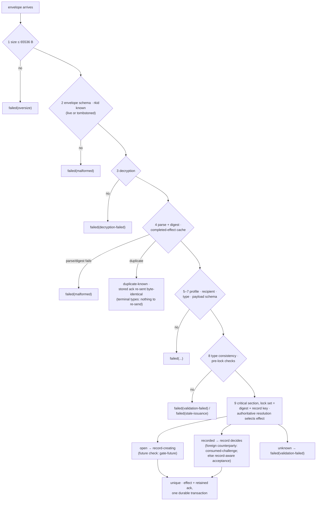

# RLTP Delivery Contract

**Real Life Trust Protocol — service contract: Delivery**

- **Status:** Editor's Draft
- **Version:** 0.17.0-draft (seventeenth casting)
- **Editors:** Anton Tranelis
- **Date:** 2026-08-10
- **Vocabulary namespace:** `https://real-life.org/rltp/v1`
- **Task-type namespace:** `https://real-life.org/trust-tasks/`
- **Target Trust Tasks framework version:** 0.4
- **Conformance profile:** `rltp-delivery@0.17` (draft)
- **Position:** not a layer. Delivery is the service behind the port
  that Encounter §11 requires; every layer may use it, none depends on
  its internals.

## Abstract

This document specifies how RLTP documents travel between people. The
delivery service moves **signed, anchor-encrypted, typed documents**
from one person to another — eventually, at least once, never silently
lost — and tells both sides honestly what it knows: the sender its
transport state, the receiver nothing the content does not prove
itself, and the sender **never** what the receiver decided.

Messages are **Trust Task documents** of private, versioned types under
`https://real-life.org/trust-tasks/` (ToIP DTGWG Trust Tasks framework
0.4, §6.5 private specifications). This casting registers three types —
`encounter-bundle`, `delivery-ack`, `encounter-credential-delivery` —
the RLTP document profile they share, and the sealed envelope they
travel in.

## Status of This Document

This is an **Editor's Draft** with no standing beyond its own
argument. It is developed together with the Encounter Layer through
an adversarial convergence process — each casting is reviewed in full
by an independent adversarial reviewer and recast, never patched. The
current casting is the seventeenth; its review round returned no
findings, and the pair was judged blocker-free and compatibly
implementable. The document will keep changing as implementation
experience accumulates; known open questions are collected in
Section 12. Feedback is welcome via the issues of the publication
repository (github.com/real-life-org/rltp-spec).

## 1. Introduction (informative)

### 1.1 Essence and principles

- **Eventually, at least once, never silently lost.** Delivery time is
  unbounded and never affects validity (Encounter 1.3). At-least-once
  makes duplicates and lost acknowledgements the *normal case*, so
  idempotency is law, not precaution. A document the service accepted
  is delivered or reported failed; silent loss is non-conformant.
- **Documents and promises, never pipes.** No normative statement
  mentions a relay, a broker, a socket, or a wire. Transport-internal
  signals never appear here.
- **Authenticity always has exactly one carrier.** Where a document's
  payload contains material signed under the Layer-1 binding rule
  (credentials, cards), that material is the carrier and the document
  needs no proof. Where it does not — the acknowledgement — the
  document itself carries a proof. Nothing is trusted because a
  channel said so.
- **The acknowledgement is arrival, and arrival only.** It is
  machine-generated at the durable recording of a document's defined
  effect, waits on no human, and carries no statement about any
  decision. The mutual-recognition moment of an encounter is carried
  by the counter-credential itself, not by any receipt.

### 1.2 The user experience this serves (informative)

After A scans and confirms, A's app shows a waiting state; the arrival
acknowledgement dissolves it ("nothing more to do on your side"), and
its absence within `ack-wait` flips A's screen to the optical
presentation of the sent card — the same enactment on another
carrier. When B's counter-credential later arrives, A sees the
relation confirmed; B's own view becomes mutual only when A's
credential reaches B (Encounter 4.2 — every view is local). Section 8
gives both state machines; a lost acknowledgement after B's commit
reconciles through redelivery and `duplicate-known`, never through a
second enactment (6.3).

## 2. Conventions and Terminology

The key words "MUST", "MUST NOT", "REQUIRED", "SHALL", "SHALL NOT",
"SHOULD", "SHOULD NOT", "RECOMMENDED", "NOT RECOMMENDED", "MAY", and
"OPTIONAL" are to be interpreted as described in BCP 14 [RFC2119]
[RFC8174] when, and only when, they appear in all capitals.

The **interim securing profile** of Encounter 2.3 applies (did:key
anchors, Ed25519/X25519 as Multikeys with decoded multicodec
verification, `eddsa-jcs-2022` embedded proofs, JCS, SHA-256,
multibase, RFC3339-UTC-`Z` timestamps).

**Document** — a Trust Task document conforming to the RLTP document
profile (Section 3). **Document digest** — the multibase-encoded
multihash (Encounter 2.3: emit `u`, accept `u`/`z`, SHA-256) over
`JCS(document)` of the plaintext document; the document's identity for
idempotency and acknowledgement reference, and format-identical to
DTGWG `digestMultibase` values. **Sealed
envelope** — the encrypted form in which a document travels
(Section 5). **Disposition** — the receiver's classification of a
processed envelope (Section 6).

| Term | Fragment |
|---|---|
| Document digest | `#DocumentDigest` |
| Sealed envelope | `#SealedEnvelope` |
| Disposition | `#Disposition` |
| Delivery acknowledgement | `#DeliveryAck` |

## 3. The RLTP Document Profile

RLTP delivery documents are Trust Task documents [TT], target framework
version **0.4**, under the private task-type rules of TT §6.5. The
profile — normative wire form
`schemas/rltp-delivery-document.schema.json` — requires:

- `id` — REQUIRED; UUID v4.
- `type` — REQUIRED; a registered RLTP task type
  (`https://real-life.org/trust-tasks/<slug>/<MAJOR.MINOR>`). Slugs
  never match `^trust-task(-|/)?` (TT §6.1).
- `issuer`, `recipient` — REQUIRED, in-band, as anchors. A consumer
  MUST reject a document whose `recipient` is not its own anchor
  (TT §7.2 rule 5 — the receiver principle at the envelope level).
- `threadId` — REQUIRED: fresh (UUID v4) on thread-opening documents,
  equal to the answered document's `threadId` on responses.
- `ceremony` — OPTIONAL, and **entirely unconstrained by the task
  specifications**, per TT §4.11.1: a task specification declares
  nothing about ceremonies, absence is never grounds for rejection,
  and every framework-defined member (`enactment`, `step`, `round`,
  `terminal`, `prev`, …) passes through unrejected. One RLTP
  *profile-level* rule applies to consumers of this contract: **where
  the member is present and carries an `enactment`, that value MUST
  recompute** against the enclosed material or the document is
  `failed(validation-failed)`; a member that grants nothing can still
  not be allowed to lie. It grants no authority (TT §7.2 rule 9); the
  authoritative enactment binding always lives in the enclosed
  credential itself.
- `issuedAt` — REQUIRED.
- `expiresAt` — MUST be absent. Delivery time is unbounded; validity
  windows live in payloads and ceremonies, with issuance semantics.
- `proof` — REQUIRED on `delivery-ack` (its authenticity has no other
  carrier: 1.1, 4.2); MUST be absent on the other types of this
  casting, whose authenticity is carried by the signed payloads
  inside. Where `proof` is present, TT §4.8.2 audience binding is
  satisfied by the in-band `recipient`.
- `payload` — REQUIRED; governed by the type's **payload schema**,
  whose `$id` is the Type URI (TT §6.3). Payload schemas describe only
  the payload; the outer members are validated by the document-profile
  schema.

**Offline schema rule:** implementations MUST pre-register every
schema of this contract by its `$id` and MUST NOT resolve any `$ref`
over the network. The shipped `schemas/` directory is the complete
closure; a validator that cannot resolve a reference from its local
registry treats the document as `malformed`.

Unknown `type` → the document MUST be rejected with disposition
`failed(unknown-type)`; a document that would have an effect is never
silently ignored.

## 4. Registered Task Types

Each type below is a private Trust Task specification with: Type URI,
target framework 0.4, payload schema (shipped), proof declaration (per
Section 3), and the consistency rules stated here.

### 4.1 `encounter-bundle/0.1`

The transmission of the one-scan ceremony (Encounter 5.8): the
scanner's sent card and step credential.

- `payload`: `{ "card", "credential" }` per
  `schemas/payload-encounter-bundle.schema.json`.
- `threadId`: fresh (opens the exchange). `proof`: absent.
- **Declarations (TT §7.3):** side effects: *mutating* (creates the
  enactment record); exposure: recipient-only, never retained by
  third parties.
- **Outer/inner consistency (MUST, before any effect):**
  `issuer` = `card.anchor` = `credential.issuer`;
  `recipient` = `credential.credentialSubject.id`;
  the card carries a sent-challenge with `sentTo` = `recipient` and
  `boundTo` = `credential.credentialSubject.challenge`
  (Encounter 6); a present `ceremony.enactment` equals
  `credential.credentialSubject.enactmentBinding`.
- **Pre-lock validation (MUST, in order — validate, then consume:
  read-only against local state **except for Encounter 5.3's aging
  latch, which every resolution writes**, and consuming nothing;
  together with the authoritative in-lock resolution this implements
  the acceptance set of Encounter 5.6):**
  1. document profile + payload schema valid; timestamps
     calendar-valid; keys decode to correct multicodec + length;
  2. card proof verifies under `card.anchor`;
  3. credential proof verifies under its issuer anchor;
  4. `credential.credentialSubject.id` = the local anchor;
  5. the credential's bound challenge **resolves** (Encounter 5.3;
     the resolution itself latches any held aged value it observes —
     the latch is monotone and lock-free, so this provisional
     observation already stands) to `open` or `recorded` — an
     `unknown` resolution ends the pre-lock checks, but is **never
     final pre-lock**: the evaluation skips the remaining checks and
     proceeds directly to the serialization point (6.2 stage 9),
     where the authoritative resolution decides. If it is still
     `unknown`, the disposition is `failed(validation-failed)` — the
     one state-free outcome that covers garbage, foreign,
     rotated-away, and record-gone bundles alike, always produced
     under the lock. If it is **any other state** (the state moved —
     e.g. the optical record arrived between pre-lock and lock), the
     evaluation MUST NOT proceed on the skipped checks: it releases
     the lock and **re-enters at stage 4** (the waiter rule of 6.2),
     completing every check under the new state before any effect;
     **`credentialSubject.ceremony` equals this
     ceremony (`encounter-scan@0.19`)** — a credential labelled
     with any other ceremony is `failed(validation-failed)`, so the
     record's ceremony is grounded rather than copied from the
     sender's label; and the enactment binding recomputes per
     Encounter 5.4 from {the resolved own challenge, card's
     sent-challenge};
  6. **the issuance window (Encounter 5.6 step 6):** `validFrom` and
     `proof.created` inside the closed interval anchored at `t_ch`
     from the resolution — held with an `open` value by its owner,
     held in the record for a `recorded` one (Encounter 5.5/5.3) —
     and `proof.created ≥ validFrom − skew-tolerance`.

  This pre-lock resolution is **provisional**; the resolution
  repeated inside the critical section is authoritative and alone
  selects the effect.
  Only after 1–6 pass does evaluation reach the final stage (6.2
  stage 9), whose critical section is keyed for bundles on **both**
  the document digest and the credential's bound challenge — the
  **record key**, the same serialization point the optical input of
  Encounter 5.8 passes through. Inside that section, and only there,
  the bound challenge is **re-resolved authoritatively** (Encounter
  5.3), and the resolution selects the effect:

  **`open` → record-creating effect:** the explicit future check
  (Encounter 5.5) — an own challenge future-dated beyond
  `skew-tolerance` is `failed(gate-future)`; the expiry side is
  structural (an aged value never resolves `open`), so no
  `gate-expired` disposition exists — then the effect committed **as
  one durable transaction**: the enactment record, **the accepted
  credential itself with its direction and credential digest** (the
  state Encounter 4.2 needs to hold `received` across restarts), the
  completed-effect cache entry, **and the acknowledgement document
  itself, retained with the cache entry** (4.2). After commit the
  credential **is accepted**; no later check can fail it.

  **`recorded` → the record decides:** a record whose counterparty is
  **not** the document issuer means the challenge was consumed by a
  different enactment — `failed(consumed-challenge)`, the only way
  this disposition arises, and it is stable under waiter re-entry:
  the record survives, so re-resolution yields `recorded` again and
  the same disposition. Otherwise (the offline path completed first,
  Encounter 5.8) the enclosed card MUST be **JCS-identical to the
  counterparty card stored in that record** — a bundle combining a
  valid credential with any other card, however well signed, is
  `failed(validation-failed)`. The binding is verified against the
  record, and the credential MUST pass Encounter acceptance (5.6) in
  full, including uniqueness; `ERR_STALE_ISSUANCE` maps to
  `failed(stale-issuance)`, every other rejection to
  `failed(validation-failed)`, and nothing is consumed. On pass, the
  **record-aware effect** committed as one durable transaction: the
  accepted credential with direction and credential digest, the
  completed-effect cache entry, and the retained acknowledgement —
  **no gate, no record creation, no consumed-challenge conflict**.

  **`unknown` → `failed(validation-failed)`:** nothing exists to
  consume; a provisional pre-lock pass only means the state moved.

  Any failure before a committed effect consumes nothing and earns no
  acknowledgement (the poisoning rule). Documents with **distinct
  digests** competing for one challenge serialize on the record key:
  exactly one commits first; each later evaluation re-selects its
  branch against the new state — an identical enclosed credential
  (equal credential digest) lands idempotently via Encounter 5.6
  step 8 with its own effect and acknowledgement; a conflicting
  credential **from the record's counterparty** (it passed the
  counterparty check) is `failed(validation-failed)`; a foreign
  counterparty is always `failed(consumed-challenge)` (above) —
  never a second record.

### 4.2 `delivery-ack/0.1`

The arrival acknowledgement (DO-1).

- `payload`: `{ "ref": <document digest of the acknowledged document>,
  "meaning": "received" }` per
  `schemas/payload-delivery-ack.schema.json`.
- **Declarations (TT §7.3):** side effects: sender status update only;
  exposure: retained only by the acknowledged document's sender.
- `threadId`: = the acknowledged document's `threadId`.
- `proof`: **REQUIRED** — `eddsa-jcs-2022` under the ack's `issuer`
  anchor. An unsigned or foreign-signed acknowledgement is invalid.
- **Consistency (MUST, on receipt):** proof verifies under `issuer`;
  `issuer` = the acknowledged document's `recipient`; `recipient` =
  the acknowledged document's `issuer`; `threadId` matches; `ref`
  matches a document this sender actually sent on that thread. Any
  failure → the ack is discarded (`failed(validation-failed)`) and the
  sender's status is unchanged.
- Generation: **automatic at the durable recording of the referenced
  document's defined effect** (4.1: the committed bundle effect,
  record-creating or record-aware; 4.3: durable buffering). It MUST NOT wait for, depend on, or reveal any
  human decision, and MUST NOT be sent for a document rejected at
  document level. **The acknowledgement document is created inside
  the effect's transaction and retained together with the
  completed-effect cache entry it belongs to** — both persist at
  least `key-retention` after commit (Section 7), the bound that
  outlives every adapter's give-up horizon and therefore every live
  redelivery. Within that bound, redelivery of a `duplicate-known`
  document MUST re-send exactly this stored document, byte-identical
  — never a newly generated one. After the bound, entry and stored
  acknowledgement MAY be discarded together; a document redelivered
  later is re-evaluated as fresh, and byte-identity binds only within
  the retention bound. The re-evaluation is harmless in both possible
  states: a bundle whose enactment record still exists (records live
  for the life of the relation, Encounter 5.5) lands in the
  **record-aware effect** and is accepted idempotently (equal
  credential digest, Encounter 5.6 step 8), earning a **freshly
  generated** acknowledgement; a bundle whose record is gone fails
  **by derivation from the state model**: with the record deleted,
  the bound challenge resolves `unknown` (Encounter 5.3 — no
  challenge history exists beyond open values and records), so
  check 5 of 4.1 fails — `failed(validation-failed)` — and no gate
  is ever reached or needed. Its sender has long reported
  `failed` either way, and a late acknowledgement only transitions
  that status honestly (6.1).
- Meaning, normatively and honestly bounded: *the recipient's anchor
  **attests** that the document reached its authenticated device and
  that its defined effect is durably recorded.* It is an attestation,
  not a proof of causal receipt — a recipient who signs falsely harms
  only their own state, and the sender's `delivered` is exactly as
  strong as that attestation. Implementations MUST NOT present it as
  acceptance, verification beyond the recording gate, or any human
  act (Encounter 7.4). `meaning` is a closed one-value set in this
  version.
- **Terminal.** The acknowledgement is a **terminal document**: its
  defined effect (the sender-status update, idempotent by
  construction) earns a completed-effect cache entry like any other,
  retained at least `key-retention` after commit — the same bound as
  every cache entry — but it generates **no acknowledgement of its
  own**: there is no acknowledgement of an acknowledgement, and the
  chain ends here by rule, not by accident. A stage-4 duplicate of a
  terminal document is `duplicate-known` with **nothing to re-send**
  (6.2).

### 4.3 `encounter-credential-delivery/0.1`

Post-enactment delivery of a step credential: the counter-step of
`encounter-scan` (`"counter"`), or a standalone credential delivery
outside any bundle thread (`"deliver"`).

- `payload`: `{ "credential" }` per
  `schemas/payload-encounter-credential-delivery.schema.json`.
- **Declarations (TT §7.3):** side effects: buffering only; exposure:
  recipient-only.
- `threadId`: fresh for standalone deliveries (`ceremony.step` =
  `"deliver"` when the member is used); = the bundle's `threadId` for
  a one-scan counter-step (`"counter"`). `proof`: absent.
- **Outer/inner consistency (MUST, before any effect):**
  `issuer` = `credential.issuer`; `recipient` =
  `credential.credentialSubject.id`; if `ceremony` is present, its
  `enactment` = `credential.credentialSubject.enactmentBinding`.
  A document violating these is `failed(validation-failed)` and
  produces no acknowledgement — an acknowledgement never goes to a
  party other than the credential's own issuer.
- **Defined effect:** durable buffering of the enclosed credential for
  Encounter acceptance. The acknowledgement is sent at buffering;
  Encounter acceptance (5.6) runs separately, never acknowledges, and
  its outcome is never signaled to the issuer (Encounter 7.4).

## 5. The Sealed Envelope

A document travels sealed to its recipient:

```
seal = { "rkid":       <recipient key-agreement key, Multikey z6LS…>,
         "epk":        <ephemeral X25519 public key, base64url, 32 bytes>,
         "nonce":      <96-bit nonce, base64url>,
         "ciphertext": <AES-256-GCM ciphertext || 128-bit tag, base64url> }
```

Normative construction, exactly one way:

- **Plaintext** is the JCS canonicalization of the document (UTF-8),
  at most **65 536 bytes**; larger documents are non-conformant and
  oversize envelopes MUST be rejected without decryption
  (`failed(oversize)`).
- **Ephemeral key:** a fresh X25519 key pair MUST be generated per
  envelope from a CSPRNG and MUST NOT be reused. **Nonce:** 96 bits
  from a CSPRNG per envelope.
- **Shared secret:** X25519(ephemeral private, recipient public),
  where the recipient public key is the one identified by `rkid` (the
  key-agreement Multikey from the recipient's card, or a derived
  service identity, Layer-1 A7). An all-zero shared secret MUST be
  rejected on both sides.
- **Key derivation:** AES-256 key = HKDF-SHA-256(ikm = shared secret,
  salt = empty, info = ASCII `rltp/v1/seal`), 32 bytes.
- **Encryption:** AES-256-GCM, 128-bit tag, **AAD = empty (exactly
  zero bytes; nothing is authenticated outside the ciphertext by
  design — all binding lives inside the document)**. Ciphertext of a
  zero-length plaintext is invalid.
- **The document digest is computed over the plaintext, never the
  ciphertext** — re-sealing on retry changes `epk`, `nonce` and
  `ciphertext`, never the document's identity.
- **Key retention (bounded by the delivery horizon):** recipients
  MUST retain every key-agreement private key that ever appeared in a
  displayed or sent card, addressable by `rkid`, for at least
  `key-retention` (Section 7) after the key last appeared in any
  card — **including keys displayed before any relation or record
  existed**, because a scanner may hold the card before the recipient
  knows them. `key-retention` MUST be at least the longest give-up
  horizon any adapter in the deployment declares (6.1), so a key can
  never retire while a delivery sealed to it is still live; adapters
  therefore declare their horizon. **A retired identifier remains
  known indefinitely as a tombstone** — the `rkid` value alone, its
  private key destroyed; tombstones are a few bytes per card ever
  issued, and they keep the disposition honest: stage 2's "known"
  includes tombstones (6.2), so an envelope sealed to a retired key
  reaches decryption and fails as `failed(decryption-failed)` —
  never `malformed`, which is reserved for identifiers this party
  never issued.

A **shipped test vector** (`vectors/seal.json`) fixes recipient key,
ephemeral key, nonce, plaintext, ciphertext, and document digest;
implementations MUST reproduce it byte-for-byte. The vector's
plaintext document is a **seal-only sample** (type
`…/seal-vector-sample/0.1`, never a wire type): it exercises this
section's construction, not the document profile, and MUST NOT be
processed as a delivery document.

No channel authentication is required or assumed: confidentiality
comes from the seal, authenticity from proofs and signed payloads
bound to anchors by the Layer-1 binding rule.

## 6. Delivery Promises

### 6.1 Sender: the status trias

| State | Meaning |
|---|---|
| `accepted` | the service durably buffered it; delivery is owed |
| `delivered` | a **valid** `delivery-ack` (4.2 consistency) referencing its digest arrived |
| `failed(reason)` | the service gave up; reason from the closed set below |

Sender failure reasons (closed set): `unroutable` · `oversize` ·
`expired-by-adapter-policy` (the adapter's declared give-up bound) ·
`rejected-by-receiver(<receiver reason>)` where an adapter conveys
one. A late valid acknowledgement after `failed` transitions the
status to `delivered`; implementations MUST surface the transition.
No other states exist — in particular, no acceptance state.

### 6.2 Receiver: dispositions, in mandatory order

The pipeline, as a picture (informative — the numbered stages below
are normative):



Every received envelope is evaluated in this order, and the first
failing stage names the disposition:

1. size bound (5) — else `failed(oversize)`;
2. envelope schema, **base64url canonicity** (lengths `mod 4 ≠ 1`,
   zero trailing bits) and `rkid` known — live or tombstoned
   (Section 5) — else `failed(malformed)`;
3. decryption (all-zero check, tag) — else `failed(decryption-failed)`;
4. document parse + digest computation — a plaintext that does not
   parse as JSON or defeats JCS/digest computation is
   `failed(malformed)`; **duplicate check against the
   completed-effect cache** — the cache contains ONLY digests whose
   stage 9 completed successfully; a digest previously rejected at
   any stage is NOT in it and is re-evaluated in full. Duplicate →
   `duplicate-known`: the prior outcome applies idempotently and the
   **stored** acknowledgement of the completed effect **MUST be
   re-sent, byte-identical** (it exists by construction for every
   acknowledging type: the ack document is retained inside the
   effect's transaction, stage 9; a crash between commit and
   transmission would otherwise lose it permanently — for a
   **terminal** document, 4.2, no acknowledgement exists and nothing
   is re-sent). Evaluation ends;
5. document-profile schema + `recipient` = own anchor — else
   `failed(malformed)` / `failed(wrong-recipient)`;
6. `type` known — else `failed(unknown-type)`;
7. payload schema — else `failed(malformed)`;
8. type consistency rules and pre-lock acceptance checks
   (Section 4, incl. the issuance window for bundles) — else
   `failed(validation-failed)` / `failed(stale-issuance)`; **one
   exception:** a bundle whose bound challenge provisionally
   resolves `unknown` (the resolution itself has already latched any
   held aged value — Encounter 5.3) skips the rest of this stage and
   enters stage 9, where the authoritative resolution decides:
   still `unknown` → dispose; any other state → release and
   re-enter at stage 4 (4.1 check 5);
9. **gates and effect, serialized per lock set:** stage 9 is a
   critical section whose **lock set** is the document digest and,
   for bundles, additionally the credential's bound challenge (the
   **record key**). The lock protocol, normatively:
   the full lock set is acquired **atomically, as one acquisition**
   — never one key after the other; an evaluation whose set overlaps
   a held set **holds nothing while waiting**; and when the way is
   free it does not resume — it **re-enters at stage 4**, rechecking
   the completed-effect cache and re-selecting its branch on the
   state actually found. One rule covers both keys; there is no
   ordering to get wrong and no lock held across the re-entry. The
   record-key namespace and lifetime are shared with the optical
   input of Encounter 5.8/5.5 — the same lock, not an equivalent one
   — so record creation, branch selection, and credential uniqueness
   are serialized with every competing trigger. The completed-effect
   cache therefore never holds provisional state: a waiter either
   finds a completed entry (→ `duplicate-known`, mandatory re-ack
   where one is retained — for a terminal document, 4.2, there is
   nothing to re-send) or finds nothing and proceeds as a fresh
   evaluation. Inside the critical section: the authoritative
   resolution and effects of 4.1 — `open` → record-creating behind
   the future check (else `failed(gate-future)`), `recorded` → the
   record decides (foreign counterparty: `failed(consumed-challenge)`;
   else record-aware), `unknown` → `failed(validation-failed)` —
   each effect committed as one durable
   transaction (record where created, accepted material, cache
   entry, **the acknowledgement document itself where the type
   acknowledges, retained together with the cache entry per 4.2**;
   4.1) → `unique`.

**Validate, then consume:** no stage before 9 consumes single-use
material, and stage 9 consumes only after 1–8 passed in full — for a
bundle that includes the issuance window, so **nothing that stage 9
records can subsequently fail** (the poisoning rule, closed).

**`incomplete(missing)`** exists in the taxonomy for types with
declared dependencies. **No type of this casting declares any**; a
future type that does MUST define its closed `missing` vocabulary,
its re-evaluation trigger, and its retention bound in its own
specification.

### 6.3 At-least-once and reconciliation

Adapters MAY deliver any envelope multiple times; receivers converge
via stage 4 (`duplicate-known`). A lost acknowledgement is
indistinguishable from a lost document to the sender; the sender's
remedy is the carrier switch of Encounter 5.8 — the **same
enactment** continues on the optical leg, and the late bundle is
accepted via the record (4.1). A **fresh enactment** arises only when
the optical leg's `boundTo` no longer resolves — the `gate-expired`
outcome of Encounter 5.8; the resulting parallel enactments are
reconciled by **Encounter 0.19, 4.2 and 5.8**: both are valid, a late
counter-credential to the first is accepted, and enactment
multiplicity never multiplies edges (one edge per anchor pair). This
contract adds nothing to those rules and relies on them.

## 7. Timing

| Parameter | Default | Meaning |
|---|---|---|
| `ack-wait` | PT30S | RECOMMENDED sender-side wait before **automatically** presenting the optical leg — the carrier switch within the same enactment (Encounter 5.8); presentation is permitted at any moment, and conformance never depends on when the switch happens; **cancelled by an arriving acknowledgement or counter-credential** |
| `key-retention` | max(P90D, longest adapter give-up horizon) | minimum retention of a key-agreement private key after it last appeared in any card (Section 5) |

`ack-wait` is a UX pacing parameter, not a validity rule: an
acknowledgement arriving after it is still valid (6.1 late
transition), and the record-aware effect (4.1) makes any switch
timing safe.
Delivery time itself is unbounded; no rule in this contract references
arrival time for validity.

## 8. State Machines (informative)

**Sender (A, one-scan):**
`scanning → confirmed/sent (waiting animation) → delivered ("nothing
more to do") → [counter-credential accepted] → relation confirmed`
— with `waiting --ack-wait elapsed--> optical presentation (show the
sent card as QR)`, and `failed --late valid ack--> delivered`.

**Receiver (B, one-scan):**
`envelope → staged evaluation (6.2) → recorded + auto-ack → prompt:
"verify A back?" → [human confirms] → counter-step issued → relation
confirmed` — any rejection before the final stage (6.2 stage 9) sends
no ack and consumes nothing; B's prompt is C4, never automated.

## 9. Security Considerations

- **The seal is to a card key.** Whoever holds the recipient's card
  can seal to them — including the bystander of the challenge race
  (Encounter §13). The seal provides confidentiality, never sender
  authenticity.
- **The acknowledgement is now a proof-carrying document.** Forging
  one requires the acknowledging anchor's key; replaying one is
  idempotent (same digest, same thread); redirecting one fails the
  4.2 consistency rules. Suppressing acknowledgements causes fallback,
  not loss, and the late-ack transition plus the Encounter merge rule
  bound the damage of selective suppression to UX, never to state
  divergence.
- **At-least-once is an attack surface made safe by idempotency.**
  Replayed envelopes converge by plaintext digest; re-sealed replays
  converge identically.
- **Oversize and garbage envelopes are rejected before expensive
  work** (6.2 order; size bound before decryption).
- **Adapters are untrusted for content.** A transport can delay, drop,
  duplicate, and observe metadata; it can never read, alter, or forge
  documents without detection.

## 10. Privacy Considerations

- **Transport metadata is visible to adapters:** recipient anchor,
  `rkid`, timing, sizes. Derived service identities (A7) bound what a
  transport learns; the contract does not hide traffic patterns.
- **An acknowledgement is a probe response, and this is stated
  precisely:** its presence tells the sender that the recipient's
  device was online **and** that the document passed every stage
  through recording — including, for a bundle, that either the
  displayed challenge was still unconsumed and the gate open
  (record-creating effect) or that the optical leg had already
  created the matching record (record-aware effect); the
  acknowledgement does not distinguish the two. A sender can
  distinguish "online but gate closed" from "recorded" by ack
  presence. This is inherent to the flow the acknowledgement serves.
  Its life differs by effect, and this is stated honestly: the **gate
  probe** ("was the challenge still open?") is bounded by the
  challenge's short life, but on the **record-aware path** an
  acknowledgement — stored or freshly generated after retention — can
  arise for as long as the enactment record lives, revealing arrival
  and the record's existence to its own counterparty, and nothing
  more. Implementations MUST NOT extend the ack with further detail.
- **Sealed content is opaque end to end.**

## 11. Conformance

- **Profile** `rltp-delivery@0.17`.
- **Classes:** *sender* (sealing, status trias, ack-wait switch
  trigger) · *receiver* (unsealing, staged dispositions, ack
  generation) · adapters are below the port line.
- **Normative schemas (shipped, complete closure for offline
  registration):** `schemas/rltp-delivery-document.schema.json` ·
  `schemas/sealed-envelope.schema.json` ·
  `schemas/payload-encounter-bundle.schema.json` ·
  `schemas/payload-delivery-ack.schema.json` ·
  `schemas/payload-encounter-credential-delivery.schema.json`.
- **Shipped vector:** `vectors/seal.json` (5).
- **Vector plan:** seal/unseal roundtrip against the shipped vector ·
  digest invariance under re-sealing · every disposition stage of 6.2
  as a distinct vector, in-order (including oversize before
  decryption, tag-only ciphertext as `malformed`, unknown `rkid`,
  all-zero secret rejection) · validate-then-consume (a bundle
  failing stage 8 consumes nothing) · duplicate and concurrent
  delivery converge with identical re-ack · **ack forgery matrix:**
  unsigned ack rejected, foreign-signed rejected, wrong-thread
  rejected, wrong-direction rejected, valid ack accepted, late valid
  ack transitions `failed → delivered` · ack generation at each
  type's defined effect, none on rejection, no dependency on the
  confirmation step · outer/inner consistency vectors per type
  (Mallory-wrapped credential produces no ack to Mallory) ·
  `ceremony` member absent (accepted), present-and-matching
  (accepted), present-and-wrong (rejected) · threadId rules per type
  · status trias transitions including every failure reason ·
  **record-aware effect:** bundle after optical completion → accepted
  via record + ack · binding mismatch against record → rejected,
  nothing consumed · enclosed card not JCS-identical to
  the record's stored counterparty card → `failed(validation-failed)`
  · conflicting or re-proofed credential on an existing record →
  `failed(validation-failed)`, no ack · every Encounter 5.6 rejection
  exercised on the record-aware path · optical record creation racing
  a bundle between stage 8 and stage 9 → branch re-selected inside
  the critical section, accepted via record, never
  `failed(consumed-challenge)` · two bundles with distinct digests
  competing for one challenge → exactly one record-creating effect;
  the other accepted idempotently (equal credential digest), or —
  **from the record's same counterparty** — a conflicting credential
  `failed(validation-failed)`, or — foreign counterparty —
  `failed(consumed-challenge)`; never a second record · crash after a
  record-aware commit and before ack transmission → redelivery yields
  the mandatory byte-identical re-ack · **state-model additions:**
  resolution selects every branch: `open` → record-creating,
  `recorded` → record decides, `unknown` → `failed(validation-failed)`
  · card `boundTo` ≠ credential's bound challenge →
  `failed(validation-failed)` at outer/inner consistency ·
  wrong-counterparty disposition stable under waiter re-entry
  (re-resolution yields `recorded` again → `failed(consumed-challenge)`
  both times) · aged-out challenge, no record → resolution `unknown`
  → `failed(validation-failed)`, no gate disposition · envelope
  sealed to a retired (tombstoned) `rkid` → passes stage 2, fails
  stage 3 `failed(decryption-failed)`; `rkid` never issued →
  `failed(malformed)` at stage 2 · **polish-round additions:**
  future-dated own challenge beyond skew at the record-creating gate
  → `failed(gate-future)` · record held by a different counterparty →
  `failed(consumed-challenge)`, nothing consumed anew · redelivered
  `delivery-ack` → `duplicate-known`, no ack-of-ack, sender status
  unchanged · post-retention redelivery with surviving record →
  record-aware idempotent acceptance, freshly generated ack;
  without surviving record → `failed(validation-failed)` at the
  pre-record checks (check 5), no gate reached · lock-set
  atomicity: interleaved bundle/optical triggers on one record key
  under load → no deadlock, one effect per document: every delivery
  waiter re-enters at stage 4, every optical waiter reacquires its
  singleton lock and reruns the record resolution of Encounter 5.5 ·
  invalid JSON inside a valid seal → `failed(malformed)` at stage 4 ·
  **polish-round additions:** framework-expanded `ceremony`
  (`round`/`terminal`/`prev` present → accepted) · credential with
  foreign ceremony label in a bundle → `failed(validation-failed)` ·
  concurrent first deliveries → exactly one `unique`, one
  `duplicate-known`, identical acks · crash between effect commit and
  ack transmission → redelivery yields the mandatory re-ack ·
  key retirement never precedes the declared adapter horizon.

## 12. Open Issues

- **DO-2b HPKE.** Whether to align the seal with RFC 9180 in a future
  version; the 0.2 construction transcribes the deployed one.
- **DO-3 Multi-device delivery.** What `delivered` means when an
  anchor has several devices; adapter-defined until the Layer-1
  device model (IO-4) lands; the ack meaning is deliberately
  device-scoped.
- **DO-4 Third-party task types.** The first type retained by third
  parties beyond the ack's sender needs its proof rules stated per
  TT §4.7.1; the ack itself is retained only by its sender.
- **DO-5 Ordering.** No global ordering is promised; thread
  causality plus the merge rule cover every current flow.

## Appendix A (informative): mapping to the current implementation

| This contract | Today (Sync 001/003, wot-core) |
|---|---|
| Document (Trust Task, profile §3) | `MessageEnvelope` / DIDComm plaintext + `MessageType` union |
| `threadId` | `thid`/`pthid` |
| Sealed envelope (5) | ECIES body `{epk, nonce, ciphertext}`, info `wot/ecies/v1` → `rltp/v1/seal`, plus new `rkid` |
| Status trias (6.1) | `RelayReceipt accepted/delivered/failed` |
| `delivery-ack` (4.2) | `attestation-receipt` (Häkchen 2) — semantics move to arrival-at-recording, **and the ack gains a proof** |
| Dispositions (6.2) | K1 `InboxAck*` taxonomy, now with mandatory order |
| Transport queue ack | relay `{type:'ack'}` — below the port line, unspecified here |

## References

[RFC2119] · [RFC8174] BCP 14 · [RFC3339] · [RFC8785] JCS · [RFC5869]
HKDF · [TT] ToIP DTGWG Trust Tasks framework specification 0.4
(§4.8.2, §4.11.1, §6.1, §6.3, §6.5, §7.2–7.3) · RLTP Encounter Layer
0.19 (port §11, binding 5.4, ceremony 5.8, state model 5.3, merge
rule 4.2) · Sync
001/003 (superseded transport specs, Appendix A).
