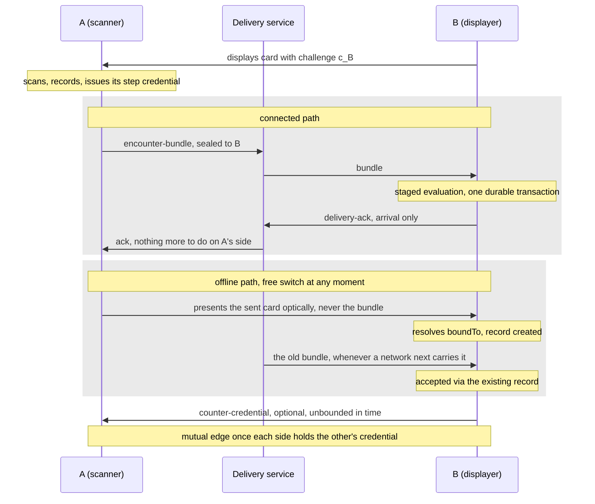

# RLTP Encounter Layer

**Real Life Trust Protocol — Layer 2: Encounter**

- **Status:** Editor's Draft
- **Version:** 0.22.0-draft (twenty-second casting)
- **Editors:** Anton Tranelis
- **Date:** 2026-08-12
- **Vocabulary namespace:** `https://real-life.org/rltp/v1`
- **Conformance profile:** `rltp-encounter@0.22` (draft). The **wire
  versions of every artifact stay at `0.19`**: this casting sharpens
  the wording of the comparison rule introduced by 0.21 and
  strengthens one conformance vector; it changes no wire shape and no
  verdict (Section 12).
- **Supersedes:** version 0.21 (archived as
  `archive/encounter-layer-0.21.md`), and castings 0.1 through 0.20
  archived alongside it.
- **Supersedes on adoption:** `02-wot-trust/001-encounter credentials.md` and
  `002-verifikation.md` (wot-spec v0.1, German); see Appendix B.

## Abstract

This document specifies the Encounter layer of the Real Life Trust
Protocol: how two people establish, record, and maintain the fact that
they have met and recognized each other.

An encounter is performed as an **enactment** of a registered
**ceremony**, in which each party sees the other's fresh challenge and
deliberately confirms recognition. Each confirmation is a **step**
whose product is an **encounter credential**, immutable and issued to
the person it is about. Credentials between two anchors form an
**edge**, which may be one-sided or mutual; recognition is mutual when
both parties confirm, and one-sided outcomes are legitimate. Every
ceremony produces the same kind of credential; the one registered
ceremony has a connected path and an offline path, and the application
switches carriers — never ceremonies — as conditions change.
Relations that are not encounters exist as paths in the graph and are
computed rather than asserted.

Cryptography proves freshness and authorship; only a human can witness
a human. When a person's anchor changes, their edges follow through
witnessed succession, specified separately in *RLTP Succession*
(currently parked).

## Status of This Document

This is an **Editor's Draft** with no standing beyond its own
argument. It is developed through an adversarial convergence process:
every casting is reviewed in full by an independent adversarial
reviewer, findings are triaged, and the document is recast — never
patched — until a casting is judged blocker-free and compatibly
implementable. The companion documents have met that criterion — the
**RLTP Delivery Contract 0.17**, which specifies the transmission leg
by normative reference, and above this layer the **RLTP Membership
Tasks 0.11** and the **RLTP Access Layer 0.25**.

This twenty-second casting has been read by that process and is
**converged**. Two consecutive rounds returned no blocker-level
finding, the second none at major level either; the single editorial
point it did return — a sentence in Section 13 that contradicted both
the proof in Section 2.3 and a vector in Section 15 — has been
corrected in place, which is the only kind of change a converged
casting takes.

The loop this casting closes began as a debt the Access Layer had
recorded against this document: the size cap that layer enforces when
it accepts a credential was not guaranteed where the credential is
made. Discharging it turned out to require more than the debt note
described — it named two unbounded fields and there were four — and
review then found something the debt had merely hidden: fractional
seconds were semantically undefined, so two conforming implementations
could reach different verdicts on identical input at an aging latch, a
future gate, or an issuance window. Whole-second normalization is now
a rule of this document rather than an assumption about it.

**No wire form changed.** The artifacts of 0.19 stand unaltered
beneath this casting, which narrows the values they may carry and
fixes the granularity at which they are compared; the wire strings
therefore remain at 0.19 and Section 12 states what a 0.19 receiver
may decide differently, and by how little.

The document will keep changing as implementation experience
accumulates; known open questions are collected in Section 16.
Feedback is welcome via the issues of the publication repository
(github.com/real-life-org/rltp-spec).

## 1. Introduction (informative)

### 1.1 Essence

> An encounter is a **protocolled act of recognition between people**,
> cryptographically bound to key control and freshness, whose cost is
> a real interaction and whose yield is a durable, immutable record
> between stable anchors — mutual when both confirm.

Three consequences shape this document:

1. **The protocol does not prove personhood.** It proves that a key
   was controlled and that an exchange was fresh. That a human is
   present, and that this human is the one they appear to be, is
   witnessed by another human. Because anchors are free to create,
   nothing in a credential proves that distinct anchors are distinct
   people; what the protocol makes expensive is forging an edge **to a
   specific, known anchor** (Section 13).
2. **An encounter is one thing.** An enactment establishes fresh
   recognition — mutual when both parties confirm; whatever ceremony
   it enacts, it produces the same kind of credential. Relations of
   other kinds are **paths and shared contexts derived from the
   graph**, computed rather than asserted.
3. **Recognition is not trust.** An encounter says "this person is
   real and I met them". It does not say "I trust them".

### 1.2 Position in the layer model

This layer consumes Layer-1 anchors and produces the edges that Layer
3 policies may reference and that applications display. It requires no
authority substrate. It uses the Delivery service through a port
(Section 11), whose message semantics are the **RLTP Delivery
Contract**; nothing in this layer depends on a transport, and **the
ceremony's offline path depends on no connectivity at all**.
Applications switch **carriers**, never ceremonies: the connected path
where connectivity exists, the optical path where it does not,
including mid-enactment and back again (5.8).

### 1.3 Design-principles note

*SRP:* this layer owns recognition and its record, nothing else.
*OCP:* ceremonies and channels are an open set extended by
registration. *LSP:* any enactment satisfying the contract in 5.2
produces an equivalent encounter credential — which is what makes
adapter switching free. *ISP:* consumers of an edge need not
understand the ceremony that produced it. *DIP:* the Delivery port is
defined by this layer's needs.

Three further principles govern this family:

- **Issuance counts, arrival does not — for delivery after an
  enactment.** The validity of a credential delivered after its
  enactment is a function of signed and locally recorded issuance-time
  data, never of when it arrived. A ceremony MAY include a synchronous
  leg **inside** the enactment (5.8); real-time checks on that leg
  bound the enactment itself and do not touch this principle.
- **Clock tolerance never rejects, and the clock's resolution never
  decides.** Every time comparison widens its interval by
  `skew-tolerance` in the direction favorable to acceptance;
  timestamps slightly in the local future — the normal case among real
  devices — MUST NOT cause rejection within the tolerance (Section 9).
  And every comparison of this layer is performed on whole seconds
  (2.3), so no
  verdict of this document depends on how finely the verifier's clock
  or the producer's serializer happens to tick. The two halves of this
  principle do not pull against each other. Because every parameter of
  Section 9 is a whole number of seconds, truncating both operands can
  only ever **add** accepted borderline cases and never withdraw one
  (the proof is in 2.3, *How*): the granularity rule cannot turn a
  tolerance that never rejects into one that does.
- **Every mechanism names its user action.** The user actions of this
  layer are exactly two: exchange cards (by scanning, one way or both
  ways), confirm recognition.

## 2. Conventions and Terminology

### 2.1 Requirement language

The key words "MUST", "MUST NOT", "REQUIRED", "SHALL", "SHALL NOT",
"SHOULD", "SHOULD NOT", "RECOMMENDED", "NOT RECOMMENDED", "MAY", and
"OPTIONAL" in this document are to be interpreted as described in
BCP 14 [RFC2119] [RFC8174] when, and only when, they appear in all
capitals, as shown here.

### 2.2 Terms

Permanent identifiers are `https://real-life.org/rltp/v1#<Fragment>`.

**Anchor** — the stable Layer-1 identifier of a person. In this
casting, a `did:key` (2.3).

**Contact card** — a person's signed self-description carrying the
verification material needed to recognize and reach them, and — when
used in an enactment — a fresh challenge. A card is **displayed**
(shown for scanning) or **sent** (transmitted inside an enactment; it
then names its recipient, Section 6). Not a credential.

**Challenge** — a fresh, single-use, high-entropy value carried in a
contact card for one enactment (5.3). One concept; displayed and sent
cards differ only in lifecycle.

**Ceremony** — a registered, versioned definition of an encounter
interaction, **including its time parameters** (Sections 5, 9).

**Enactment** — one performed run of a ceremony between two people.
Never reused. An enactment MAY be two-phase (5.8): it **completes**
when both parties hold records; recognition within it is per step.

**Step** — one credential issuance within an enactment.

**Enactment binding** — the digest, identical in both step credentials
of an enactment, that ties them to one exchange descriptor (5.4).

**Enactment record** — a party's durable local record of an enactment
(5.5).

**Encounter credential** — the immutable credential in which one party
records that they recognized another (Section 7).

**Credential digest** — the multibase-encoded multihash (2.3) over
`JCS(document)` of the complete credential including its proof —
the same include-the-proof scope the DTGWG chain digests use.

**Bundle** — the one-scan transmission, specified as the Delivery
Contract task `encounter-bundle` (its 4.1).

**Edge** — the relation between two anchors constituted by the
encounter credentials between them; **incoming**, **outgoing**, or
**mutual** (4.2). **One edge exists per anchor pair, however many
enactments contributed to it.**

| Term | Fragment | | Term | Fragment |
|---|---|---|---|---|
| Anchor | `#Anchor` | | Enactment | `#Enactment` |
| Contact card | `#ContactCard` | | Enactment binding | `#EnactmentBinding` |
| Challenge | `#Challenge` | | Encounter credential | `#EncounterCredential` |
| Ceremony | `#Ceremony` | | Credential digest | `#CredentialDigest` |
| Step | `#Step` | | Edge | `#Edge` |

Referenced: **Credential** (W3C VC 2.0, RLTP-owned type per 7.1),
**Delivery port /
RLTP Delivery Contract** *(services)*.

### 2.3 Interim securing profile

The Layer-1 (Identity) specification is not yet cast. Until it is,
this document is self-contained by requiring, normatively:

- An **anchor** is a **`did:key`** DID whose method-specific
  identifier encodes an Ed25519 public key: `z6Mk` plus exactly 44
  base58btc characters. The anchor is **self-certifying**; no
  resolution, registry, or directory is involved at any point.
- **The key-to-anchor binding rule:** signatures under an anchor MUST
  verify under key material bound to that anchor by the Layer-1
  profile's binding rule — in this interim profile, containment.
  An artifact naming anchor X but verifying only under unbound
  material is invalid, whatever it carries.
- **Keys are verified decoded, not just pattern-matched:** on parsing,
  a `z6Mk…` value MUST decode to multicodec `ed25519-pub` plus 32 key
  bytes, and a `z6LS…` key-agreement Multikey to `x25519-pub` plus 32
  key bytes; anything else is malformed, whatever its length.
- Credentials and cards are JSON documents carrying an embedded
  **`DataIntegrityProof`** with cryptosuite **`eddsa-jcs-2022`**
  [DI-EDDSA]: canonicalization JCS [RFC8785], hash SHA-256, signature
  Ed25519, `verificationMethod` = the anchor's `did:key` verification
  method. No RDF processing is required or permitted.
- **The proof value is bounded by the signature it carries.** An
  Ed25519 signature is exactly 64 bytes [RFC8032], and `proofValue` is
  its multibase base58btc encoding: the character `z` followed by 64
  to 88 base58 characters — **65 to 89 characters, and nothing
  else.** Both ends are properties of the encoding, not chosen
  numbers. The upper end holds because 58⁸⁷ ≤ 2⁵¹² − 1 < 58⁸⁸, so the
  largest 64-byte value needs 88 digits and no 64-byte value needs
  89. The lower end holds because base58btc renders each leading zero
  byte as exactly one `1` character, so the shortest encoding of 64
  bytes is the 64 characters of the all-zero string. A string outside
  this interval is not the encoding of a 64-byte value and therefore
  cannot be an Ed25519 signature; **rejecting it at the format check
  discards no signature that could ever have verified.**
- **Digest values are multibase-encoded multihashes** over
  JCS-canonicalized JSON, aligned with W3C VCDM `digestMultibase` and
  CID 1.0: the SHA-256 digest is wrapped in a multihash header
  (`0x12 0x20` + 32 bytes) and multibase-encoded. Producers in this
  profile **emit `u`** (base64url-no-pad, 46 characters after the
  header); verifiers MUST accept both CID 1.0 headers (`u` and `z`)
  and MUST verify the decoded multihash algorithm and length at
  parse. *(One verifier thereby serves RLTP and DTGWG artifacts
  alike.)*
- All timestamps are [RFC3339] date-times in UTC with `Z`, seconds
  `00`–`59` (leap seconds excluded), carrying **at most three
  fractional-second digits** — at most 24 characters. Schemas enforce
  syntax by pattern; implementations MUST additionally reject
  calendar-invalid dates when parsing.
- **Every time comparison of this layer is performed at whole-second
  granularity.** This is the rule, and it is normative, because
  without it the sentence that follows from it would be a hope about
  implementations rather than a property of the protocol.

  **Where.** Before **every Encounter comparison — every comparison
  this document requires, and every comparison a companion document
  delegates to this one** — **each operand is normalized**: every
  timestamp read from an artifact (`validFrom`, `proof.created`, a
  card's `challenge.issuedAt`), every timestamp read from local state
  (a record's or a held value's `t_ch`), and **the locally read
  `now`**. Interval endpoints are then computed from normalized
  operands by adding the parameters of Section 9, which are themselves
  whole seconds or coarser. No Encounter comparison takes an
  unnormalized operand on either side, and a comparison whose two
  sides were normalized differently is non-conformant.

  **How far this reaches — and where it stops.** It reaches every
  comparison of the record gate, the challenge resolution, the aging
  latch and the issuance window, wherever they are performed: when the
  Delivery Contract's staged evaluation resolves a challenge or
  evaluates the issuance window, it is performing *this* document's
  comparisons and performs them under this rule. It does **not** reach
  a companion's own time windows. Where a companion defines its own
  parameter and its own interval — the Membership Tasks' invite
  validity under `membership-skew`, the Access Layer's service views,
  duty slots, provisional window and retention bounds — those
  endpoints are not computed from Section 9 and those comparisons are
  not this document's to govern. This rule states the granularity of
  Encounter time, not of RLTP time.

  **How.** Normalization is **truncation toward the past**: the
  fractional part is discarded, never rounded. Three reasons, in
  order. It is a purely **lexical** operation on the wire form —
  delete the `.` and every character between it and the `Z`, leaving
  the whole-second form `YYYY-MM-DDThh:mm:ssZ` — so it needs no
  arithmetic and no agreement on a rounding mode. It is **the same
  operation this document already requires of an over-precise
  producer** (Appendix A), so producer truncation and verifier
  normalization compose to one instant, where rounding would have a
  verifier read a value no truncating producer ever wrote. And on
  whole-second values — the form producers SHOULD emit — it is the
  **identity**, so the canonical case pays nothing.

  **Why truncating cannot narrow acceptance.** Truncating `now`
  downward could in principle have tightened the side of a gate that
  compares against `now` plus a tolerance — and a rule that made a
  clock tolerance reject would contradict 1.3. It does not, and this
  is provable rather than merely intended: for a whole-second offset
  `S`, `t ≤ now + S` implies `⌊t⌋ ≤ ⌊now⌋ + S`, since `⌊t⌋ ≤ t` and
  `⌊now + S⌋ = ⌊now⌋ + S`. The same holds for every other inclusive
  bound of this document, each of whose offsets is whole-second
  (Section 9). **Truncation can therefore accept borderline cases an
  exact comparison would have refused, but it can never refuse one an
  exact comparison accepted.** The principle "clock tolerance never
  rejects" survives this rule as a theorem, not as a hope.
  *(Round-half-up would also have been deterministic, monotone and
  compatible with whole-second offsets; truncation is preferred
  because it is the operation already imposed on the producing side,
  not because rounding would have been unsound.)*

  **What it is not.** Normalization governs **comparison only**. The
  bytes that are canonicalized, hashed, signed, verified, and digested
  are always the bytes of the artifact as it stands; an implementation
  that normalizes before JCS breaks every proof it touches.

  **What follows.** Every time parameter of this layer is
  second-granular or coarser (Section 9), so with this rule **no
  verdict of this document — record gate, resolution, aging latch,
  issuance window — can differ on the fraction**, and two conforming
  implementations reach the same verdict on the same input whatever
  the resolution of their clocks. That is what the aging latch (5.3)
  needs to be the deterministic, monotone thing it claims to be.
  Producers SHOULD nonetheless emit **whole seconds**, now for a
  narrower reason: it is the canonical form in which one instant has
  exactly one serialization and hence exactly one digest.
- **The precision bound is byte economy, nothing more.** Because the
  fraction cannot move a verdict, the choice of three digits is no
  longer a semantic decision but purely an interoperability one: an
  unbounded fraction would be an unbounded field in an artifact whose
  size is capped (7.5), so *some* bound is required. It is drawn at
  three digits rather than at zero because millisecond precision is
  what the common ISO-8601 serializers emit unaided, so the bound
  costs a conforming producer nothing it was not already doing; it is
  not drawn at nine, which would also be bounded, because the extra
  twelve bytes buy precision no rule of this document reads. A
  producer spending more precision than the protocol reads MUST
  truncate (Appendix A) — the same truncation the comparison rule
  performs.
- **Contexts are pinned by value, not processed.** A credential's
  `@context` is exactly
  `["https://www.w3.org/ns/credentials/v2",
  "https://real-life.org/rltp/v1"]`, in order, with no additions;
  term meaning comes from this specification and the published RLTP
  context document (`contexts/rltp-v1.jsonld`, a normative
  deliverable), never from JSON-LD processing at runtime. This is
  stated honestly: verification is JSON Schema plus the rules of this
  document; implementations MUST NOT apply RDF or JSON-LD expansion,
  and documents with other context sets are rejected at the format
  check.

Method-agnosticism is a Layer-1 goal and is **not claimed by this
casting**.

## 3. What an Encounter Establishes

An encounter establishes exactly four things, and implementations MUST
NOT present it as establishing more:

| Established | By |
|---|---|
| **Key control** — the issuer controlled their anchor's key | proof (2.3) |
| **Freshness** — the exchange happened within one enactment | challenge binding (5.3) |
| **Deliberate recognition** — a human decided to confirm | the confirmation step (5.2, C4) |
| **A durable record** — the fact survives the moment | the encounter credential (Section 7) |

It does **not** establish physical presence, personhood, identity of a
name to a legal person, or trust. Freshness and recognition are
established **toward the participants**; what a third party can later
verify is strictly less (Section 8).

## 4. Anchors, Credentials, Edges

### 4.1 The atom is the encounter credential

An encounter credential is issued by one party about another. It is
complete on its own and is delivered to its subject, who holds it
(7.4). **The issuer keeps a copy**; holding does not confer authority.

### 4.2 The edge is the relation, and it is per anchor pair

An **edge** between anchors A and B is constituted by the encounter
credentials that exist between them. A party's view of an edge is
local. Implementations MUST model, per counterparty and direction, the
states **recorded** (an enactment record exists), **issued** (own step
credential issued), **received** (counterparty credential accepted
under 5.6).

From a party's local view: an edge is **outgoing** when they have
issued and not received, **incoming** when they have received and not
issued, and **mutual** when, for at least one enactment, they have
both issued and received.

**The merge rule.** There is exactly **one edge per anchor pair**,
whatever the number of enactments between the two anchors — including
parallel enactments born from a `gate-expired` fresh enactment or the
simultaneous-scan race (5.8 step 5). Every valid
credential from any enactment attaches to the same edge; a late
counter-credential to an earlier enactment is accepted under 5.6
against that enactment's record, harmlessly. **Enactment multiplicity
never multiplies edges**, and any counting or evaluation (a Layer-3
predicate) counts edges, never enactments or credentials.

Evidence weight differs by direction: an **incoming** credential is
evidence about the subject; an **outgoing** credential is evidence
about the other party and **no evidence about the issuer**. Counting
MUST consider incoming credentials only, or mutual edges; outgoing
credentials MUST NOT count toward the issuer's own standing.

**What counting is worth, honestly:** anchors are free to create, so
edges between unknown anchors are free to manufacture. An edge count
is meaningful only **relative to anchors the evaluator already has
reason to care about**; a Layer-3 policy that counts edges MUST state
this assumption.

### 4.3 Anchor scope, honestly stated

This casting requires `did:key` anchors (2.3). A counterparty using
any conforming client is verifiable offline, from the card alone.
Interoperating with other DID methods is a Layer-1 concern; until the
Identity layer is cast, claims of method-agnosticism would be
unbacked, and this document makes none.

## 5. Ceremonies and Enactments

### 5.1 Registered ceremonies

A **ceremony** is a registered, versioned definition, and the
registration **pins the ceremony's time parameters** (Section 9).
Ceremonies are an open set. This version registers **one** ceremony,
`encounter-scan@0.19` (5.8), whose connected and offline paths carry
the same enactment material on different legs. Two conforming parties evaluating
the same credential under the same registered ceremony reach the same
verdict; there is no deployment-local parameter variation.

### 5.2 The enactment contract

An interaction is an enactment of an encounter ceremony if and only if
it establishes all of:

- **C1 Material exchange.** Each party obtains the other's contact
  card, each card carrying a fresh challenge — by scanning a displayed
  card, or by receiving a sent card.
- **C2 Freshness, enforced by the generator.** Each challenge is
  single-use and fresh at enactment time. **Each party enforces
  freshness and single use for its own challenge**; no party is
  required to verify the age of the counterparty's challenge.
- **C3 Binding.** Each step credential binds the challenge of its
  **subject** and the enactment binding (5.4).
- **C4 Deliberate confirmation.** Before issuing, a human confirms
  recognition. Implementations MUST NOT issue encounter credentials
  automatically.
- **C5 Enactment record.** Each party durably records the enactment
  (5.5) before issuing. In a two-phase ceremony the enactment
  **completes** when the second record exists (5.8); completion is
  about the exchange, recognition remains per step, and one-sided
  outcomes are legitimate.

Interactions that establish something else (possession of a phone
number, control of a domain) are **not** encounter enactments and MUST
NOT produce credentials under this specification.

### 5.3 Challenges

A challenge MUST be a string of 22 to 88 characters of base64url
alphabet without padding, carrying at least 128 bits of
cryptographically random material; producers SHOULD emit exactly 22
characters. It travels in a contact card together with its **issuance
time**, and is generated by the party it protects:

- **Displayed card:** the challenge is published for whoever scans;
  its owner rotates it and enforces single use across scans.
- **Sent card:** the challenge is generated at the moment of sending,
  dedicated to that one enactment; the card names its recipient
  (`sentTo`) **and the displayed-challenge value the enactment
  answers (`boundTo`)** (Section 6). The display challenge MUST NOT
  be reused in a sent card.

A value present in any enactment record MUST NOT be accepted in a new
enactment (single use, enforced by its generator's record store).

**The own-challenge state model.** Every challenge value is, by a
party's own state, in exactly one of three states — exclusivity is
guaranteed not by disjoint predicates but by the **precedence of the
resolution algorithm** below:

- **open** — a challenge this party issued (displayed, or sent in an
  enactment awaiting its record), held together with its issuance
  time `t_ch`, not superseded by a record, and not aged out by the
  party's own clock: `now ≤ t_ch + challenge-max-age +
  skew-tolerance`, **with `now` and `t_ch` normalized to whole
  seconds per 2.3 before the parameters are added**, so the age bound
  falls on the same second in every implementation.
  **Retention is mandatory:** a party MUST retain
  every issued value with its issuance time until it becomes
  recorded or ages past the bound — rotation changes which value is
  *displayed*, never the retention of previously issued values, so
  an unaged rotated value is still open. A value past the bound is
  not open — the expiry side of the record gate is structural, not
  a check that can be forgotten; the **future side** remains an
  explicit check at record creation (5.5, outcome `gate-future`).
  Aged-out values MAY be physically discarded.
- **recorded** — the own challenge of a surviving enactment record
  (5.5); the record holds `t_ch` and the counterparty. **Record
  creation atomically supersedes the open entry** — the transition
  `open → recorded` happens inside the record's transaction, within
  the serialization point, so no observer ever resolves the same
  value both ways.
- **unknown** — everything else: never issued, aged out, or recorded
  once but deleted with its relation. These cases are
  **indistinguishable by design**; no challenge history exists
  beyond open values and records.

**The resolution algorithm** maps a bound challenge value to a state
by precedence, and this order is normative:

1. a surviving enactment record holds it as own challenge →
   **`recorded`**;
2. otherwise, a retained issued value within the age bound →
   **`open`**;
3. otherwise → **`unknown`**.

Resolution is **total, deterministic, and read-only but for one
write** — resolving never consumes anything, and the precedence
makes the answer unique even in the one overlapping moment (a
freshly recorded value whose open entry has not yet been discarded
resolves `recorded`). The one write is the aging latch:
**every resolution — provisional or authoritative — that finds a
held value past the age bound MUST mark it `aged` before returning
`unknown`.** "Past the age bound" is the normalized comparison of
the `open` definition above: the latch fires on a whole-second
boundary, so **two implementations observing the same state at the
same instant latch together**, and no verdict of this model differs
on a fraction of a second. The mark is atomic per value and
**monotone**
(set-only): concurrent, unserialized writers can only ever agree,
so the latch needs no lock for its safety, and an aged value never
resolves `open` again — whatever the clock later says. A
backward-moving clock therefore cannot resurrect a value: the latch
already stands from the first observation, wherever it was made,
and the authoritative resolution observes every previously written
latch. Whether an aged value is physically retained or discarded
after the latch is unobservable. Dispositions still belong to the
serialization point: a provisional `unknown` never finalizes a
rejection — the evaluation proceeds to the lock, where the
authoritative resolution decides (Contract 4.1; the optical leg's
`unknown` refusal is likewise produced there, 5.5). The model's
entry point is issuance: a newly issued value **enters as `open`**;
"never issued" values are `unknown` without ever having been open.
The complete transition set: *(issuance)* `→ open`,
`open → recorded` (record creation, atomic, in-lock),
`open → unknown` (the aging latch only — never early discard),
`recorded → unknown` (record deleted with its relation). There is no
transition out of `unknown` (single use, 5.3 above). A resolution
performed outside the record-key serialization point (5.5, Delivery
Contract 6.2) is provisional; the resolution performed inside it is
authoritative and selects the branch taken (Contract 4.1). Every
consumer of a bound challenge — bundle evaluation, optical input,
credential acceptance — goes through resolution; no rule of this
family references "the displayed challenge" in any other way.

A step credential MUST bind the challenge of its **subject** in this
enactment; acceptance is checked against the subject's own enactment
record (5.6), so the binding remains checkable however late the
credential is delivered.

### 5.4 The enactment binding

Both step credentials of an enactment carry the same **enactment
binding**, constructed identically for every ceremony:

```
binding = multibase( multihash( SHA-256( JCS( {
    "ceremony":   <ceremony identifier and version>,
    "challenges": [ <value_1>, <value_2> ]   // ascending lexicographic
  } ) ) ) )                                  // emit u, accept u/z (2.3)
```

**What the binding is (exactly):** a shared exchange descriptor. For
the **participants**, whose records tie the values to a live exchange,
it proves one enactment. For a **third party** it proves consistency,
not occurrence (Section 8).

*Honesty note (normative for claims):* the binding does not hide the
relation. The two credentials of an enactment name the two anchors in
plaintext; **anyone holding both can correlate them from the anchors
alone**, and implementations and documentation MUST NOT claim
otherwise.

### 5.5 The enactment record

Before issuing, each party MUST durably record: the ceremony
identifier and version; the counterparty anchor and its card as
received; both challenge values **and the issuance time of the party's
own challenge** (`t_ch`, needed by 5.6 step 6); the computed enactment
binding; and the local time of the enactment. Records MUST be retained
for the life of the relation, and they subsume the consumed-challenge
history.

**Record creation applies the gate in every ceremony, stated in
resolution terms (5.3).** A record MUST be created only for an own
challenge that **resolves `open`** — the expiry side is structural
(an aged value is no longer open) — and whose issuance time passes
the explicit **future check**, `t_ch ≤ now + skew-tolerance` by the
creating party's own clock, **both operands normalized to whole
seconds per 2.3**; a value failing it is refused with the
named outcome **`gate-future`**, on every leg. The scanner applies
this at scan time (trivially fresh); the receiver at receipt of the
sent card — whichever carrier brought it (5.8). **Record creation is
idempotent and unique:** at most one record per own-challenge value;
repeated or concurrent triggers with the same material — a
redelivered bundle (Delivery Contract 6.2), a re-scanned optical
card, or one of each — converge on one record. Every trigger for the
same own-challenge value MUST pass through the same serialization
point — the record-key lock of Delivery Contract 6.2, one namespace
and lifetime for bundles and optical inputs alike — so concurrent
triggers observe each other, and the resolution performed inside it
is the authoritative one. An optical input whose own challenge
**resolves `recorded`** is handled by the same taxonomy a bundle
meets (Contract 4.1): a JCS-identical counterparty card is an
idempotent no-op; a card from a **different counterparty** is
refused — the challenge is consumed; the same counterparty with
different material is refused as invalid. An optical input whose
`boundTo` **resolves `unknown`** creates nothing and is refused —
the refusal produced **at the serialization point**, where the
authoritative resolution latches any held aged value first (5.3) —
the user-facing outcome named `gate-expired` in 5.8, honest in both
of its indistinguishable causes (aged out or never this device's).
No second record arises in any of these cases.

### 5.6 Acceptance

On receiving a credential claiming to be an encounter credential about
the local anchor, an implementation MUST evaluate, in order:

1. **Format.** The document validates against
   `schemas/encounter-credential.schema.json`; its
   `credentialSubject.format`, ceremony, and ceremony version are
   known; timestamps parse calendar-valid; keys decode per 2.3; else
   reject `ERR_VERSION`.
2. **Signature.** The `DataIntegrityProof` verifies under the key
   bound to the issuer anchor (2.3); else reject `ERR_SIG`.
3. **Addressee.** `credentialSubject.id` is the local anchor; else
   reject `ERR_ADDRESSEE`.
4. **Record.** Exactly one enactment record exists whose own challenge
   equals the credential's bound challenge (5.5 guarantees at most
   one); its counterparty anchor equals the credential's issuer; else
   reject `ERR_NO_RECORD`.
5. **Ceremony.** The credential's ceremony equals the record's
   ceremony; else reject `ERR_CEREMONY`.
6. **Issuance window.** With `t_ch` from the record (5.5), **both**
   `validFrom` **and** `proof.created` MUST lie in the closed interval
   `[t_ch − skew-tolerance,
     t_ch + challenge-max-age + issuance-window + skew-tolerance]`,
   **and** `proof.created ≥ validFrom − skew-tolerance`; else reject
   `ERR_STALE_ISSUANCE`. **All four values — `validFrom`,
   `proof.created`, `t_ch`, and hence both endpoints — are normalized
   to whole seconds per 2.3 before either comparison**, so a
   millisecond on either side of an inclusive endpoint is not a
   discriminator. Endpoints are inclusive; skew always widens.
7. **Binding.** The enactment binding recomputes from the record per
   5.4; else reject `ERR_BINDING`.
8. **Uniqueness.** No credential has been accepted for this record and
   direction. Equal credential digest → idempotent acceptance; any
   other credential — including a re-proofed copy — is rejected
   `ERR_CONFLICT`.

A credential failing any check is **not an encounter credential**; it
MUST NOT be counted as an encounter and MUST NOT satisfy a Layer-3
encounter predicate. Each error state is a distinct conformance
vector.

### 5.7 The channel is informative

The channel and its properties (in person, video, near-field) are
recorded as informative metadata and carry **no normative weight**.
*(The one-scan transmission rules are enactment mechanics specified in
the Delivery Contract: confidentiality to the receiver via the sealed
envelope, authenticity from the signed material inside.)*

### 5.8 The registered ceremony of this version

**`encounter-scan@0.19`** — the one ceremony of this casting. It has a
**connected path** and an **offline path**, which carry the same
enactment material on different legs: the connected path delivers the
**bundle** (card + credential) through the Delivery service; the
offline path presents the **sent card alone** as a ceremony-level
optical input. Switching between them is free in both directions at
any moment, and neither path ever starts a second enactment. What
varies is never the ceremony — only the carrier of the enactment
material.

The ceremony, as a picture (informative — the normative rules follow
below):



Common trunk, normatively:

1. B displays a card with challenge `c_B`.
2. A scans it and generates a **sent card**: fresh challenge `c_A`
   created now, `sentTo` = B's anchor, `boundTo` = `c_B` — the value
   that tells B's device *which* of its own challenges this
   enactment answers (Section 6).
3. A applies the record gate on `c_A` (trivially fresh), records
   (5.5), confirms (C4), issues its step credential binding `c_B` and
   the binding over `{c_B, c_A}`, and hands the `encounter-bundle`
   task (sent card + credential) to the Delivery service. **The
   enactment completes when B holds a record**; how A's material
   reaches B is the adapter's business:

**Connected path.** The bundle travels as the Delivery Contract task,
sealed to B's key-agreement key. The Contract's staged evaluation
governs B's processing — validate, then consume: nothing consumes
`c_B` before the bundle's credential has passed the **complete
pre-lock acceptance set** (Contract 4.1: format, signatures,
addressee, ceremony, binding recomputation, and the issuance window
with `t_ch` from `c_B`'s resolution — `open` here, 5.3). Only then,
in the Contract's final stage — inside the lock-set critical section
of Contract 6.2 — `c_B` is **re-resolved authoritatively**: `open`
selects the record-creating effect (future check, `gate-future`;
then one durable transaction: the record, the accepted credential
with direction and digest, and the retained proof-carrying
`delivery-ack`). After this point the credential is accepted; no
later check can fail it.

**Offline path.** A's device MAY present **the sent card itself**
optically **at any moment after step 3** — presentation is never
gated on a timer; `ack-wait` (Delivery Contract §7) is only the
RECOMMENDED automatic trigger, and conformance never depends on when
the switch happens. B scans the presented card. The optical leg is
**not a delivery of the bundle**: it is a ceremony-level input
carrying **enactment material only, never credentials** — the sent
card is card-sized and scannable where a sealed bundle is not, and
credentials belong to the delivery layer, whose time is unbounded. B
validates the sent card (proof under its anchor, version, `sentTo` =
own anchor), **resolves `boundTo`** (5.3) — `open` → future check →
record creation under the serialization rule of 5.5; `recorded` →
the idempotency taxonomy of 5.5; `unknown` → refused, the
`gate-expired` outcome — idempotent per own challenge; a re-scan or
a racing bundle converges on the one record. The
enactment is complete; B's view of the edge is **outgoing at most**
until A's credential arrives (4.2: mutuality is held, never inferred
— a `sentTo` card suggests recognition, only the credential proves
it). A's queued bundle then delivers whenever a network adapter next
carries it, and is accepted **via the existing record** (Contract
4.1 record-aware effect, selected inside the challenge-keyed critical
section of Contract 6.2): the enclosed card MUST be JCS-identical to
the record's stored counterparty card, the binding is verified against
the record, the credential passes acceptance (5.6), effect =
credential acceptance and acknowledgement — no second gate, no second
record, no consumed-challenge conflict.

4. B MAY confirm (C4) and issue the counter-step, binding `c_A`,
   delivered as task `encounter-credential-delivery` (step
   `counter`), unbounded in time, over any adapter. A accepts under
   5.6 with `t_ch` = `c_A`'s issuance time.
5. **Path switching and merge.** The acknowledgement is a delivery
   signal, never acceptance (7.4); receipt of B's counter-credential
   or of the acknowledgement cancels any pending automatic switch.
   Switching is safe because each leg is idempotent at its own level:
   record creation is unique per own challenge (5.5), delivery of the
   bundle document is idempotent per document digest (`duplicate-known`
   with byte-identical re-ack, Contract 6.2), and the two levels meet
   only inside the lock-set critical section, where the authoritative
   resolution selects the branch. A genuinely **fresh
   enactment** remains only as the last resort — when the optical
   leg's `boundTo` no longer resolves
   (`gate-expired`) — and the merge rule (4.2) keeps even that at one
   edge per anchor pair, as it does for the simultaneous-scan race
   where both parties scan each other's displayed cards and two
   enactments arise.

Neither path requires a third party. The connected path requires
transient connectivity for both ends; the offline path requires none.
Until step 4's counter-issuance, the edge is one-sided — a legitimate
outcome.

## 6. The Contact Card

A contact card is a person's **self-description** — explicitly **not a
credential**.

A card MUST validate against `schemas/contact-card.schema.json` and
carries: a **format version**; the **anchor**; a **key-agreement key**
(Multikey, decoded-verified, 2.3); a **challenge** with its **issuance
time**, whenever the card is used in an enactment; **`sentTo`** — the
recipient's anchor — and **`boundTo`** — the displayed-challenge
value the enactment answers — **whenever the card is sent** (a sent
card without either, with a foreign `sentTo`, or — in a bundle —
with a `boundTo` differing from the enclosed credential's bound
challenge, MUST be rejected by its receiver; a displayed card
carries neither); and a `DataIntegrityProof`
per 2.3 verifying under the anchor. It MAY carry a display name and
delivery hints.

**Every field of a card is bounded too**, by the shared rules of 2.3
for its proof and its timestamp and by the card's own maxima (200
characters of display name, at most eight delivery hints of 512
characters each). A card therefore has a finite largest JCS
serialization: **26 683 bytes** at the adversarial escaping maximum of
its free text (C0 control characters, six bytes each), **5203 bytes**
when that text is **unescaped** one-byte ASCII — the qualifier
matters, because a quote or a backslash is one-byte ASCII and still
costs two bytes under JCS (7.5). No layer of this stack places an *acceptance* cap on a
card, so unlike the credential (7.5) the card needs no source
guarantee: where a card travels inside another document, fit is that
document's **sender duty**, never a theorem. The bound is what makes
the duty dischargeable — and it keeps the `encounter-bundle` payload,
a maximal card plus a maximal credential, under 28 KiB and so inside
the Delivery Contract's 65 536-byte plaintext bound by construction.
The generosity of the card bound against the document maxima above
this layer is recorded as OI-6.

A card with an **unknown version** MUST NOT enter an enactment.
Degradation is always toward less assurance. The name in a card is
**self-declared**; recipients bind their own local name to the anchor
(petname principle). Cards are updated in the relationship.

## 7. The Encounter Credential

### 7.1 Form

A W3C Verifiable Credential 2.0 secured per 2.3, of type
`VerifiableCredential`, **`EncounterCredential`** — an RLTP-owned type
defined by the pinned RLTP context. It deliberately carries **no DTG
type**: the DTG `WitnessCredential` is defined as a third party's
attestation, while an encounter credential is a **participant's**
recognition, and stamping the type without meeting the DTG base
structure would be paper conformance (see Appendix C for the upstream
path). Statements that are not encounters are outside this
specification.

### 7.2 Data model

The normative wire format is
`schemas/encounter-credential.schema.json`. **The document root is
closed:** exactly the properties below, no others. In particular,
`validUntil`, `credentialStatus`, and any validity-controlling VC
property are **absent by construction** — encounter credentials are
never revoked and never expire (7.3), and a document carrying such a
property is not an encounter credential (`ERR_VERSION`). Extension
happens through a new format version, never through extra fields.

| Property | Type | Card. | Content |
|---|---|---|---|
| `@context` | array | 1 | exactly the two pinned contexts, in order (2.3) |
| `type` | array | 1 | exactly `VerifiableCredential`, `EncounterCredential` |
| `issuer` | anchor | 1 | the recognizing party |
| `validFrom` | datetime | 1 | issuance time (SHOULD equal enactment time) |
| `credentialSubject.id` | anchor | 1 | the recognized party |
| `credentialSubject.format` | string | 1 | `rltp-encounter-credential/0.19` |
| `credentialSubject.ceremony` | string | 1 | registered ceremony id and version; at most 56 characters (7.5) |
| `credentialSubject.challenge` | string | 1 | the subject's challenge |
| `credentialSubject.enactmentBinding` | multibase | 1 | per 5.4 |
| `credentialSubject.channel` | string | 0..1 | informative |
| `proof` | object | 1 | `DataIntegrityProof`, `eddsa-jcs-2022`; `created` participates in 5.6 step 6; every member bounded (7.5) |

The credential MUST NOT carry the counterparty's challenge — enforced
structurally by the closed root and closed subject.

**Every property above has an upper bound**, and the closed root
admits no others. The two facts together are what make the size of an
encounter credential a property of the artifact rather than a hope
about its producer; the guarantee that follows is 7.5.

### 7.3 Immutability

Encounter credentials are immutable and are **never revoked**. A
changed assessment is expressed by issuing a new credential; both
remain true of their moment. A credential is a durable, independently
meaningful claim from issuance; the enactment is provenance, not a
validity condition.

### 7.4 Receiver principle, honestly bounded

An encounter credential belongs to its subject **in authority, not in
exclusivity**. The issuer retains a copy, and **the protocol gives the
subject no control over the issuer's copy**. What the protocol
guarantees: no directory, no publication mechanism, no protocol
operation by which an issuer can alter, revoke, or condition a
delivered credential, and no protocol-level acceptance signal to the
issuer. Delivery acknowledgements signal arrival (Delivery Contract
4.2), MUST NOT be presented as acceptance, and carry no statement
about the receiver's decision. Implementations MUST NOT present the
relation as disclosable only by the subject.

### 7.5 Bounded size, guaranteed at the source

The Access Layer accepts a **transported** encounter credential only
if its JCS serialization is at most **2048 bytes** (its 5.3, where a
transported variant proof carries at most 16 of them). That is an
*acceptance* cap: it tells a receiver what to reject, and it told a
producer nothing. This casting turns it into a property of the
artifact, so that **no conforming producer can build a credential that
cap would have to reject.**

The guarantee is **structural, not a duty**: it follows from the
format alone, because every property of an encounter credential has an
upper bound. Four had none before casting 0.20 — `proofValue`,
`validFrom`, `proof.created` (through the shared timestamp definition)
and `credentialSubject.ceremony` — and any single one of them was
enough to defeat the cap.

| Property | Bound | Where the bound comes from |
|---|---|---|
| `@context` | two pinned constants | 2.3 |
| `type` | exactly two members, both fixed | 7.1 |
| `issuer`, `credentialSubject.id` | 56 characters | `did:key` over Ed25519 (2.3) |
| `validFrom`, `proof.created` | 24 characters | RFC3339 UTC, ≤ 3 fractional digits (2.3) |
| `credentialSubject.format` | one constant | 7.2 |
| `credentialSubject.ceremony` | 56 characters | ≤ 48 label characters, ≤ 3 digits per version part (19 in the one registered ceremony, 5.1) |
| `credentialSubject.challenge` | 88 characters | 5.3 |
| `credentialSubject.enactmentBinding` | 49 characters | multibase multihash over SHA-256 (2.3); a correct one occupies 47 |
| `credentialSubject.channel` | 64 characters | 5.7 |
| `proof.type`, `proof.cryptosuite`, `proof.proofPurpose` | constants | 2.3 |
| `proof.verificationMethod` | 105 characters | `did:key` verification method (2.3) |
| `proof.proofValue` | 65–89 characters | Ed25519 signature, base58btc (2.3) |

**The arithmetic, in bytes.** A JSON string's byte length is not its
character length, and the cap is in bytes: under JCS [RFC8785] a C0
control character costs six bytes (`\u00xx`), a non-BMP code point
four, a three-byte BMP code point three, and a quote or backslash two
— **so even one-byte ASCII is not always one byte on the wire.** A
bounded *character* count therefore buys at most a **six-fold** byte
count. Only `channel` is free text; every other property above is
confined to an alphabet that escapes to one byte per character.
Measured over the whole escaping range, at 64 `channel` characters:

| `channel` alphabet | bytes per character | schema maximum | valid maximum |
|---|---|---|---|
| unescaped one-byte ASCII | 1 | 1068 | 1029 |
| quote or backslash | 2 | 1132 | 1093 |
| three-byte BMP code point | 3 | 1196 | 1157 |
| non-BMP code point | 4 | 1260 | 1221 |
| C0 control character | 6 | **1388** | **1349** |

**The two columns are two different claims, and only one of them is a
credential.**

- The **schema maximum, 1388 bytes**, takes every property at the
  bound its *schema* admits — a 56-character `ceremony`, a
  49-character `enactmentBinding`. It is a size construction, **not a
  valid credential**: a 56-character ceremony identifier names no
  ceremony this profile registers and is rejected at 5.6 step 1, and
  49 characters cannot hold the prescribed multihash (below). It is
  nevertheless the number the guarantee rests on, because the cap is
  argued against the *format*: no document the schema admits can
  exceed it, so nothing this document can emit — valid or not —
  reaches 2048.
- The **valid maximum, 1349 bytes**, takes every property at the bound
  a *credential that passes 5.6* can reach: `ceremony` is
  `encounter-scan@0.19`, 19 characters, because that is the one
  ceremony this version registers (5.1); and `enactmentBinding` is 47
  characters, because a SHA-256 multihash is `0x12 0x20` plus 32
  bytes, whose base58btc rendering is always exactly 46 characters
  (the fixed prefix pins it) and whose base64url rendering is 46 by
  construction — 47 with the multibase header either way. The
  base58btc figure is **derived and measured**: the derivation is the
  fixed two-byte prefix, and a sweep over the digest range (200 000
  random digests together with the all-zero and all-`0xff` extremes)
  produced 47 characters in every case and no other length. The
  schema's 49 is syntactic slack that no correct multihash occupies.

Both numbers are **measured**, not estimated, and both are below 2048
with margin. **A producer therefore needs no size check to stay inside
the cap**, and a receiver enforcing the cap never rejects a conforming
credential.

The bounds are enforced where every other format rule of this document
is enforced: the schema check of 5.6 step 1, failing as `ERR_VERSION`.

*Honestly bounded.* This is a guarantee about **conforming**
credentials, and it does not license a receiver to skip the cap. The
sender of a transported credential need not be its issuer, and a
receiver validates what arrived rather than trusting who sent it; the
Access Layer therefore keeps enforcing at acceptance, and what this
section removes is not that check but the possibility that the check
and the format could contradict each other.

## 8. What a Third Party Can Verify

A single credential is verified from its content alone. Presented with
**both step credentials** of an enactment, a verifier can check both
proofs, reciprocal anchors, each subject's challenge binding, and the
shared enactment binding recomputed per 5.4.

**What that establishes, exactly:** two reciprocal, independently
signed statements committing to one exchange descriptor. It does
**not** establish that C1–C5 occurred — colluding key holders can
manufacture a consistent pair, and nothing on the wire can expose that
(4.2, Section 13). Implementations MUST NOT present pair-verification
as proof that a meeting took place; its honest reading is *these two
anchors mutually assert an encounter, consistently*.

*(Informative: in DTGWG evidence terms the pair is `collected` step
evidence joined by a shared descriptor — deliberately no more.)*

## 9. Time Parameters

| Parameter | `encounter-scan@0.19` | Meaning |
|---|---|---|
| `challenge-max-age` | PT5M | max age of a challenge at record creation (5.5), both paths |
| `issuance-window` | PT24H | max delay from enactment to credential issuance (5.6 step 6) |
| `skew-tolerance` | PT5M | clock-skew allowance; always widens, never rejects |

The registered ceremony version pins these values; `ack-wait` (the
recommended automatic switch trigger of 5.8) is a Delivery Contract
parameter and never a conformance condition. All
intervals are closed. Retention: enactment records for the life of the
relation.

**Every parameter in this table is a whole number of seconds or
coarser, and every comparison that uses one is performed on
whole-second operands (2.3).** The two facts are one design
decision: a gate whose parameters are minutes has no use for a
sub-second operand, and admitting one would only let the verifier's
clock resolution decide a verdict. Sub-second parameters are
therefore not merely absent from this table — a future ceremony
registration MUST NOT introduce one without first replacing the
comparison rule of 2.3, because under that rule a sub-second
parameter would be silently truncated away.

## 10. Paths and Shared Contexts (informative)

Relations weaker than an encounter are **computed, not asserted**: *A
knows B through C* is a path in the graph; *A and B share a context*
is derived from Layer 3 membership or a shared context artifact
(OI-2). Because these are derived, they cannot be forged independently
of the edges they rest on.

## 11. Service Port

**Delivery.** This layer requires authenticated, end-to-end-encrypted
delivery with durable buffering and explicit delivery status; silent
loss is non-conformant. The message semantics of this port are the
**RLTP Delivery Contract** (normative reference): the tasks
`encounter-bundle`, `delivery-ack`, `encounter-credential-delivery`,
the sealed envelope, the staged dispositions, and the status trias.
Post-enactment delivery time is unbounded and never affects validity;
the one-scan transmission leg is part of the enactment (5.8).
Enactments MUST be possible without any service (the offline path, 5.8).

## 12. Evolvability

- Every wire artifact carries an explicit format version — cards,
  credentials (`credentialSubject.format`), tasks (their Type URIs).
- **Wire version and profile version are distinct, and this casting
  moves only one of them.** A wire version advances when a wire
  *shape* changes; the profile version advances with every casting of
  this document. Profile `rltp-encounter@0.22` therefore
  produces and accepts exactly the `…/0.19` wire forms — `rltp-card/0.19`,
  `rltp-encounter-credential/0.19`, and the ceremony
  `encounter-scan@0.19` — because none of 0.20, 0.21 and 0.22 adds a
  property, removes one, renames one or retypes one: 0.20 **narrowed
  the admitted value range of four existing fields inside an unchanged
  shape** (7.5), 0.21 adds a **comparison rule** (2.3) that touches
  no serialized byte at all, and 0.22 changes neither an artifact nor
  a verdict — it corrects the wording of that rule and strengthens one
  vector. **This
  paragraph is the compatibility statement the companion documents
  rely on:** the Delivery Contract 0.17 names the ceremony
  `encounter-scan@0.19` and the Access Layer 0.25 pins
  `rltp-encounter@0.19` where encounter rules are used; both hold
  unchanged, and no schema and no fixture of either companion moves.
  The comparison rule of 2.3 governs those companions' **encounter-time
  comparisons** and only those — the Delivery Contract's staged
  evaluation resolves challenges and evaluates the issuance window
  under this layer's rules, and it does so with this layer's
  normalization, while a companion's own windows (Membership's
  `membership-skew`, the Access Layer's service, duty-slot,
  provisional and retention bounds) remain governed by the document
  that defines them (2.3). Either way nothing they serialize changes,
  so the pins hold.
- **What the narrowing costs, in both directions.** A 0.19 receiver
  accepts **every** artifact a 0.22 producer emits, because producers
  from 0.20 onward emit a strict subset. In the other direction a 0.22
  receiver rejects a 0.19 artifact in exactly two cases. A
  `proofValue` outside the length of an Ed25519 signature is the
  harmless one — it could never have verified (2.3), so the format
  check merely fails earlier than the signature check. A timestamp
  spending more than three fractional digits is the real one: such an
  artifact **could** have verified, and this is a narrow but genuine
  break, stated rather than glossed. A wire bump would not repair it
  but widen it: version handling in this layer is exact match (5.6
  step 1, Section 6), so bumping would make a 0.22 receiver reject
  *every* 0.19 artifact instead of the few that spend a precision the
  protocol never read. The bound is therefore drawn where the common
  serializers already stop, and Appendix A records the migration.
- **What the comparison rule costs, stated with the same honesty.**
  It changes no artifact, but it does change *verdicts*: a 0.19
  receiver compared full instants, a receiver from 0.21 onward
  compares whole
  seconds. Where the two disagree is exactly bounded — only for values
  lying within one second of an interval endpoint, since truncation
  moves an operand by less than a second while every gate is already
  widened by `skew-tolerance` of PT5M. No conforming artifact is
  rejected that a 0.19 receiver accepted for a reason other than
  a sub-second position at a boundary, and none is accepted that
  0.19 rejected for any other reason. The disagreement is in fact
  one-sided at the tolerated bounds: truncation only ever widens
  acceptance there (2.3, *Why truncating cannot narrow acceptance*).
  This is not a wire break and
  needs no wire bump: it is the removal of an indeterminacy 0.19 and
  0.20 both had, in which two 0.19 receivers could already disagree
  with each other on the same input.
- New ceremonies, channels and card fields register new identifiers;
  existing ones are never re-interpreted. Ceremony registrations pin
  time parameters. Credential root and subject are closed; extension
  is a new format version.
- Unknown constructs degrade toward *less* assurance.
- Renames only via alias table; the binding construction layout (5.4)
  is never renamed.

## 13. Security Considerations

- **Freshness is not presence.** A channel can be relayed;
  implementations MUST NOT claim presence.
- **The confirmation step is the security boundary.** C4 is where a
  human decides; automating it removes the only thing this layer
  secures.
- **Keys are bound to anchors by the Layer-1 binding rule**, verified
  decoded (2.3).
- **Sybil anchors are free; targeted forgery is not.** What the design
  makes expensive is attaching an edge to a **specific existing
  anchor**: that requires its fresh challenge and survives its owner's
  gates. Counts are meaningful only relative to known anchors (4.2).
- **The challenge race.** Whoever can observe a displayed card can
  race the legitimate scanner to its single-use challenge — but
  **cannot burn it with garbage**: the Delivery Contract's
  validate-then-consume order means only a fully valid bundle
  consumes. The displayed party's protection at confirmation is the
  human check that the claimed identity matches the person present.
- **Replay and substitution.** Challenge binding, the uniqueness
  check, and record idempotency by document digest make retries and
  replays safe.
- **Backdating is bounded by the record gate, not by timestamps
  alone.** `validFrom` and `proof.created` are issuer-asserted; both
  are windowed and ordered (5.6 step 6), and what defeats a pocketed
  card is that no record can exist for it: the record gate is
  real-time-bounded in both directions on every path, and a party who
  never participated holds no record for the bound challenge.
- **Challenge entropy is load-bearing.** ≥128 bits; UUID v4 is
  non-conformant (Appendix A).
- **Time gates are layered consistently, and their granularity is
  pinned.** Skew always widens; parameters are ceremony-pinned; and
  every comparison **of this layer** — wherever it is performed,
  including inside a companion that delegates it here — runs on
  whole-second operands (2.3), so a verifier
  cannot be steered to a different verdict by a fraction of a second
  chosen by whoever wrote the timestamp. Without that rule the aging
  latch would be deterministic only per implementation, which is not
  deterministic at all. The granularity rule moves no whole-second
  boundary. Measured against an exact-instant comparison it can widen
  acceptance by less than one second, at a boundary `skew-tolerance`
  has already widened by minutes — and it can never narrow it, which
  is a theorem rather than a hope (2.3). No fraction chosen by
  whoever wrote a timestamp buys more than that one second, because
  the fraction is discarded before it is ever compared.

## 14. Privacy Considerations

- **No directory, no publication mechanism.** Disclosure is always an
  act of a holder — and **holders include the issuer** (7.4). The
  credential pair is correlatable by anyone holding both (5.4).
- **Cards reveal what their author put in them**; implementations
  SHOULD default to minimal cards. A sent card additionally reveals
  its recipient (`sentTo`) and the displayed-challenge value it
  answers (`boundTo`) to whoever reads the plaintext — which,
  sealed, is the recipient alone. On the **optical leg** the sent
  card travels unsealed, and `boundTo` is then an exact session
  correlator between the earlier displayed card and this sent card
  for anyone observing both screens. This is stated, not mitigated:
  the value is high-entropy, was publicly displayed by its owner,
  grants nothing — and the stable anchors on both cards already
  reveal the parties to the same observer.
- **Anchors are stable and therefore correlatable** across contexts;
  channel and service identifiers MAY be derived per relationship.
  Minimal-disclosure presentations are OI-3. *(Informative: the DTGWG
  `enactmentPrivacy: blinded` pattern — a per-step commitment
  `H(enactment ‖ stepSalt)`, salts revealed by the receipt — solves
  enactment correlation where identifiers are pairwise. Under this
  profile's stable anchors the credential pair is correlatable
  regardless, which is why this layer states the fact instead of
  blinding a value the anchors reveal anyway; should a future Layer-1
  profile introduce pairwise disclosure, the upstream pattern is
  available.)*
- The acknowledgement's probe surface is stated in the Delivery
  Contract §10.

## 15. Conformance

- **Profile** `rltp-encounter@0.22`, whose wire forms remain those of
  `0.19` (Section 12 — no wire shape changed); includes the interim
  securing profile (2.3) until `rltp-identity` is cast; **normatively
  references `rltp-delivery@0.17`** for the one-scan transmission.
- **Classes:** *participant* · *verifier*.
- **Normative schemas (shipped):**
  `schemas/encounter-credential.schema.json`,
  `schemas/contact-card.schema.json`.
- **Vector plan:** everything of 0.5, plus: the gate on **both**
  legs (future-stamped own challenge beyond skew refused as
  `gate-future` at optical record creation too; aged-out value
  resolves `unknown` — structural expiry) · **state-model vectors:**
  resolution total on {open, recorded, unknown} with normative
  precedence — a freshly recorded value whose open entry survives
  the same instant resolves `recorded`, in every implementation ·
  record creation supersedes the open entry atomically (no
  interleaving observes both states) · record deletion moves the
  value to `unknown`; no transition leaves `unknown` · sent card without
  `boundTo` rejected; `boundTo` resolving `unknown` refused
  (`gate-expired`), nothing created; bundle whose `card.boundTo` ≠
  credential's bound challenge rejected · rotation leaves several
  open values, each resolving independently; a rotated but unaged
  value still resolves `open` (mandatory retention — early discard
  is non-conformant) · `proof.created` outside
  window rejected; `proof.created` < `validFrom − skew` rejected ·
  sent card without `sentTo` rejected; foreign `sentTo` rejected;
  displayed card with `sentTo` rejected · closed root: `validUntil`,
  `credentialStatus`, unknown top-level property → `ERR_VERSION` ·
  decoded-key vectors (valid pattern, wrong multicodec → malformed) ·
  **merge-rule vectors: a lost acknowledgement switches carriers
  within the same enactment (no E2); a fresh enactment E2 arises only
  at `gate-expired`, and a late E1 counter-credential is still
  accepted; one edge, no double count; both orderings; the
  simultaneous-scan race yields two enactments, one edge** · bundle
  path per Delivery Contract staged order
  (garbage bundle consumes nothing) · **polish-round additions:**
  legacy DTG-typed credential (`WitnessCredential`) → `ERR_VERSION` ·
  foreign ceremony label in a bundle credential rejected pre-record ·
  restart after bundle acceptance: `received` state and credential
  survive · counter-credential before ack-timeout cancels the
  automatic switch · **unification vectors:** optical sent-card leg
  creates the record and completes the enactment; a later bundle for
  that challenge is accepted via the record, never
  `consumed-challenge` · optical input racing bundle stage 9 on the
  same challenge → one record, deterministic branch selection inside
  the critical section, no `consumed-challenge` on the loser ·
  re-scan of the optical card → the one record, idempotent · two
  different valid sent cards competing for one displayed challenge →
  one record, the second refused (foreign counterparty → consumed;
  same counterparty, different material → invalid) ·
  outgoing-only state after optical record creation until the
  credential is held; mutual exactly on acceptance · redelivered
  bundle document → `duplicate-known`, byte-identical re-ack; the
  optical leg never produces `duplicate-known` · aged-out challenge
  at the optical leg → `gate-expired` → fresh enactment, one edge ·
  switching in both directions before and after `ack-wait` — same
  outcomes · *(twentieth-casting additions — the source-cap round)*
  **at the schema maximum:** a document with every bounded field at
  the bound its schema admits — 56-character ceremony identifier,
  88-character challenge, 49-character binding, 64-character
  `channel`, 24-character `validFrom` and `proof.created`,
  89-character `proofValue` — serializes to **1388 bytes** with
  `channel` in C0 control characters and **1068 bytes** with `channel`
  in unescaped one-byte ASCII. **This vector is a size construction,
  not a valid credential:** it MUST be rejected at 5.6 step 1 for its
  unregistered ceremony, and its 49-character binding decodes to no
  SHA-256 multihash. It is the vector that carries the 2048-byte
  argument, because the guarantee is about what the *format* admits ·
  **at the valid maximum:** the largest credential that passes all of
  5.6 — ceremony `encounter-scan@0.19` (19 characters), 47-character
  binding, everything else at its bound — serializes to **1349 bytes**
  (**1029** with `channel` in unescaped one-byte ASCII) and is
  **accepted**; together with the previous vector this shows the
  Access 5.3 acceptance cap met **at the source**, with no size check
  performed anywhere · **the escaping range:** the same 64-character
  `channel` in quotes/backslashes, three-byte BMP code points and
  non-BMP code points measures 1132 / 1196 / 1260 bytes at the schema
  maximum, confirming the C0 case is the maximum over *all* alphabets
  and not merely over the one tested · **over the bound, field by
  field, each `ERR_VERSION` at
  5.6 step 1:** `proofValue` of 90 characters; `proofValue` of 64
  characters (below the shortest encoding of 64 bytes, so not a
  signature); `proof.created` or `validFrom` with four or more
  fractional digits; a ceremony label of 49 characters or a version
  part of four digits · **the regression
  check is a construction, not an assertion:** with any one of the
  four new bounds removed, a schema-valid credential above 2048 bytes
  is constructible; each such construction MUST fail the format check
  while the bound stands · **card bounds:** a card at every maximum is
  valid and serializes to 26 683 bytes (5203 with unescaped one-byte
  free text), and the `encounter-bundle` payload built from a maximal
  card and a maximal credential stays under 28 KiB, inside the Delivery
  Contract's 65 536-byte plaintext bound ·
  *(twenty-first-casting additions — whole-second comparison, 2.3)*
  **the fraction cannot move a verdict, tested at the boundaries where
  it otherwise would:** *(a)* **aging latch** — `t_ch` =
  `12:00:00.100`, `challenge-max-age + skew-tolerance` placing the
  bound at `12:10:00`, `now` = `12:10:00.500`: normalized both sides,
  the value resolves **`open`** and no latch is written; the
  unnormalized comparison would return `unknown` and latch. *(b)* **no
  latch was created, and a backward clock proves it** — the same input
  replayed after the decision of *(a)*, with a clock that has moved
  back to `12:09:59.999`: still **`open`**, because nothing was
  latched; the fraction never created a latch that monotonicity would
  then have made permanent. *(c)* **future gate**
  — `t_ch` = `12:05:00.900`, `now` = `12:00:00.500`, `skew-tolerance`
  PT5M: normalized, `12:05:00 ≤ 12:05:00` passes; unnormalized,
  `gate-future`. *(d)* **issuance window** — a `validFrom` of
  `…:00.001` one millisecond past the inclusive upper endpoint
  `…:00.000`: **accepted**; unnormalized, `ERR_STALE_ISSUANCE`. Each
  vector is run at whole seconds, one and three fractional digits and
  MUST yield the identical verdict · **normalization is not
  canonicalization:** a credential whose `proof.created` carries a
  non-zero fraction verifies **on its own bytes**; an implementation
  that truncates before JCS produces `ERR_SIG` and is non-conformant ·
  *(twenty-second-casting addition — latch monotonicity tested on a
  latch that exists)* **the aging latch, once set, survives a
  backward clock**, in three steps on one held value with the bound
  again at `12:10:00`: *(1)* at `now` = `12:10:00.400` the value
  resolves **`open`** and **no latch is written** — the normalized
  bound has not been passed; *(2)* one second later, at `now` =
  `12:10:01.000`, the same value resolves **`unknown`** and the latch
  **is written**; *(3)* with the clock moved back before the bound, to
  `12:09:59.000`, the value MUST still resolve **`unknown`** — the
  latch is read, not recomputed. Step *(3)* is the vector's point: an
  implementation that derives the aged state from the clock at every
  resolution passes *(1)* and *(2)* and returns `open` here, and is
  non-conformant (5.3). Where *(a)* and *(b)* show that a fraction
  creates no latch, this shows that a set latch is never withdrawn.
- Every normative statement is vector-testable or explicitly marked
  state-dependent.

## 16. Open Issues

- **OI-1 Group encounters.** *n(n−1)/2* pairwise enactments for a
  circle. *(Upstream material: the DTGWG note sketches a 1:N in-person
  shape — `perRole` multiplicity, an `ofStep` completion threshold, a
  `coDerived` anchor bound by the roles present — with the honest
  limit that two roles is not two parties, so group enactments need
  their definition inline for offline verification.)*
- **OI-2 Shared contexts.** Derived relation, form undefined.
- **OI-3 Minimal-disclosure presentation.**
- **OI-4 Time and renewal.** Whether repeated encounters between the
  same anchors are distinguishable — related, but not identical, to
  the merge rule: edges are one per pair, but repeated-encounter
  *semantics* (renewal) remain undefined.
- **OI-5 Card format alignment.**
- **OI-6 Card size against the document maxima above this layer.**
  Every field of a card is bounded (Section 6), but generously: once a
  card's free text uses escaped or multi-byte characters its maximum
  (26 683 bytes; 5203 in **unescaped** one-byte ASCII, and already
  9499 if that text is quotes or backslashes) exceeds the 16 384-byte
  document maximum the Membership Tasks place on an invite and an
  accept, both of which carry a card. Nothing here is unsound — those
  documents make fit a sender duty, and a sender can always emit a
  smaller card — but a source-side card bound below that maximum would
  turn that duty into a theorem, as 7.5 does for the credential.

  **Why leaving it open is defensible, not merely convenient.** This
  is not the same error class as the credential debt 0.20 discharged.
  There, an *acceptance* cap existed with no corresponding source
  bound, so a conforming producer could build what a conforming
  receiver had to reject. Here the Membership Tasks declare an invite
  or accept over 16 384 bytes **non-conformant at issuance** and
  require the issuer's final whole-document size check, so the
  oversized document is never conformant on either side; and a contact
  card is a valid artifact outside Membership entirely, where no
  16 384-byte limit applies to it at all. Membership already
  RECOMMENDS minimal cards without `deliveryHints`. A tighter card
  bound would be a genuine compositional gain, but it is not needed to
  make any current claim true.

  It is therefore not taken in this casting for two reasons, both
  honest rather than technical: it would narrow a field users see and
  fill (delivery hints), which is a product decision and not this
  document's to make alone; and it would move arithmetic inside a
  converged companion.

## Appendix A (informative): bindings to the current implementation

| This specification | wot-core v0.x | Status |
|---|---|---|
| Contact card | QR-challenge payload | no version field; `enc` → Multikey; **`sentTo` new** |
| Challenge | `nonce` (UUID v4) | **non-conformant (122 bits)** — migration generates new values |
| One-scan flow | relay counter-verification | the connected path of `encounter-scan@0.19` over Delivery Contract tasks; the offline path replaces manual two-way handling |
| Ack | `attestation-receipt` | Delivery Contract `delivery-ack`: arrival semantics, **proof-carrying** |
| Encounter credential | `WotVerification` VC-JWS | RLTP `EncounterCredential`, embedded `eddsa-jcs-2022`, closed root, pinned contexts |
| Acceptance gate | Trust 002 gate | 5.6 with named errors, `proof.created` windowed |
| Timestamp precision | `toISOString()`, three fractional digits | conformant unchanged (2.3); a producer emitting more MUST truncate, and SHOULD emit whole seconds |
| Timestamp comparison | full-instant `Date` comparison | **normalize to whole seconds first** (2.3) — the same truncation, now on the reading side too: delete the `.` and everything between it and the `Z`, on **both** operands, before comparing, and never before hashing. The rule covers this layer's comparisons wherever they run; a companion's own windows keep their own rules |
| Proof value | base58btc Ed25519 signature | unchanged on the wire; now bounded to 65–89 characters (2.3), which no verifying signature can leave |

## Appendix B (informative): relation to prior specifications

On adoption this document supersedes `02-wot-trust/001-encounter
credentials.md` and `002-verifikation.md`. The remote-verification
path of Trust 002 is **removed**: that relation is a path through the
graph (Section 10), not a credential.

## Appendix C (informative): vocabulary alignment with DTGWG Trust Ceremonies

*Ceremony* (definition), *enactment* (one run), and *step* follow ToIP
DTGWG ADR 0001, adopted after finding independent convergence on the
word and its rationale — and, in the enactment binding, on the
co-derived identifier construction (their `coDerived` anchor). The
DTGWG registry now carries **`mutual-attestation/0.1`** ("Two people
meet, confirm each other, and each issues the other a credential. No
third party, no ordering, no network"), which is the upstream
expression of this layer's mutual encounter: its loosely described
anchor derivation ("a value the two parties establish while together
and which neither could have produced alone") is concretely
instantiated by the enactment binding of 5.4. This layer adopts the
vocabulary, the evidence framing (with the bounds of Section 8), and
the digest convention (2.3); RLTP messages adopt Trust Tasks as
private specifications; the message layer is the RLTP Delivery
Contract. The participant-witness credential-type question remains the
open upstream item (O12).

## References

[RFC2119] · [RFC8174] BCP 14 · [RFC3339] · [RFC8032] EdDSA
(Ed25519 signature length, 2.3) · [RFC8785] JCS · [DI-EDDSA]
W3C Data Integrity EdDSA Cryptosuites v1.0 · W3C Verifiable
Credentials Data Model 2.0 · DTG Credential Specification (ToIP DTGWG,
draft) · ToIP DTGWG Trust Ceremonies ADR 0001 and design note
(Proposed) · did:key method draft · Multikey / multicodec registry ·
**RLTP Delivery Contract 0.17 (normative)** · wot-spec v0.1 (superseded
parts, Appendix B).
