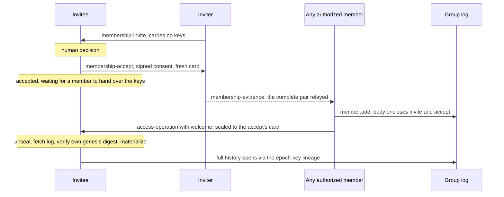
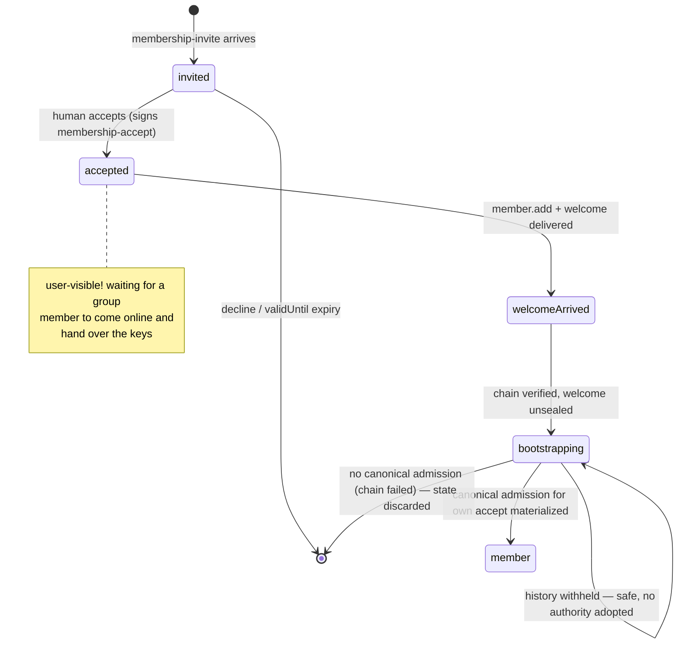

# RLTP Membership Tasks

**Real Life Trust Protocol — task types: Membership**

- **Status:** Editor's Draft
- **Version:** 0.7.0-draft (seventh casting)
- **Editors:** Anton Tranelis
- **Date:** 2026-08-11
- **Vocabulary namespace:** `https://real-life.org/rltp/v1`
- **Task-type namespace:** `https://real-life.org/trust-tasks/`
- **Target Trust Tasks framework version:** 0.4
- **Conformance profile:** `rltp-membership@0.7` (draft)
- **Position:** a task-type registration on top of the **RLTP Delivery
  Contract 0.17** (normative reference), carrying operations of the
  **RLTP Access Layer** (currently drafted as `access-layer.md` 0.3;
  the operation envelope of its §3.3 is the payload this
  specification transports; the `member.add` body members used here
  are a profile this document defines and the Access layer is
  expected to adopt).

## Abstract

This document registers the task types with which membership changes
of an RLTP group travel between people: the **invitation** and its
explicit **acceptance**, and the generic carrier for **access
operations** — including the welcome material a new member needs and
the removal notice a removed member is owed.

The dividing line is the replica boundary: inside a group, the
authority log replicates as shared state; **tasks carry operations to
parties who stand outside the replica** — the invitee who is not yet
a member, the removed member whom the capability gate has just shut
out. The log is canonical; a task is a feeder, never a second truth.
Authority never comes from a task: every operation carries its own
signatures, and its validity is judged by the Access layer's
materialization rules alone — issuance counts, arrival never.

Membership is entered only by explicit, cryptographically bound
consent, and the consent evidence travels **inside the admitting
operation**: the invitation and acceptance documents themselves,
verifiable by every replica. That makes admission verifiable without
private knowledge, lets **any authorized member** complete an
admission, and makes **invitation provenance provable** — who
invited whom is read from signatures in the log, never asserted by a
field.

## Status of This Document

This is an **Editor's Draft** with no standing beyond its own
argument, the seventh casting of this document. It is developed through
the same adversarial convergence process as the Encounter Layer and
the Delivery Contract (casting, independent adversarial review, full
recast — never a patch); the first four rounds each found blockers,
rounds five and six left a shrinking set of findings, resolved here;
this casting has not yet completed its own round. The document will change; known open
questions are collected in Section 9. Feedback is welcome via the
issues of the publication repository
(github.com/real-life-org/rltp-spec).

## 1. Introduction (informative)

### 1.1 What this fixes

The deployed app enforces membership on two disconnected planes: a
membership document that only clients check, and a relay registry
that only the relay checks. The seams show — a promoted admin passes
every client check and still cannot enforce a removal; a removed
member never canonically learns of the removal, because the same
capability gate that enforces it also cuts off the replica that would
tell them; an invitation hands the full key history to someone who
never consented to join. This specification is one half of the
repair: operations travel as first-class, acknowledged task documents
to exactly the parties the replica cannot reach, and keys travel only
after consent. The other half — one authority plane, the operation
log, with services fed by chain-proven epoch updates instead of their
own registries — belongs to the Access layer and its service ports.

### 1.2 The flow at a glance

1. A member sends an **invite** — no key material, but the inviter's
   contact card (so the answer has a key to travel under) and the
   group's genesis digest (so the invitee can later verify the
   bootstrap against what was offered).
2. The invitee decides, humanly, and sends an **accept**: signed by
   themselves, bound to that exact invite, carrying their own
   contact card (so the welcome has a key to travel under).
3. **Any authorized member** — not only the inviter — completes the
   admission: a `member.add` operation that carries the invite and
   the accept **inside its signed body**, travelling together with
   the **welcome** (the current epoch's keys, sealed to the invitee,
   digest-committed by the operation's signatures). The full history
   opens from the replica afterwards, epoch by epoch, through the
   key lineage the log itself carries (1.3). Until the welcome
   arrives, the invitee's state is honest and visible: *accepted —
   waiting for a group member to come online and hand over the keys*
   (Section 7).

The flow, as a picture (informative):

### 1.3 History through lineage, not through the welcome

The welcome carries **only the current epoch**. The group's history
is opened by the **epoch-key lineage** that the Access layer records
in the replicated log itself: at each epoch transition, the previous
epoch key travels encrypted under the new one. A new member holding
the current key therefore unlocks the entire readable history from
the replica, epoch by epoch — the group's shared world whole
(calendar, board, map), which is this profile's default. The
visibility policy narrows history exactly by omitting lineage
entries; nothing about history size ever burdens the welcome, and
nothing can be withheld from a new member that is not equally
withheld from the replica. The lineage artifact is Access-layer
property, and this document states the dependency as a
**requirement, not an option** (MO-6): the full-history default of
this profile is delivered only where the lineage exists; absent it,
a bootstrap degrades honestly to current-epoch access. This document
transports no history either way.

### 1.4 The three principles inherited

- **Issuance counts, arrival never** (Encounter 1.3): an operation's
  validity is a function of its signatures and its causal position,
  never of when its task arrived.
- **Authenticity always has exactly one carrier** (Contract 1.1): the
  operation envelope carries its signatures, encloses its consent
  evidence, and commits to its welcome by digest, so
  `access-operation` documents carry no proof; the invitation and
  the acceptance carry proofs of their own, because nothing else
  carries their authenticity while they travel alone.
- **The acknowledgement is arrival, and arrival only** (Contract
  4.2): no acknowledgement of this specification is ever a consent,
  an acceptance of membership, or a policy proof. Consent has its own
  document, signed by the person consenting.

## 2. Conventions and Terminology

The key words "MUST", "MUST NOT", "REQUIRED", "SHALL", "SHALL NOT",
"SHOULD", "SHOULD NOT", "RECOMMENDED", "NOT RECOMMENDED", "MAY", and
"OPTIONAL" are to be interpreted as described in BCP 14 [RFC2119]
[RFC8174] when, and only when, they appear in all capitals.

The **interim securing profile** of Encounter 2.3 applies. The
**document profile, sealed envelope, staged dispositions, and
acknowledgement rules** of the Delivery Contract (Sections 3–6) apply
to every type registered here. **Task proofs of this document** (on
invite and accept) MUST verify under the key bound to the document
`issuer` anchor (Encounter 2.3), and the proof's `verificationMethod`
DID MUST equal that `issuer`.

**Group** — an Access-layer group, identified by its group DID.
**Operation** — an Access-layer operation envelope (its §3.3):
self-addressing (`oid:`), causally referenced (`prev`), individually
signed (`proof.signatures`). **Materialization** — the Access layer's
deterministic derivation of group state from the operation DAG; an
operation is **canonical** when materialization at its causal
position accepts it. **Replica boundary** — the set of parties
holding (and entitled to hold) the group's replicated log at a given
materialized state. **Admission chain** — invite → accept →
`member.add`, carried in full inside the admitting operation
(Section 3.3). **Boundary-crossing `member.add`** — the
`access-operation` document that delivers an admitting `member.add`
to its own subject.

**The membership size budget:** a `membership-invite` and a
`membership-accept` document MUST NOT exceed **16 384 bytes** in
their JCS serialization. An oversized document is non-conformant at
issuance and `failed(validation-failed)` at receipt. The budget
exists so that complete enclosure (3.3) fits the Delivery Contract's
envelope bound in every normal construction, and it doubles as the
log-growth cap per admission. It is **not** a proof of fit: operation
bodies, signature sets, and the Access-owned `material` are not
bounded by this profile, so the sender MUST verify the complete
serialized task against the Contract's plaintext limit before
sealing (the Contract's stage-1 bound remains the authoritative
gate), and a welcome plaintext MUST NOT exceed 16 384 bytes in its
JCS serialization either.

**Enclosed cards are key transport, not enactment material:** the
contact cards inside invite and accept follow Encounter §6's
displayed form — their proof MUST verify under their `anchor`, and
they MUST carry neither `sentTo` nor `boundTo` and no challenge
obligation applies (they enter no enactment). No freshness is claimed
or needed — a seal needs a *live* key, not a fresh one; creating the
card for this thread is RECOMMENDED, required is only the retention
of Section 5.

## 3. Registered Task Types

### 3.1 `membership-invite/0.1`

The invitation: one member proposes membership to a person outside
the group. **It carries no key material and no operation** — nothing
a non-accepting recipient could hold against the group.

- `payload`: per `schemas/payload-membership-invite.schema.json` —
  `invite` object with:
  - `group` — the group DID;
  - `inviter` — anchor; MUST equal the document `issuer`;
  - `invitee` — anchor; MUST equal the document `recipient`. Signed
    into the invite so that consent cannot be transplanted: only
    this person's accept answers this invite;
  - `card` — the inviter's contact card. Its proof MUST verify under
    its `anchor`, and `card.anchor` MUST equal `inviter` — the
    accept is sealed to this card's key-agreement key, so ownership
    is a confidentiality requirement, not bookkeeping;
  - `genesisDigest` — multibase multihash of the group's genesis
    operation. This identifies the group's **lineage** (two
    divergent histories can share a genesis — it is not a state
    commitment); its role is bootstrap verification (3.3);
  - `validUntil` — RFC3339; bounds the invite's answerable life and
    the inviter's reply-key retention (Section 5), and MUST be ≥ the
    document's `issuedAt`. Stated honestly: the comparison runs
    against issuance times the issuer controls — it is an
    honest-clock bound and a retention anchor, not a cryptographic
    freshness proof; the effective gate on stale consent is the
    human admission decision (3.3);
  - optional display fields (`name`, `note`, bounded).
- `threadId`: fresh — opens the membership thread.
- `proof`: **REQUIRED**, verifying under `issuer` (Section 2).
- **Declarations (TT §7.3):** side effects: durable buffering and
  surfacing to the human only; exposure: recipient-only while
  travelling; on admission the invite becomes part of the group's
  log (3.3) and is thereby visible to the group — invitation is not
  anonymous, by design (provenance, 3.3).
- **Key obligation:** the inviter MUST retain the key-agreement
  private key of `card` at least until `validUntil` plus the longest
  adapter give-up horizon (Contract §5's retention rule, anchored to
  the invite instead of the card's last display).
- **Defined effect:** durable buffering plus surfacing for the
  recipient's decision. Accepting or ignoring is a human act; the
  acknowledgement says arrival, never inclination.

### 3.2 `membership-accept/0.1`

The explicit acceptance — the consent artifact. **Membership is
entered only through it:** a `member.add` admitting a subject across
the replica boundary MUST enclose a valid accept (3.3); without one,
issuing such a `member.add` is non-conformant, and a welcome MUST NOT
be sent.

- `payload`: per `schemas/payload-membership-accept.schema.json` —
  `accept` object with:
  - `group` — MUST equal the referenced invite's `group`;
  - `subject` — anchor; MUST equal the document `issuer` (consent is
    signed by the person consenting) **and** MUST equal the
    referenced invite's `invitee` (consent cannot be transplanted);
  - `ref` — the document digest of the invite being accepted
    (content-bound: this accept answers exactly that invitation);
  - `card` — the subject's contact card. Its proof MUST verify under
    its `anchor`, and `card.anchor` MUST equal `subject` — the
    welcome is sealed to this card's key-agreement key; a foreign
    card here would redirect the group's keys, so ownership
    verification is mandatory at every consumer (receipt AND
    admission AND materialization, 3.3).
- `threadId`: = the invite's `threadId`.
- `proof`: **REQUIRED**, verifying under `issuer` (Section 2).
- `recipient`: the invite's `issuer`. Other members receive the
  accept inside the admitting operation (3.3), not by fan-out.
- **Consistency (MUST, on receipt, before any effect):** proof
  verifies under `issuer`; `issuer` = `accept.subject`; `ref`
  matches a `membership-invite` this recipient actually sent on this
  thread; `accept.subject` = that invite's `invitee`; `accept.group`
  = that invite's `group`; `accept.card` verifies and its anchor
  equals `subject`; the accept's `issuedAt` **and** its
  `proof.created` are ≤ the invite's `validUntil` +
  `membership-skew` (Section 5). Any failure →
  `failed(validation-failed)`, no acknowledgement.
- **Defined effect:** durable recording of the consent. The consent
  is input to the group's admission policy (Access §4); the accept
  itself grants nothing, and **one accept authorizes at most one
  admission** (3.3).

### 3.3 `access-operation/0.1`

The generic carrier: one Access-layer operation, travelling to a
party outside the replica boundary.

- `payload`: per `schemas/payload-access-operation.schema.json` —
  `operation` (the Access §3.3 envelope, validated against
  `schemas/access-operation-envelope.schema.json`) and OPTIONAL
  `welcome` (a `rltp-welcome/0.1` welcome seal, Section 4).
- `threadId`: = the membership thread when the operation is the
  admitting `member.add`; fresh otherwise.
- `proof`: **absent** — the operation envelope carries its own
  signatures (one carrier).
- **Outer/inner consistency (MUST, before any effect):**
  - the document `issuer` MUST equal `operation.author` or one of
    `operation.proof.signatures[].signer`;
  - **pre-buffer validation** (needs no group state; MUST pass
    before any durable buffering): payload schemas valid; the
    operation's `id` recomputes; every signature in
    `operation.proof` verifies under its signer's anchor;
  - if `welcome` is present: the operation is an admitting
    `member.add` (its body per the profile below), the document
    `recipient` equals `operation.body.subject`, and
    `admission.welcome` equals the digest of the welcome's plaintext
    (Section 4), with the welcome's binding fields matching the
    operation.
  A violation is `failed(validation-failed)` and earns no
  acknowledgement.
- **The boundary-crossing rule (MUST):** the `access-operation`
  document that delivers an admitting `member.add` **to its own
  subject** MUST carry the welcome. A boundary-crossing `member.add`
  without a welcome is non-conformant at the sender and
  `failed(validation-failed)` at the receiver.
- **Declarations (TT §7.3):** side effects: mutating (log merge,
  bootstrap, removal hygiene); exposure: recipient-only.
- **The `member.add` body profile (MUST; defined here, expected to
  be adopted by the Access layer — MO-5):** an admitting
  `member.add`'s body carries:
  - `subject` — the admitted anchor;
  - `admission` — **the full consent evidence**:
    `{ "invite": <the complete membership-invite document>,
       "accept": <the complete membership-accept document>,
       "welcome": <digest of the welcome plaintext, Section 4> }`.
  Enclosing the documents (not digests) is what makes admission
  verifiable without private knowledge: every replica — and every
  member who wants to complete an admission — holds the evidence.
  The documents are validated by their own schemas via the profile
  schema (`schemas/payload-access-operation.schema.json` applies the
  body profile when `operation.op` = `member.add`).
- **Materialization requirements for `member.add` (MUST; the
  consumable-consent rule of this profile):** materialization accepts
  an admitting `member.add` only if, at its causal position:
  1. both enclosed documents validate against their schemas and
     their proofs verify (invite under `invite.inviter`, accept
     under `accept.subject`, each per Section 2's rule applied to
     the enclosed document);
  2. all cross-bindings hold: `accept.ref` = document digest of the
     enclosed invite; `accept.subject` = `invite.invitee` =
     `body.subject`; `accept.group` = `invite.group` =
     `operation.group`; `invite.inviter` = the enclosed invite
     document's `issuer`; card ownership per 3.1/3.2;
  3. the time window holds: the accept's `issuedAt` and
     `proof.created` ≤ `invite.validUntil` + `membership-skew`;
  4. `invite.inviter` is an authorized inviter at the operation's
     causal position (per the group's policy);
  5. **the accept is consumed exactly once, merge-stably**, in two
     steps. *Causal step:* a candidate whose `prev` closure already
     contains a rule-passing admission for the same accept digest is
     **non-canonical outright** — at its own causal position the
     accept is consumed; a causally later replay can never displace
     its ancestor, so grinding by re-issuing is dead. *Concurrency
     step:* among the remaining candidates — mutually concurrent by
     construction — exactly **one** is canonical: the one whose
     operation `id` is smallest under **unsigned bytewise comparison
     of the complete `oid:` string's ASCII bytes** (an exact total
     order; no locale, no alphabet-value comparison, no decoding).
     Replicas holding the same DAG select the same winner; a
     later-*merged* genuinely concurrent admission can displace an
     earlier-seen one, so implementations MUST treat admission
     canonicality as revisable until the DAG is stable (N2).
     Displacement is benign for **membership**: all candidates
     enclose the identical accept (digest-equal ⇒ JCS-identical) and
     therefore the identical invite, subject, and group — the
     displaced invitee IS the canonically admitted member; only the
     admitting operation differs. **Key handover is
     arbitration-independent:** the bootstrap effect (case 1) is
     served by ANY rule-passing candidate's welcome; arbitration
     selects the canonical admission and never invalidates a
     delivered welcome — a candidate with unusable `material` harms
     only handover redundancy, never membership. Residuals, stated:
     welcomes of adjacent epochs from concurrent admitters are
     prospective-only exposure, and under a history-narrowing
     visibility policy the group SHOULD issue an `epoch.rotate` upon
     merging a displacement (Section 8); and a member fabricating
     concurrency can steer *whose* operation is canonical — subject,
     invite, and accept being fixed, that steers attribution of the
     admitting act among already-authorized members, never
     authority. Additional document-level
     checks in rule 2 apply: the enclosed invite document's
     `recipient` = `invite.invitee`; the enclosed accept document's
     `recipient` = the enclosed invite document's `issuer`; both
     documents share the invite's `threadId`; `invite.validUntil` ≥
     the invite document's `issuedAt`.
  A `member.add` failing any of these is not canonical, whatever its
  signatures. *(These rules live here as a profile; the Access layer
  owns materialization and is expected to adopt them — MO-5.)*
- **Invitation provenance (derived, never asserted):** who invited a
  member is read from the enclosed, signed invite of the canonical
  admission — in the log, verifiable by every member. Applications
  MUST be able to display provenance from it; no separately asserted
  "added by" field exists in this profile.
- **Defined effects, by case:**
  1. **Bootstrap (boundary-crossing `member.add` + welcome):** this
     document is **self-contained** — its effect MUST NOT require
     resolving the operation's `prev` closure. The invitee MUST
     verify, before any effect: the pre-buffer checks; that
     `admission.accept`'s document digest equals the digest of **the
     invitee's own accept** (JCS-canonical identity); that
     `admission.invite`'s document digest equals the invitee's own
     `accept.ref` (and is thereby the invitee's own received
     invite); `body.subject` = own anchor = the enclosed
     `accept.subject`; `operation.group` = own accept's `group`;
     `admission.welcome` = digest of the enclosed welcome plaintext,
     whose binding fields match the operation (Section 4). Then the
     effect: durably buffer operation and welcome, unseal the
     welcome, and start the Access bootstrap — fetch the log,
     **verify the fetched genesis against the OWN invite's
     `genesisDigest`** (the one the accept bound; a divergent-lineage
     bootstrap fails here), materialize, and confirm **two things —
     never that the carrier itself won arbitration**: (a) the
     carrier operation passes rules 1–4 and the causal-consumption
     step of rule 5, evaluated at its causal position (the operation
     plus its `prev` closure, never an unspecified network head);
     and (b) the materialized DAG contains **a canonical admission
     for the invitee's own accept digest** — the carrier or a
     concurrent sibling, indifferent: all candidates admit the same
     subject, so membership stands and the delivered welcome remains
     effective either way (rule 5). Bootstrap state is discarded
     only when NO canonical admission for the own accept exists —
     the chain itself failed. A counterparty withholding required
     history can delay confirmation indefinitely; the invitee then
     remains safely in the bootstrapping state and adopts no
     authority.
  2. **Removal notice (`member.remove` whose subject = the
     `recipient`):** effect = durable buffering plus an immediate
     merge attempt against the recipient's own replica. **Removal
     hygiene** (Access §5.3) triggers **only when materialization
     accepts the removal as a new canonical transition** — never on
     delivery. A forged operation fails materialization and triggers
     nothing; a replayed or already-materialized operation is
     idempotent by operation id and triggers nothing new.
  3. **Other operations:** durable buffering for log merge.
- **Dependency (`incomplete(missing)`, Contract 6.2):** this type
  declares the one dependency `group-state`: an operation whose
  `prev` closure cannot be resolved against any local state of that
  group — except case 1, self-contained by definition — is disposed
  `incomplete(missing: group-state)`. Mechanics as in the second
  casting, unchanged: pending store keyed by document digest;
  redelivery idempotent, retention from first receipt, never reset;
  triggers coalesced and re-evaluations serialized per group;
  retention ≥ `bootstrap-retention`, discard after, fresh evaluation
  on later redelivery; quotas MAY, behind the pre-buffer floor.
- **Idempotency, two levels:** redelivery of the same document is
  `duplicate-known` (byte-identical re-ack); a different document
  carrying the same operation merges idempotently by operation id —
  effects keyed to new canonical transitions fire at most once per
  operation.

### 3.4 `membership-evidence/0.1`

The evidence relay's wire form: any holder of the consent pair MAY
hand it to any authorized member, so that any member can complete an
admission (the availability property of 1.2). The original documents
cannot simply be re-sealed — their signed `recipient` fields name the
invitee and the inviter, and the Contract's receiver principle would
rightly reject them — so they travel **enclosed**, exactly as they
later travel inside the admitting operation.

- `payload`: per `schemas/payload-membership-evidence.schema.json` —
  `evidence` object enclosing the COMPLETE `invite` and `accept`
  documents (proofs required; same shapes as `admission` in 3.3).
- `threadId`: = the membership thread (the invite's).
- `proof`: **absent** — the enclosed documents carry their own
  proofs; the relayer adds no authority and needs no signature (the
  same one-carrier reasoning as `access-operation`).
- **Consistency (MUST, before any effect — the pair-internal check
  set, enumerated):** both enclosed documents validate against their
  schemas and their proofs verify (invite under `invite.inviter`,
  accept under `accept.subject`, per Section 2 applied to enclosed
  documents); `accept.ref` = document digest of the enclosed invite;
  `accept.subject` = `invite.invitee`; `accept.group` =
  `invite.group`; the enclosed invite document's `recipient` =
  `invite.invitee` and the enclosed accept document's `recipient` =
  the enclosed invite document's `issuer`; both share the invite's
  `threadId`; `invite.validUntil` ≥ the invite document's `issuedAt`
  and the accept's `issuedAt` and `proof.created` ≤ `validUntil` +
  `membership-skew`; card ownership per 3.1/3.2. *(No equality of
  this list references an operation — evidence has none.)* Any
  failure → `failed(validation-failed)`, no acknowledgement.
- **Recipient authorization (MUST):** the sender addresses evidence
  only to a party it believes authorized to admit in
  `invite.group`; the receiver verifies **its own** authorization
  against its group state before the effect. A receiver holding no
  state for that group does not fail — the type declares the same
  `group-state` dependency as 3.3: the document is
  `incomplete(missing: group-state)` under the identical pending
  mechanics (keyed by document digest, retention from first
  receipt, `bootstrap-retention`); a receiver that resolves the
  state and finds itself unauthorized then disposes
  `failed(validation-failed)`.
- **Declarations (TT §7.3):** side effects: durable buffering and
  surfacing only; exposure: recipient-only.
- **Defined effect, semantically idempotent:** durable buffering of
  the verified pair as admission evidence, keyed by **the enclosed
  accept's document digest** — surfacing to the member's admission
  decision happens at most once per accept; a further wrapper for an
  already-held accept has a no-op effect and is still acknowledged
  (arrival is arrival). The evidence grants nothing and consumes
  nothing; issuing the admission remains a deliberate act under the
  group's policy.

## 4. The Welcome Seal

The welcome carries what the current epoch requires and nothing more;
history opens through the lineage in the replica (1.3).

- **Plaintext** is a `rltp-welcome/0.1` document
  (`schemas/welcome.schema.json`): `{ "v": "rltp-welcome/0.1",
  "group", "subject", "accept": <document digest of the accept this
  admission consumes>, "material": { …Access-owned: current epoch
  keys and the subject's implicit capability… } }`. The binding
  fields (`v`, `group`, `subject`, `accept`) are owned by this
  specification and closed; `material` is owned by the Access layer
  and opaque here (MO-4). *(The welcome binds the accept, not the
  operation id: the operation's id covers `admission.welcome`, so a
  welcome pointing back at the id would be a hash fixed point and
  unconstructible. One carrier, one direction: the operation commits
  to the welcome.)*
- **Commitment:** `admission.welcome` in the operation body is the
  multibase multihash over `JCS(plaintext)`. The operation's
  signatures cover the body, so the welcome's one authenticity
  carrier is the operation: it cannot be swapped between groups,
  subjects, or admissions without breaking either the digest or the
  binding fields, which the receiver MUST verify against the
  operation (`group` = `operation.group`, `subject` =
  `body.subject`, `accept` = the document digest of the enclosed
  `admission.accept`).
- **Seal construction:** as Contract §5 with two deliberate
  differences — HKDF info `rltp/v1/welcome` (domain separation), and
  the plaintext is the `rltp-welcome` document, **never a delivery
  document**: a welcome seal never enters Contract 6.2. The
  recipient key is the key-agreement key of the **accept's enclosed
  card** (ownership-verified, 3.2); the subject MUST retain that key
  per Contract §5's retention rule from the accept's issuance.
- **Size:** the welcome plaintext MUST NOT exceed 16 384 bytes in
  its JCS serialization (Section 2); no continuation mechanism
  exists. Fit of the complete task is governed by the sender's
  mandatory final serialized-size check against the Contract's
  plaintext limit (Section 2) — never assumed.

## 5. Timing

| Parameter | Default | Meaning |
|---|---|---|
| `invite-validity` | P90D | default for `validUntil` when the inviter names none |
| `membership-skew` | PT5M | clock-skew allowance of this profile; widens every comparison of Section 3 toward acceptance (registered here — Encounter's `skew-tolerance` is pinned to its ceremony and not borrowed) |
| `bootstrap-retention` | P90D | minimum retention of an `incomplete(missing: group-state)` document, from first receipt; redelivery never resets it |

Delivery time is unbounded (Contract §7); no rule of this document
references arrival time for validity. The one issuance-time window —
accept against `validUntil` — is an honest-clock bound (3.1), widened
by `membership-skew`; clock tolerance never rejects.

## 6. What is deliberately absent

- **No member-update signal type.** The operations themselves travel
  as tasks; the canonical truth remains the materialized log.
- **No membership-level acknowledgement.** Arrival is the ack's
  whole meaning; group state is read from the log.
- **No service frames.** Services learn authority from chain-proven
  epoch updates (Access §10), never from their own registries, and
  never via trust tasks.
- **No history transport.** The welcome carries one epoch; history
  is the replica's lineage (1.3). Fit is enforced by the sender's
  final size gate (Section 2), never assumed.

## 7. State Machines (informative)

**Invitee:** `invited (human decision pending) → accepted — waiting
for a group member to come online and hand over the keys → welcome
arrived → bootstrapping (fetch log, verify genesis against own
invite, materialize incl. own admission) → member` — the waiting
state MUST be user-visible as such; decline or expiry ends the
thread with local state only.

**Admitting member (any authorized member):** `admission evidence at
hand → verify chain → issue member.add enclosing invite + accept,
with welcome → done`. The evidence reaches non-inviter members via
`membership-evidence` (3.4) — that wire form is what makes "any
authorized member can admit" operationally true rather than merely
possible.

**Removed member:** `remove-op arrives → merge attempt against own
replica → canonical? → hygiene` — a non-canonical op changes nothing.

## 8. Security Considerations

- **A task conveys, never authorizes.** Every acceptance decision
  about an operation is materialization; validate-then-consume holds
  throughout, and the pre-buffer checks keep even the pending store
  behind signature verification.
- **Consent is verifiable by everyone who must judge it:** the
  admitting operation encloses the signed invite and accept, so
  materialization verifies the chain itself — a malicious authorized
  member cannot make a consentless admission canonical, and the
  consumable rule caps one admission per accept.
- **Keys travel only after consent,** sealed to an
  ownership-verified key from the accept, digest-committed by the
  admitting operation. A person who never accepts never holds group
  material; a substituted card breaks a mandatory check at receipt,
  admission, and materialization alike.
- **History is as revocable as the replica:** the welcome cannot
  leak more than the current epoch; everything older is governed by
  the lineage in the log and the visibility policy.
- **The removal notice is honest but not privileged:** hygiene fires
  only on a canonically materialized removal.
- **Rotation on displacement:** upon merging a displacement of a
  concurrent admission (3.3 rule 5), the group SHOULD issue an
  `epoch.rotate` where a history-narrowing visibility policy is in
  force — the adjacent-epoch exposure of the displaced welcome is
  prospective-only, and the rotation closes it forward.
- **Provenance without assertion:** the signed invite in the
  canonical admission is the answer to "who invited"; there is no
  assertable field to forge.
- **The permanence cost of enclosure, stated in full:** for every
  admitted member, the log permanently replicates the complete
  invite and accept — sender and recipient anchors, thread and
  document identifiers, issuance and proof timestamps, both contact
  cards including key identifiers and any `deliveryHints`, display
  fields, and both proofs. Invitation is not anonymous, by design;
  correlation across these fields is group-internal but permanent.
  The size budget (Section 2) caps growth at ≤ 32 KiB of evidence
  per admission; issuers SHOULD keep membership cards minimal — in
  particular, `deliveryHints` SHOULD be absent from cards enclosed
  in membership documents.

## 9. Open Issues

- **MO-1 Fan-out inside the boundary.** Whether operations SHOULD
  additionally travel as tasks to members whose replicas lag. This
  casting says: replication owns the inside.
- **MO-2 Policy-proof transport.** Richer admission policies (Z9)
  need more inputs than one accept.
- **MO-3 Leave and dissolve notices.**
- **MO-4 The `material` schema** is Access-layer property; pinned
  once the Access layer converges.
- **MO-5 Upstreaming the `member.add` body profile** (`subject`,
  `admission`, the materialization rules 1–5, the consumable-accept
  rule) into the Access layer's next casting.
- **MO-6 The epoch-key lineage** (1.3) is Access-layer property;
  this document depends on its existence for the full-history
  default and pins nothing about its form.

## 10. Conformance

- **Profile** `rltp-membership@0.7`; normatively references
  `rltp-delivery@0.17`; profiles the Access operation envelope and
  `member.add` body as stated.
- **Normative schemas (shipped, offline closure):**
  `schemas/payload-membership-invite.schema.json` ·
  `schemas/payload-membership-accept.schema.json` ·
  `schemas/payload-membership-evidence.schema.json` ·
  `schemas/payload-access-operation.schema.json` ·
  `schemas/welcome.schema.json` ·
  `schemas/access-operation-envelope.schema.json` (transcription).
- **Vector plan:** *(round-1 set)* invite proof/issuer/recipient
  binding vectors · accept issuer/subject/ref/group vectors ·
  transplantation rejected · consumable accept: one accept, two
  adds → second non-canonical · welcome digest and binding-field
  vectors · welcome next to non-admitting op rejected · issuer
  neither author nor signer rejected · pre-buffer rejections touch
  no storage · unknown-group op → incomplete, re-evaluation, ack on
  completion · pending idempotency and retention vectors ·
  duplicate-known re-ack · removal: forged / replayed / genuine ·
  *(round-2 additions)* valid authorized operation with invented
  admission digests → materialization rejects (documents cannot be
  invented: they must enclose and verify) · own accept but
  substituted enclosed invite → `accept.ref` mismatch →
  materialization rejects and bootstrap rejects · operation group ≠
  enclosed accept/invite group → rejected · foreign card anchor in
  invite or accept → rejected at receipt, admission, and
  materialization · enclosed card with `sentTo`/`boundTo` →
  rejected (displayed form) · boundary-crossing `member.add`
  without welcome → `failed(validation-failed)` · post-expiry
  accept: `issuedAt` and `proof.created` beyond
  `validUntil + membership-skew` → rejected; backdated pair inside
  the window → accepted and honestly documented as human-gated ·
  bootstrap: divergent lineage (fetched genesis ≠ own invite's
  digest) → bootstrap fails, state discarded · bootstrap
  self-contained: never `incomplete` · welcome size: plaintext over
  16 384 bytes JCS non-conformant (no continuation
  mechanism exists) · provenance read from the canonical admission
  equals the enclosed invite's signed inviter · *(round-3
  additions)* welcome constructibility: welcome binds the accept
  digest, never the operation id — a construction attempt with a
  back-pointer is impossible and the schema rejects the field ·
  concurrent consumption: two concurrent admissions enclosing the
  same accept on divergent branches → after merge exactly one
  canonical (smallest operation id), on every replica identically;
  admission canonicality revisable until DAG-stable · size budget:
  invite or accept over 16 384 bytes JCS → non-conformant at
  issuance, `failed(validation-failed)` at receipt; the sender's
  final serialized-size check is the fit gate, never assumption ·
  enclosed
  document without proof → schema-rejected · welcome beside a
  non-`member.add` operation → schema-rejected · document-level
  materialization checks: enclosed invite recipient ≠ invitee,
  enclosed accept recipient ≠ invite issuer, thread mismatch,
  `validUntil` < invite `issuedAt` → each non-canonical · evidence
  relay (3.4): relayed pair validates as historical evidence and a
  member admitting from it produces a canonical admission; a
  tampered enclosed document fails its proof → rejected; a re-sealed
  ORIGINAL document (not enclosed) → `failed(wrong-recipient)` per
  the Contract, as intended · lineage absent → bootstrap degrades to
  current-epoch access, honestly surfaced, nothing else breaks ·
  *(round-4 additions)* oid ordering: candidates whose ids differ
  only in `-` vs `A` prefix rank by unsigned ASCII bytes,
  identically on every replica · displacement: same-subject argument
  holds (winner and displaced admit the same subject); under a
  narrowing policy a displacement merge triggers the SHOULD-rotate ·
  size: sender-side final serialized check enforced; a schema-valid
  construction exceeding the Contract limit is rejected at the
  sender and, if sent anyway, at Contract stage 1 · welcome
  plaintext over 16 384 bytes JCS → non-conformant · *(round-5
  additions)* causal replay of an already-consumed accept →
  non-canonical outright (never enters arbitration); grinding by
  re-issuance dead · genuinely concurrent displacement → membership
  unchanged (same subject), delivered welcome stays valid,
  SHOULD-rotate fires under narrowing policy · evidence to a
  non-member: receiver with state → `failed(validation-failed)`;
  receiver without state → `incomplete(missing: group-state)`,
  resolved on state arrival · repeated evidence wrappers for one
  accept → one surfacing, no-op effects, each wrapper acknowledged ·
  evidence check set is pair-internal: a validator referencing
  operation fields fails the suite.
- Every normative statement is vector-testable or explicitly marked
  state-dependent.

## References

[RFC2119] · [RFC8174] BCP 14 · [RFC8785] JCS · [TT] ToIP DTGWG Trust
Tasks framework 0.4 · **RLTP Delivery Contract 0.17** (normative) ·
**RLTP Encounter Layer 0.19** (securing profile 2.3, principles 1.3,
contact card §6) · RLTP Access Layer draft 0.3 (operation envelope
§3.3, welcome material §5.3, policy §4, visibility §8, service ports
§10).
