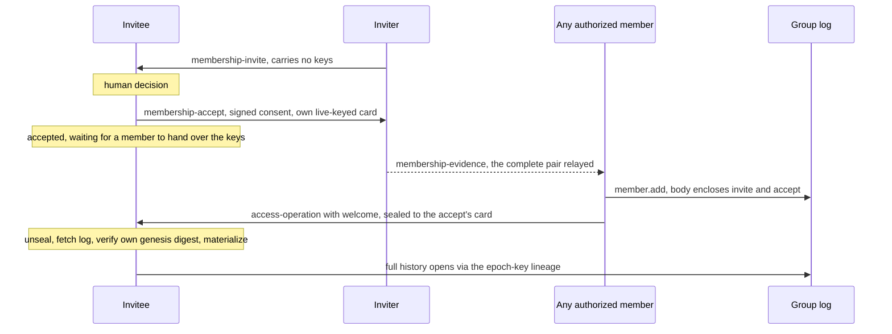
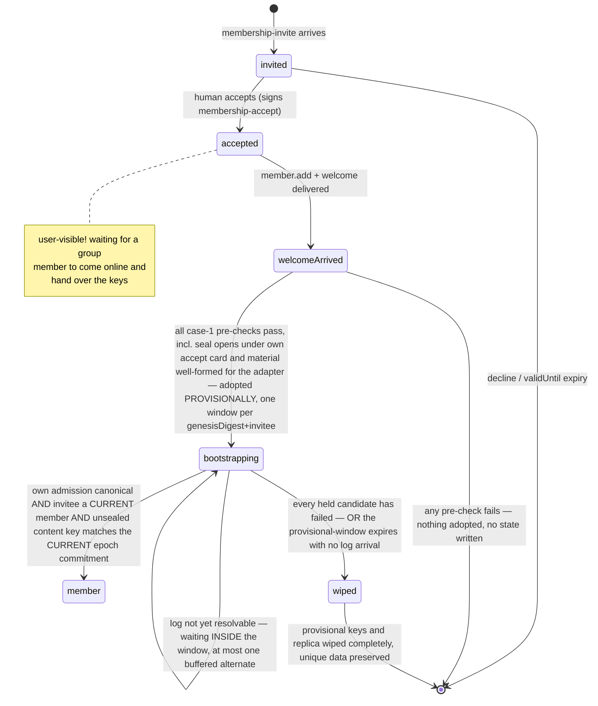

# RLTP Membership Tasks

**Real Life Trust Protocol — task types: Membership**

- **Status:** Editor's Draft
- **Version:** 0.16.0-draft (sixteenth casting)
- **Editors:** Anton Tranelis
- **Date:** 2026-08-24
- **Vocabulary namespace:** `https://real-life.org/rltp/v1`
- **Task-type namespace:** `https://real-life.org/trust-tasks/`
- **Target Trust Tasks framework version:** 0.4
- **Conformance profile:** `rltp-membership@0.16` (draft)
- **Position:** a task-type registration on top of the **RLTP Delivery
  Contract 0.69** (normative reference; its §4.4 registry carries
  these types), carrying operations of the
  **RLTP Access Layer 0.53** (normative reference; its wire forms
  remain `0.24`, so the transcribed schemas of this document stand
  byte-identically): the operation
  envelope of its §3.3 is the payload this specification transports,
  and **the Access layer owns every question of authority** —
  admission validity and canonicality (its §5.3), the `member.add`
  body profile (its §4.5), materialization and merge outcomes (its
  §3.5/3.6), key material (its §9.5), and the removal notice (its
  §10.2). This document owns the travel: which documents exist, what
  they bind, how they are checked on receipt, and what a receiver
  does with them.
- **Supersedes:** version 0.15 and earlier (archived as
  `archive/membership-tasks-0.15.md`,
  `archive/membership-tasks-0.14.md`,
  `archive/membership-tasks-0.13.md`,
  `archive/membership-tasks-0.12.md`,
  `archive/membership-tasks-0.11.md`,
  `archive/membership-tasks-0.10.md` … `-0.1.md`).

## Abstract

This document registers the task types with which membership changes
of an RLTP group travel between people: the **invitation** and its
explicit **acceptance**, and the carrier that delivers the
**admitting operation and its welcome** to a new member across the
replica boundary.
(The removal notice a removed member is owed travels as the Access
layer's own compact task, `removal-notice/0.1` — Access §10.2;
transition-bearing operation envelopes never cross the replica
boundary at all, Access §5.3.)

The dividing line is the replica boundary: inside a group, the
authority log replicates as shared state, and **exactly one
operation crosses the boundary as a task** — the admitting
`member.add` delivered to its own subject, the invitee who is not
yet a member and holds no replica to receive it from. The removed
member, whom the capability gate has just shut out, is owed a
signed **claim** rather than an operation (Access
`removal-notice/0.1`, its §10.2). The log is canonical; a task is a
feeder, never a second truth.
Authority never comes from a task: every operation carries its own
signatures, and its validity is judged by the Access layer's
materialization rules alone — issuance counts, arrival never.

Membership is entered only by explicit, cryptographically bound
consent, and the consent evidence travels **inside the admitting
operation**: the invitation and acceptance documents themselves,
verifiable by every replica. That makes admission verifiable without
private knowledge, lets **any authorized member** complete an
admission, and makes **invitation provenance provable** — who
invited whom is read from signatures in the log, never asserted by a
field.

## Status of This Document

This is an **Editor's Draft** with no standing beyond its own
argument, the sixteenth casting of this document. It is developed
through the same adversarial convergence process as its companions
(casting, independent adversarial review, full recast — never a
patch). The tenth and eleventh castings closed the joint seam with
Access 0.24/0.25 on both sides.

The twelfth through fifteenth castings are this document's half of the **M-DID
loop** (`design/mdid-loop-zerlegung-2026-08.md`,
`design/mdid-guss-plan-2026-08.md`), recast against **Access
0.26**: every anchor of this document's flow — `invite.inviter`,
`invite.invitee`, `accept.subject`, the enclosed cards' anchors,
and thereby `member.add`'s `body.subject` — is a **member anchor**
(Access §5.1: the per-group context anchor; DTGWG: M-DID), never a
cross-group coordinate. Three consequences are this casting's
substance: the **prelude** — the inviter cannot derive the
invitee's member anchor, so the invitee's app supplies it over the
existing relationship channel before the formal invite (3.1), an
application exchange like the human decision itself, stated
honestly rather than hidden; the enclosed **cards are member-anchor
cards** and MUST carry no `deliveryHints` (Section 2 — the log's
permanence now prices in group-scoped identifiers only); and the
**candidacy** of the vouched admission path SHOULD be
surfaced into the group space as Layer-4 content (3.4 — Access
§5.3 owns the flow's authority rules; this document owns only the
travel and the surfacing duty). The transcribed Access schemas
stand byte-identically (wire `0.24` unchanged — the coupling of
Section 10 holds without a break); the Access section references
of this document cite Access 0.26 **as of that casting** — this is
genealogy, not the current companion pin; §10 carries that. This casting begins a
fresh convergence loop; the eleventh casting's seam-closure
applies to it, not to this draft.

The thirteenth casting answers the loop's joint round 1
(`design/mdid-joint-review1-2026-08.md`): the **prelude is closed
at its consumer** — the invitee MUST verify, on invite receipt,
that `invite.invitee` equals its own derivation from
`invite.genesisDigest`, so no substitution or mis-binding
survives to an accept (M6); and the **candidacy becomes explicit
consent** — the accept (type bumped to `membership-accept/0.2`)
carries a signed `candidacy` boolean, the pre-admission surfacing
of 3.4 is gated on it, and the candidacy content has a stated
lifecycle with the honest one-way-door sentence (M10 — the
opt-in exists precisely because group-space publication cannot be
recalled). Companion pins moved with the joint castings (**then** Delivery 0.21 and Access 0.29 — this is genealogy, not the current pin; §10 carries that). The
fourteenth casting answers joint round 2: the candidacy lifecycle
names only **observable** triggers — completed admission and
invite expiry — and states that a group's refusal is deliberately
NOT an observable event (refusal privacy: no artifact announces
"we decided against"), so earlier removal stays at the surfacing
member's discretion; and the normative references pin the joint
castings consistently (M4/M5). The **sixteenth casting is the DTG
adoption cast** (`design/dtg-credential-adoption-2026-08.md`): the
invitation becomes **`membership-invite/0.2`, a conformant DTG
InvitationCredential** — issuer = the inviting member's anchor,
`credentialSubject.id` = the invitee's member anchor, `validUntil`
native, `taskContext` = the membership thread (the WD01 binding,
adopted), and every RLTP field (`group`, `genesisDigest`, `card`)
a WD01-legal additional subject property. The invite's proof is
the VC's own DataIntegrityProof (one carrier — the document-level
task proof falls away for the invite; the accept keeps its task
proof). Every consumer check maps one-to-one onto the new paths;
nothing weakens.
Feedback is welcome via the issues of the publication repository
(github.com/real-life-org/rltp-spec).

## 1. Introduction (informative)

### 1.1 What this fixes

The deployed app enforces membership on two disconnected planes: a
membership document that only clients check, and a relay registry
that only the relay checks. The seams show — a promoted admin passes
every client check and still cannot enforce a removal; a removed
member never canonically learns of the removal, because the same
capability gate that enforces it also cuts off the replica that would
tell them; an invitation hands the full key history to someone who
never consented to join. This specification is one half of the
repair: consent, the admitting operation, and the keys it commits to
travel as first-class, acknowledged task documents to exactly the one
party the replica cannot reach — the invitee — while the removed
member is owed a compact signed notice of their own (Access §10.2);
and keys travel only after consent. The other half — one authority plane, the operation
log, with services fed by chain-proven epoch updates instead of their
own registries — belongs to the Access layer and its service ports.

### 1.2 The flow at a glance

0. The **prelude** (application-level, over the existing
   relationship channel): the inviter asks, the invitee's app
   derives the invitee's **member anchor** for the offered group
   from the genesis digest (Access §5.1, Identity §6's
   `group/<digest>` context) and answers with it — the inviter
   cannot derive another person's context anchor, so the formal
   invite can name it only after this exchange.
1. A member sends an **invite** — no key material, but the inviter's
   contact card at the inviter's own member anchor (so the answer
   has a key to travel under) and the group's genesis digest (so
   the invitee can later verify the bootstrap against what was
   offered). It names the invitee's member anchor from the
   prelude.
2. The invitee decides, humanly, and sends an **accept**: signed by
   themselves, bound to that exact invite, carrying their own
   contact card (so the welcome has a key to travel under).
3. **Any authorized member** — not only the inviter — completes the
   admission: a `member.add` operation that carries the invite and
   the accept **inside its signed body**, travelling together with
   the **welcome** (the current epoch's keys, sealed to the invitee,
   digest-committed by the operation's signatures). The full history
   opens from the replica afterwards, epoch by epoch, through the
   key lineage the log itself carries (1.3). Until the welcome
   arrives, the invitee's state is honest and visible: *accepted —
   waiting for a group member to come online and hand over the keys*
   (Section 7).

The flow, as a picture (informative):

### 1.3 History through lineage, not through the welcome

The welcome carries **only the current epoch**. The group's history
is opened by the **epoch-key lineage** that the Access layer records
in the replicated log itself: at each epoch transition, the previous
epoch key travels encrypted under the new one. A new member holding
the current key therefore unlocks the entire readable history from
the replica, epoch by epoch — the group's shared world whole
(calendar, board, map), which is this profile's default. The
visibility policy narrows history exactly by omitting lineage
entries; nothing about history size ever burdens the welcome, and
nothing can be withheld from a new member that is not equally
withheld from the replica. The lineage is Access-layer property
and, since Access 0.24, a normative fact rather than a dependency
this document must demand: Access §7.1 requires every transition
to carry its lineage state explicitly (MO-6 discharged). The
full-history default of this profile is delivered exactly as far
as unbroken lineage reaches; across a narrowed or damaged span, a
bootstrap degrades honestly to current-epoch access. This document
transports no history either way.

### 1.4 The three principles inherited

- **Issuance counts, arrival never** (Encounter 1.3): an operation's
  validity is a function of its signatures and its causal position,
  never of when its task arrived.
- **Authenticity always has exactly one carrier** (Contract 1.1): the
  operation envelope carries its signatures, encloses its consent
  evidence, and commits to its welcome by digest, so
  `access-operation` documents carry no proof; the invitation and
  the acceptance carry proofs of their own, because nothing else
  carries their authenticity while they travel alone.
- **The acknowledgement is arrival, and arrival only** (Contract
  4.2): no acknowledgement of this specification is ever a consent,
  an acceptance of membership, or a policy proof. Consent has its own
  document, signed by the person consenting.

## 2. Conventions and Terminology

The key words "MUST", "MUST NOT", "REQUIRED", "SHALL", "SHALL NOT",
"SHOULD", "SHOULD NOT", "RECOMMENDED", "NOT RECOMMENDED", "MAY", and
"OPTIONAL" are to be interpreted as described in BCP 14 [RFC2119]
[RFC8174] when, and only when, they appear in all capitals.

The **interim securing profile** of Encounter 2.3 (Encounter 0.29)
applies. The
**document profile, sealed envelope, staged dispositions, and
acknowledgement rules** of the Delivery Contract (Sections 3–6) apply
to every type registered here. **Task proofs of this document** (on
the accept) MUST verify under the key bound to the document
`issuer` anchor (Encounter 2.3), and the proof's `verificationMethod`
DID MUST equal that `issuer`; **the invite carries its authenticity
inside** — its payload is a DTG InvitationCredential whose
DataIntegrityProof verifies under its `issuer` (one carrier; the
invite document itself carries no proof, like the operation carrier
of 3.3). Stated honestly, that carrier covers `payload.invite` and
nothing else: the invite document's own `id`, `issuedAt`, and
`ceremony` are unauthenticated transport metadata and MUST carry no
authority at any consumer (a present `ceremony.enactment` MUST
still recompute per Delivery §3 — a validity gate that can reject
the document, never a source of authority). **The invitation's identity — for
consent, consumption, and idempotency — is the digest of the
complete credential** (the multibase multihash over the JCS of
`payload.invite` including its proof), never the enclosing
document's digest: a mutated wrapper around the same credential is
the same invitation, and every alias collapses onto it.

**Group** — an Access-layer group. Its **identity is the genesis
digest** (Access §3.2 — the multibase multihash over the genesis
operation's proof-free signature input); the group DID is its
*address*, never its identity, and implementations key all group
state — pending stores, evidence authorization, bootstrap
verification — by genesis digest.
**Operation** — an Access-layer operation envelope (its §3.3):
self-addressing (`oid:`), causally referenced (`prev`), individually
signed (`proof.signatures`). **Materialization** — the Access layer's
deterministic derivation of group state from the operation DAG; an
operation is **canonical** per Access §3.5/§3.6 — judged at its
causal position, with merge outcomes governed by Access's closed
exception list. **Replica boundary** — the set of parties
holding (and entitled to hold) the group's replicated log at a given
materialized state. **Admission chain** — invite → accept →
`member.add`, carried in full inside the admitting operation
(Section 3.3). **Boundary-crossing `member.add`** — the
`access-operation` document that delivers an admitting `member.add`
to its own subject.

**The membership size budget:** a `membership-invite` and a
`membership-accept` document MUST NOT exceed **16 384 bytes** in
their JCS serialization. An oversized document is non-conformant at
issuance and `failed(validation-failed)` at receipt. The budget
exists so that complete enclosure (3.3) fits the Delivery Contract's
envelope bound in every normal construction, and it doubles as the
log-growth cap per admission. It is **not** a proof of fit: even
with Access §5.3's transported-variant caps on the enclosed proof
(at most 64 signatures and 16 credentials of at most 2048 bytes
JCS each), adversarially maximized documents can exhaust the
budget, so the sender MUST verify the complete
serialized task against the Contract's plaintext limit before
sealing (the Contract's stage-1 bound remains the authoritative
gate; where the admission cannot fit, the re-welcome fallback of
3.3 travels instead), and a welcome plaintext MUST NOT exceed
16 384 bytes in its
JCS serialization either.

**Enclosed cards are key transport, not enactment material:** the
contact cards inside invite and accept follow Encounter §6's
displayed form — their proof MUST verify under their `anchor`,
which is the party's **member anchor** (Access §5.1), and
they MUST carry neither `sentTo` nor `boundTo` and no challenge
obligation applies (they enter no enactment). They MUST carry no
`deliveryHints` (hardened from the earlier SHOULD): the log
replicates every enclosed card forever, and a member-anchor card
carries a group-scoped identity and a seal key — never routing
material. No freshness is claimed
or needed — a seal needs a *live* key, not a fresh one; creating the
card for this thread is RECOMMENDED, required is only the retention
of Section 5.

## 3. Registered Task Types

### 3.1 `membership-invite/0.2`

The invitation: one member proposes membership to a person outside
the group. **It carries no key material and no operation** — nothing
a non-accepting recipient could hold against the group.

- `payload`: per `schemas/payload-membership-invite.schema.json` —
  `invite`, a **conformant DTG InvitationCredential** (WD01):
  - `@context` — the three pinned contexts (W3C v2, DTG v1, RLTP
    v1), in order; `type` — `VerifiableCredential`,
    `DTGCredential`, `InvitationCredential`, `MembershipInvite`
    (the RLTP hint beside the concrete subtype, the WD01 PHC
    pattern);
  - `issuer` — the inviter's **member anchor** (Access §5.1); MUST
    equal the document `issuer`;
  - `credentialSubject.id` — the invitee's **member anchor**,
    obtained in the prelude (1.2); MUST equal the document
    `recipient`. Signed into the credential so that consent cannot
    be transplanted: only this person's accept answers this
    invite — the transplant gate is unchanged, because the accept
    must be signed by exactly this anchor. **The invitee MUST
    verify, on receipt and before any accept, that it equals its
    own derivation from this invite's `genesisDigest`** (Access
    §5.1 — including its canonical-`u` re-encoding of the digest
    before the `group/<digest>` label, so a `z`-carried digest
    derives the same anchor; a mismatch is
    `failed(validation-failed)`, never
    answered) — the check that makes the prelude's answer, however
    it travelled, irrelevant to soundness;
  - `credentialSubject.group` — the group DID (the address);
  - `credentialSubject.genesisDigest` — **the group's identity**
    (Access §3.2: the multibase multihash over the genesis
    operation's proof-free signature input). It pins which group
    is being offered — an invitee bootstraps against exactly this
    digest (3.3), and materialization rejects an admission whose
    enclosed invite names a different digest than the group's own
    (Access §5.3 rule 2);
  - `credentialSubject.card` — the inviter's contact card
    (`rltp-card/0.25` displayed form). Its proof MUST verify under
    its `anchor`, and `card.anchor` MUST equal the invite's
    `issuer` — the accept is sealed to this card's key-agreement
    key, so ownership is a confidentiality requirement;
  - `validFrom` — issuance time; `validUntil` — the **WD01-native
    window**: bounds the invite's answerable life and the
    inviter's reply-key retention (Section 5), MUST be ≥
    `validFrom`. An honest-clock bound, not a freshness proof; the
    effective gate on stale consent is the human admission
    decision (3.3). WD01's single-use guidance is met more
    strongly by accept consumption (Access §5.3);
  - `taskContext` — this membership thread's `threadId` (the WD01
    trust-task binding, adopted);
  - optional display fields inside `credentialSubject` (`name`,
    `note`, bounded);
  - `proof` — DataIntegrityProof `eddsa-jcs-2022` under `issuer`,
    incl. the mandatory proof-`@context` copy (Encounter 2.3).
- `threadId`: fresh — opens the membership thread; equals the
  invite's `taskContext`.
- `proof` (document level): **absent** — the enclosed credential is
  the one carrier (Section 2).
- **Declarations (TT §7.3):** side effects: durable buffering and
  surfacing to the human only; exposure: recipient-only while
  travelling; on a consented candidacy (3.4) or on admission the
  invite becomes visible to the group — as surfaced content or as
  part of the log (3.3) — invitation is not
  anonymous, by design (provenance, 3.3).
- **Key obligation:** the inviter MUST retain the key-agreement
  private key of `card` at least until `validUntil` plus the longest
  adapter give-up horizon (Contract §5's retention rule, anchored to
  the invite instead of the card's last display).
- **Defined effect:** durable buffering plus surfacing for the
  recipient's decision. Accepting or ignoring is a human act; the
  acknowledgement says arrival, never inclination.

### 3.2 `membership-accept/0.2`

The explicit acceptance — the consent artifact. **Membership is
entered only through it:** a `member.add` admitting a subject across
the replica boundary MUST enclose a valid accept (3.3); without one,
issuing such a `member.add` is non-conformant, and a welcome MUST NOT
be sent.

- `payload`: per `schemas/payload-membership-accept.schema.json` —
  `accept` object with:
  - `group` — MUST equal the referenced invite's
    `credentialSubject.group`;
  - `subject` — the invitee's **member anchor** (Access §5.1); MUST
    equal the document `issuer` (consent is signed by the person
    consenting, under the group-scoped anchor they will act as)
    **and** MUST equal the referenced invite's
    `credentialSubject.id` (consent cannot be transplanted);
  - `ref` — the **credential digest** of the invite being accepted:
    the multibase multihash over the JCS of the complete invite
    credential (`payload.invite` including its proof; digest
    equality over decoded multihash bytes, Encounter 2.3).
    Content-bound
    to the signed invitation itself, not to its delivery wrapper —
    a re-wrapped invite is the same invitation (Section 2), so this
    accept answers it exactly once;
  - `card` — the subject's contact card. Its proof MUST verify under
    its `anchor`, and `card.anchor` MUST equal `subject` — the
    welcome is sealed to this card's key-agreement key; a foreign
    card here would redirect the group's keys, so ownership
    verification is mandatory at every consumer (receipt AND
    admission AND materialization, 3.3);
  - `candidacy` — boolean, REQUIRED (the 0.2 type bump): the
    subject's explicit, **signed** consent (`true`) or refusal
    (`false`) to the pre-admission candidacy surfacing of 3.4.
    `false` means the silent evidence relay only — nothing about
    the pending admission becomes visible to the group before the
    admission itself.
- `threadId`: = the invite's `threadId`.
- `proof`: **REQUIRED**, verifying under `issuer` (Section 2).
- `recipient`: the invite's `issuer`. Other members receive the
  accept inside the admitting operation (3.3), not by fan-out.
- **Consistency (MUST, on receipt, before any effect):** proof
  verifies under `issuer`; `issuer` = `accept.subject`; `ref`
  matches the credential digest of a `membership-invite` this
  recipient actually sent on this
  thread; `accept.subject` = that invite's `credentialSubject.id`;
  `accept.group`
  = that invite's `credentialSubject.group`; `accept.card` verifies and its anchor
  equals `subject`; the accept's `issuedAt` **and** its
  `proof.created` are ≤ the invite's `validUntil` +
  `membership-skew` (Section 5). Any failure →
  `failed(validation-failed)`, no acknowledgement.
- **Defined effect:** durable recording of the consent. The consent
  is input to the group's admission policy (Access §4); the accept
  itself grants nothing. An accept is consent to **one
  membership** — the subject is a member once, however many
  canonical admissions enclose the accept (concurrent same-subject
  admissions are idempotent, Access §5.3) — and the accept is
  **consumed content-bound and never freed**: every canonical
  admission enclosing it consumes it, and no merge returns it to an
  unconsumed state (Access §5.3; the earlier castings'
  "one accept authorizes at most one admission" is withdrawn — it
  conflated the single membership effect with a single canonical
  operation, which idempotent admissions make wrong).

### 3.3 `access-operation/0.1`

The carrier for the **one operation that genuinely crosses the
replica boundary: the admitting `member.add` delivered to its own
subject**, the bootstrap. Round 8 narrowed this type to exactly
that: replication owns the inside (MO-1), so members already hold
operations; a removed member's notice is Access's own
`removal-notice/0.1` (its §10.2); transition key material travels
per recipient via `key-delivery/0.1` (Access §10.1); and
transition-bearing envelopes never leave the replica at all
(Access §5.3). **A conformant `access-operation/0.1` payload
therefore carries an admitting `member.add` and its welcome, and
nothing else** — the schema requires `op = member.add`, a
`member.add` body, and the welcome (there is no non-admitting
use). Leave and dissolve notices, if they are ever wanted, need
their own compact task types (MO-3), not this generic hole.

- `payload`: per `schemas/payload-access-operation.schema.json` —
  `operation` (the Access §3.3 envelope, an admitting `member.add`,
  validated against
  `schemas/access-operation-envelope.schema.json`) and the
  `welcome` (a `rltp-welcome/0.1` welcome seal, Section 4;
  REQUIRED — a boundary-crossing admission without keys would
  strand the subject).
- `threadId`: = the membership thread (the invite's).
- `proof`: **absent** — the operation envelope carries its own
  signatures (one carrier).
- **Outer/inner consistency (MUST, before any effect):**
  - the document `issuer` MUST equal `operation.author` or one of
    `operation.proof.signatures[].signer`;
  - **pre-buffer validation** (needs no group state; MUST pass
    before any durable buffering): payload schemas valid; the
    operation's `id` recomputes; every signature in
    `operation.proof` verifies under its signer's anchor;
  - the operation is an admitting `member.add` (its body per the
    profile below), the document
    `recipient` equals `operation.body.subject`, and
    `admission.welcome` equals the digest of the welcome's plaintext
    (Section 4), with the welcome's binding fields matching the
    operation.
  A violation is `failed(validation-failed)` and earns no
  acknowledgement.
- **The admission-only rule (MUST):** the payload's operation MUST
  be an admitting `member.add` carrying its welcome — this type
  has no other conformant shape (above; the schema requires it).
  A payload whose `op` is anything else, or an admitting
  `member.add` without a welcome, is non-conformant at the sender
  and `failed(validation-failed)` at the receiver.
- **Fit and the
  fallback (Access §5.3):** the sender's mandatory final
  serialized-size check (Section 2) governs fit; the enclosed
  operation carries a **transported variant proof** — at most 64
  signatures and 16 credentials, each credential at most 2048
  bytes JCS, never a replica's merged proof — and where the
  complete document still cannot fit the Contract's plaintext
  limit, **the self-contained re-welcome of Access §10.1 travels
  instead** (`key-delivery/0.1`, kind `re-welcome`, case-1
  semantics per Access §10.1's bootstrap rules): the subject
  bootstraps from it, and the admission evidence reaches them
  through replication afterwards. No admission is undeliverable.
  The admission-only rule already excludes every
  transition-carrying envelope (`member.remove`, `epoch.rotate`,
  `policy.change`, `visibility.change`, `document.detach`) — none
  is a `member.add` — and the schema additionally rejects any
  operation body carrying a `transition`, defence in depth against
  a future admitting operation that ever grew one. Access §5.3's
  boundary rule is the reason: a `keyDist` scaled to the retained
  set fits no carrier budget, and nothing outside the replica is
  entitled to it.
- **Declarations (TT §7.3):** side effects: mutating (log merge,
  bootstrap); exposure: recipient-only.
- **The `member.add` body (owned by Access §5.3, restated here
  informatively):** an admitting `member.add`'s body carries
  `subject` (the admitted anchor) and `admission` — **the full
  consent evidence**:
  `{ "invite": <the complete membership-invite document>,
     "accept": <the complete membership-accept document>,
     "welcome": <digest of the welcome plaintext, Section 4> }`.
  Enclosing the documents (not digests) is what makes admission
  verifiable without private knowledge: every replica — and every
  member who wants to complete an admission — holds the evidence.
  The documents are validated by their own schemas via the profile
  schema (`schemas/payload-access-operation.schema.json` applies the
  body profile when `operation.op` = `member.add`). **Validity,
  canonicality, consumption, and every merge question are the
  Access layer's** (its §5.3 — the profile this document carried
  provisionally has been adopted there and improved; MO-5
  discharged): admission is consent-bound with the exact
  cross-binding, window, and authorization checks this document's
  earlier castings stated, the genesis-digest binding included;
  **an accept is consumed by every canonical admission that
  encloses it, content-bound and merge-finally** — no accept ever
  frees again; and **concurrent admissions of one subject are
  idempotent**: the subject is a member through every candidate,
  none is voided and none is distinguished. The smallest-id
  arbitration of this document's castings one through seven is
  **withdrawn** — Access's convergence showed that any rule
  voiding or distinguishing a candidate hands an
  envelope-grinding party influence it must not have; nothing of
  the kind remains, and delivered welcomes are never invalidated
  by anything.
- **Invitation provenance (derived, never asserted):** who invited
  a member is read from the enclosed, signed invites of the
  subject's canonical admissions — in the log, verifiable by every
  member. Where concurrency produced several canonical admissions
  of one subject, each encloses a genuine signed act of invitation
  and provenance is simply plural — every entry true, attributable,
  and unforgeable. Applications MUST be able to display provenance
  from the log; no separately asserted "added by" field exists in
  this profile.
- **Defined effect — the bootstrap, and only the bootstrap.** The
  invitee MUST verify, **before any effect**, the pre-adoption
  checks its **carrier permits** — and a case-1 bootstrap arrives
  by one of two carriers that differ in what they carry:
  - the **embedded welcome** — the `access-operation/0.1` payload
    of this section, which carries the admitting operation **and**
    its welcome — permits the **complete** case-1 pre-check set,
    and the invitee MUST run all of it;
  - the **re-welcome** — `key-delivery/0.1`, kind `re-welcome`
    (Access §10.1) — carries the sealed welcome **alone, no
    operation**, so the operation-dependent members of the set
    have nothing to run against; its pre-adoption checks are the
    self-contained subset Access §10.1 names, and no less than
    that subset.

  The **complete embedded-welcome set**, which is complete because
  a bootstrapping invitee holds no group state against which
  anything further could be checked:
  - the pre-buffer checks (above) *(operation-dependent)*;
  - `admission.accept`'s document digest equals the digest of **the
    invitee's own accept** (JCS-canonical identity)
    *(operation-dependent)*;
  - the **credential digest** of `admission.invite` — the multibase
    multihash over the JCS of its `payload.invite` including its
    proof (Section 2) — equals the invitee's own
    `accept.ref`, and the enclosed invite is thereby the invitee's
    own received invitation, whatever wrapper carried it —
    which also pins `genesisDigest` (3.1) *(operation-dependent)*;
  - `body.subject` = own anchor = the enclosed `accept.subject`;
    `operation.group` = own accept's `group` *(operation-dependent)*;
  - `admission.welcome` = digest of the enclosed welcome plaintext,
    whose binding fields match the operation (Section 4)
    *(operation-dependent)*;
  - **the welcome seal opens under the key-agreement private key of
    the card enclosed in the invitee's own accept** (3.2) — no other
    locally held key qualifies, however successfully the delivery
    layer resolved the sealed envelope's recipient key identifier
    against it (Contract §5): a welcome sealed to a superseded or
    compromised key of the same person MUST be rejected here, before
    adoption *(carrier-independent)*;
  - **the unsealed `material` is well-formed for the named adapter**
    (Section 4: an `rltp-access-material/0.24` object valid against
    `schemas/access-material.schema.json`, its `keys` closed by the
    adapter registration) — a material carrying a field the adapter
    does not register MUST be rejected here, before adoption, not
    only at first materialization *(carrier-independent)*.

  The **re-welcome subset** is exactly the carrier-independent
  members, which is exactly what Access §10.1 lists for its
  self-contained re-welcome: the welcome seal opens under the
  invitee's own accept card's key-agreement key; the payload's
  `group` and `genesisDigest` equal the invitee's own invite pin
  (3.1); and the unsealed `material` is well-formed for the named
  adapter. The operation-dependent members have no operation to
  run against and are **deferred to first materialization**, where
  Access §10.1 binds canonicality and the epoch commitment against
  the log. This is not a weaker bootstrap smuggled in: the
  re-welcome inherits the embedded welcome's own **trust sequence**
  — provisional adoption, then verification at the log — never a
  stronger pre-check it cannot perform (Access §10.1). Any failure
  of the checks a carrier permits is `failed(validation-failed)`,
  nothing is adopted, and no state is written.

  Passing the checks its carrier permits, the
  invitee **adopts the welcome provisionally under Access §10.1's
  lifecycle**, which owns every remaining rule and this document
  does not restate: replicate scoped by the **invitee's own
  pinned `genesisDigest`** (verify the fetched genesis against
  it — a divergent lineage fails there); at first materialization
  the named admission must be **canonical with the invitee as
  subject**, the invitee must be a **current member** in the
  materialized state — not merely the subject of some historical
  canonical admission (a stale Epoch-7 welcome after a rotation
  or a removal fails this) — and the unsealed content key must
  match the current epoch's commitment. **Membership state is the
  Access layer's** (§5.3, whose eviction on a canonical removal
  makes a removed subject a non-member); Access §10.1's
  first-materialization gate is where the current-member condition
  binds, and this document **requires it there** — a seam item
  since **discharged**: Access carries the current-member
  condition explicitly at that gate (its 0.25 seam cast). One
  `provisional-window`
  per (genesisDigest, invitee), at most one buffered alternate.
  **The wipe distinguishes a candidate from the pair:** a single
  candidate's failure wipes **that candidate's** provisional state
  and immediately checks the buffered alternate (Access §10.1's
  fallback — a failure presupposes the log, so no window mechanics
  apply to the successor); only when **every held candidate has
  failed**, or the `provisional-window` expires with no log
  arrival, is **everything** provisional wiped. Unique data is
  preserved throughout. This document adds nothing to that
  lifecycle and weakens no part of it; it only states that the
  welcome's travel is what makes the bootstrap possible, and that
  same-subject idempotence (Access §5.3) is why *which*
  canonical admission the invitee ends up under never matters.
  The division of labour is exact and has exactly one direction:
  **the pre-adoption checks above are this document's** (they are
  checks on a delivered document, which is what this document
  owns), and Access §10.1's self-contained re-welcome runs the
  **carrier-independent subset** of them for its own case-1
  bootstrap; **everything after adoption is Access §10.1's** and
  is referenced, never restated. There is one receiver checklist
  per carrier — the full set for the embedded welcome, its
  carrier-independent subset for the re-welcome — and both
  converge on the same post-adoption gate.
- **No other case.** This type carries only the admitting
     `member.add` (the admission-only rule), so there is no
     "other operations" effect and no removal case — the removal
     notice is Access's `removal-notice/0.1` (its §10.2), a
     surfaced signed claim with no mandatory state effect.
- **Dependency (`incomplete(missing)`, Contract 6.2):** the
  bootstrap is **self-contained** — its effect MUST NOT require
  resolving the operation's `prev` closure against pre-existing
  local state, because the invitee has none. Two distinct,
  layered retentions apply and must not be conflated:
  - **The Delivery-level pending record** of the *document*, when
    the invitee cannot yet resolve the admission's closure: an
    `incomplete(missing: group-state)` disposition (Contract 6.2),
    pending store **keyed by document digest**, retention from
    first receipt, never reset, ≥ `bootstrap-retention`, discard
    after, fresh evaluation on later redelivery; triggers
    coalesced, quotas MAY behind the pre-buffer floor. This holds
    the wire document.
  - **The Access-level provisional security state** of the
    *adopted keys and replica* (Access §10.1): one
    `provisional-window` per (genesisDigest, invitee), complete
    wipe on failure or window expiry. This holds the unsealed
    material.
  The two are keyed differently on purpose — the document by its
  own digest (the invitee holds no group state to key by yet),
  the security state by the invitee's **own pinned
  `genesisDigest`** (§2), which the invitee has held since its
  invite, so sibling geneses sharing a group DID (Access §3.2)
  never collide. Only the invitee's own admitting `member.add`
  ever reaches either (the admission-only rule); no third party's
  operation can create a pending entry here.
- **Idempotency, two levels:** redelivery of the same document is
  `duplicate-known` (byte-identical re-ack); a different document
  carrying the same operation merges idempotently by operation id —
  effects keyed to new canonical transitions fire at most once per
  operation.

### 3.4 `membership-evidence/0.1`

The evidence relay's wire form: any holder of the consent pair MAY
hand it to any authorized member, so that any member can complete an
admission (the availability property of 1.2). The original documents
cannot simply be re-sealed — their signed `recipient` fields name the
invitee and the inviter, and the Contract's receiver principle would
rightly reject them — so they travel **enclosed**, exactly as they
later travel inside the admitting operation.

- `payload`: per `schemas/payload-membership-evidence.schema.json` —
  `evidence` object enclosing the COMPLETE `invite` and `accept`
  documents (the accept with its document proof, the invite carrying
  its credential's proof — the one-carrier rule of Section 2; same
  shapes as `admission` in 3.3).
- `threadId`: = the membership thread (the invite's).
- `proof`: **absent** — the enclosed documents carry their own
  proofs; the relayer adds no authority and needs no signature (the
  same one-carrier reasoning as `access-operation`).
- **Consistency (MUST, before any effect — the pair-internal check
  set, enumerated).** *Path convention, here and in Access §5.3:
  in these checks `invite` names the enclosed invite **credential**
  — the `payload.invite` of the enclosed invite document — and the
  enclosing delivery document is always named explicitly ("the
  enclosed invite document"); `accept` names the enclosed accept
  document's payload object.* Both enclosed documents validate
  against their
  schemas and their proofs verify (the invite credential's
  DataIntegrityProof under its `issuer`,
  accept under `accept.subject`, per Section 2 applied to enclosed
  documents); `accept.ref` = the credential digest of the enclosed
  invite (Section 2);
  `accept.subject` = `invite.credentialSubject.id`; `accept.group` =
  `invite.credentialSubject.group`; the enclosed invite document's
  `recipient` =
  `invite.credentialSubject.id` and the enclosed accept document's `recipient` =
  the enclosed invite document's `issuer`; both enclosed documents
  share the enclosed invite document's `threadId` (= the invite's
  `taskContext`); `invite.validUntil` ≥ the invite's `validFrom`
  and the enclosed accept document's `issuedAt` and its
  `proof.created` ≤ `invite.validUntil` +
  `membership-skew`; card ownership per 3.1/3.2. *(No equality of
  this list references an operation — evidence has none.)* Any
  failure → `failed(validation-failed)`, no acknowledgement.
- **Recipient authorization (MUST):** the sender addresses evidence
  only to a party it believes authorized to admit in
  `invite.credentialSubject.group`; the receiver verifies **its own** authorization
  against its group state before the effect. A receiver holding no
  state for that group does not fail — the type declares the same
  `group-state` dependency as 3.3: the document is
  `incomplete(missing: group-state)` under the identical pending
  mechanics (keyed by document digest, retention from first
  receipt, `bootstrap-retention`); a receiver that resolves the
  state and finds itself unauthorized then disposes
  `failed(validation-failed)`.
- **Declarations (TT §7.3):** side effects: durable buffering and
  surfacing only; exposure: recipient-only.
- **Candidacy surfacing (SHOULD, consent-gated):** a member
  holding a verified pair whose accept carries `candidacy: true`
  SHOULD surface the **candidacy** — the consent pair and the
  candidate's display profile at its member anchor — into the
  group space as Layer-4 content, so that members can act on it
  themselves where the group's policy wants vouching (Access
  §5.3: vouch over an existing relationship channel, meet first,
  or introduce the candidate further — authority remains solely
  the materialized `member.add`; the candidacy is visibility,
  never a lever). An accept with `candidacy: false` MUST NOT be
  surfaced — evidence relay only. **Lifecycle, observable
  triggers only:** on completed admission and on the invite's
  expiry (`validUntil`), the surfacing member SHOULD remove the
  candidacy content; a group's **refusal is deliberately not an
  observable event** — no artifact announces "we decided
  against" (refusal privacy, exactly as at the introduction act,
  Visibility §8.4) — so removal before expiry stays at the
  surfacing member's discretion; and the one-way
  door is stated honestly — group-space content is replicated and
  its removal is best-effort, which is exactly why the surfacing
  is opt-in by a signed field: an unsuccessful candidacy under
  `candidacy: true` may remain visible to the group as a
  historical fact.
- **Defined effect, semantically idempotent:** durable buffering of
  the verified pair as admission evidence, keyed by **the enclosed
  accept's document digest** — surfacing to the member's admission
  decision happens at most once per accept; a further wrapper for an
  already-held accept has a no-op effect and is still acknowledged
  (arrival is arrival). The evidence grants nothing and consumes
  nothing; issuing the admission remains a deliberate act under the
  group's policy.

## 4. The Welcome Seal

The welcome carries what the current epoch requires and nothing more;
history opens through the lineage in the replica (1.3).

- **Plaintext** is a `rltp-welcome/0.1` document
  (`schemas/welcome.schema.json`): `{ "v": "rltp-welcome/0.1",
  "group", "subject", "accept": <document digest of the accept this
  admission consumes>, "material": <the Access material object> }`.
  The binding
  fields (`v`, `group`, `subject`, `accept`) are owned by this
  specification and closed; `material` is owned by the Access layer
  and **pinned** (MO-4 discharged): it is the
  `rltp-access-material/0.24` object of Access §9.5, validated
  against `schemas/access-material.schema.json` — the current
  epoch's key material per the adapter registration, current epoch
  only, re-derivable, within this section's plaintext budget.
  (No implicit-capability blind exists: the implicit capability
  follows from membership itself, Access §6.) *(The welcome binds the accept, not the
  operation id: the operation's id covers `admission.welcome`, so a
  welcome pointing back at the id would be a hash fixed point and
  unconstructible. One carrier, one direction: the operation commits
  to the welcome.)*
- **Commitment:** `admission.welcome` in the operation body is the
  multibase multihash over `JCS(plaintext)`. The operation's
  signatures cover the body, so the welcome's one authenticity
  carrier is the operation: it cannot be swapped between groups,
  subjects, or admissions without breaking either the digest or the
  binding fields, which the receiver MUST verify against the
  operation (`group` = `operation.group`, `subject` =
  `body.subject`, `accept` = the document digest of the enclosed
  `admission.accept`).
- **Seal construction:** as Contract §5 with two deliberate
  differences — HKDF info `rltp/v1/welcome` (domain separation), and
  the plaintext is the `rltp-welcome` document, **never a delivery
  document**: a welcome seal never enters Contract 6.2. The
  recipient key is the key-agreement key of the **accept's enclosed
  card** (ownership-verified, 3.2); the subject MUST retain that key
  per Contract §5's retention rule from the accept's issuance.
- **Size:** the welcome plaintext MUST NOT exceed 16 384 bytes in
  its JCS serialization (Section 2); no continuation mechanism
  exists. Fit of the complete task is governed by the sender's
  mandatory final serialized-size check against the Contract's
  plaintext limit (Section 2) — never assumed.

## 5. Timing

| Parameter | Default | Meaning |
|---|---|---|
| `invite-validity` | P90D | default for `validUntil` when the inviter names none |
| `membership-skew` | PT5M | clock-skew allowance of this profile; widens every comparison of Section 3 toward acceptance (registered here — Encounter's `skew-tolerance` is pinned to its ceremony and not borrowed) |
| `bootstrap-retention` | P90D | minimum retention of an `incomplete(missing: group-state)` document, from first receipt; redelivery never resets it |

Delivery time is unbounded (Contract §7); no rule of this document
references arrival time for validity. The one issuance-time window —
accept against `validUntil` — is an honest-clock bound (3.1), widened
by `membership-skew`; clock tolerance never rejects.

## 6. What is deliberately absent

- **No member-update signal type.** Inside the replica, operations
  travel by replication and nothing travels as a task (MO-1);
  outside it, exactly one carrier exists — the admitting
  `member.add` to its own subject (3.3). Leave and dissolve are
  **not** `access-operation` payloads: the schema rejects them, and
  if they are ever wanted they need their own compact notice types
  (MO-3), as removal already has (Access `removal-notice/0.1`). The
  canonical truth remains the materialized log.
- **No membership-level acknowledgement.** Arrival is the ack's
  whole meaning; group state is read from the log.
- **No service frames.** Services learn authority from chained,
  quorum-signed authorization views (Access §7.3), never from their
  own registries, and never via trust tasks.
- **No history transport.** The welcome carries one epoch; history
  is the replica's lineage (1.3). Fit is enforced by the sender's
  final size gate (Section 2), never assumed.

## 7. State Machines (informative)

**Invitee:** `invited (human decision pending) → accepted — waiting
for a group member to come online and hand over the keys → welcome
arrived → bootstrapping (provisional under Access §10.1: fetch log
scoped by the own pinned genesis digest, materialize, check the own
admission against the current state) → member` — the waiting state
MUST be user-visible as such; decline or expiry ends the thread with
local state only. The bootstrapping state is **provisional and
time-bounded**: it ends in `member` only on current membership with
a current-epoch commitment match. A **single candidate's** failure
wipes that candidate and checks the buffered alternate at once
(Access §10.1's fallback); only when **every held candidate has
failed**, or the `provisional-window` expires with no log arrival,
is the bootstrap wiped completely. The diagram below
depicts §3.3 and Access §10.1; where it and they could be read
apart, they govern.

**Admitting member (any authorized member):** `admission evidence at
hand → verify chain → issue member.add enclosing invite + accept,
with welcome → done`. The evidence reaches non-inviter members via
`membership-evidence` (3.4) — that wire form is what makes "any
authorized member can admit" operationally true rather than merely
possible.

**Removed member:** `removal-notice arrives (Access §10.2) →
surfaced as a signed claim → verification attempt (replication) →
hygiene only on the member's own canonical application of the
removal` — the notice itself changes no state; a forged notice is a
surfaced, attributable lie with no mechanical effect.

## 8. Security Considerations

- **A task conveys, never authorizes.** Every acceptance decision
  about an operation is materialization; validate-then-consume holds
  throughout, and the pre-buffer checks keep even the pending store
  behind signature verification.
- **Consent is verifiable by everyone who must judge it:** the
  admitting operation encloses the signed invite and accept, so
  materialization verifies the chain itself — a malicious authorized
  member cannot make a consentless admission canonical, and
  consumption is content-bound and merge-final (every canonical
  admission consumes the accept it encloses; no accept ever frees
  again — Access §5.3).
- **Keys travel only after consent,** sealed to an
  ownership-verified key from the accept, digest-committed by the
  admitting operation. A person who never accepts never holds group
  material; a substituted card breaks a mandatory check at receipt,
  admission, and materialization alike. **The consented key is the
  only key:** the bootstrap check set (3.3) requires the seal to
  open under the key-agreement key of the card the invitee enclosed
  in their own accept, so a welcome sealed to a superseded or
  compromised key of the same person is rejected before adoption —
  the delivery layer's willingness to resolve a recipient key
  identifier is a routing fact, never a consent fact. For the same
  reason the unsealed material must be well-formed for the named
  adapter before adoption: an unregistered field in key material is
  refused while the state it would touch is still empty.
- **History is as revocable as the replica:** the welcome cannot
  leak more than the current epoch; everything older is governed by
  the lineage in the log and the visibility policy.
- **The removal notice is a claim, never a lever:** it travels as
  Access's `removal-notice/0.1` (§10.2), is surfaced and verified,
  and has no mandatory state effect — hygiene binds only to the
  member's own canonical application of the removal. Any stronger
  effect would make every member signature a policy-free denial
  lever; the removal's enforcement never needed the notice (atomic
  rotation and replica eviction carry it — Access §5.3, §7.1).
- **Concurrency voids nothing:** same-subject admissions are
  idempotent (Access §5.3) — no displacement exists, no candidate
  is distinguished, delivered welcomes stay valid under every
  merge. Welcomes sealed by concurrent admitters of adjacent
  epochs are prospective-only exposure; the re-welcome duty of
  Access §3.6 covers any key gap the merge leaves.
- **Provenance without assertion:** the signed invites enclosed in
  the subject's canonical admissions answer "who invited"; where
  concurrency made provenance plural, every entry is a genuine
  signed act — there is no assertable field to forge and no
  arbitration to steer.
- **The permanence cost of enclosure, stated in full:** for every
  admitted member, the log permanently replicates the complete
  invite and accept — sender and recipient anchors, thread and
  document identifiers, issuance and proof timestamps, both contact
  cards including key identifiers, display fields, and both
  proofs. Invitation is not anonymous, by design; correlation
  across these fields is group-internal but permanent — and since
  this casting it correlates **group-scoped identifiers only**:
  every enclosed anchor is a member anchor, `deliveryHints` are
  forbidden on enclosed cards (Section 2), and the coordinate that
  would join a person across groups appears nowhere (Access §13 —
  the M5 surface closed at its root). The size budget (Section 2)
  caps growth at ≤ 32 KiB of evidence per admission; issuers keep
  membership cards minimal by rule, not by advice.
- **The prelude adds no transplant surface:** the invitee's member
  anchor travels to the inviter over their authenticated
  relationship channel; a forged prelude answer could only name an
  anchor whose accept the forger cannot sign — the accept's
  signature under `invitee` remains the gate, exactly as before.

## 9. Open Issues

- **MO-1 Fan-out inside the boundary.** Whether operations SHOULD
  additionally travel as tasks to members whose replicas lag. This
  casting says: replication owns the inside.
- **MO-2 Policy-proof transport.** Richer admission policies need
  more inputs than one accept. Partially resolved by Access §5.3's
  transported variant proof (up to 64 signatures and 16 vouches
  travel inside the enclosed admission, under the
  aggregate cost bound of Access §4.4); what remains open is
  transport for policy inputs beyond the admission case.
- **MO-3 Leave and dissolve notices.** The removal case is
  resolved (Access `removal-notice/0.1`, §10.2); whether leave and
  dissolve deserve analogous compact notices remains open.
- **MO-4/MO-5/MO-6 — discharged in Access 0.24.** The `material`
  schema is pinned (Section 4; Access §9.5); the `member.add` body
  profile and all materialization rules are Access §5.3's, with
  the same-accept consumption strengthened to content-bound
  merge-finality and the smallest-id arbitration withdrawn in
  favor of idempotent same-subject admissions; the epoch-key
  lineage is a normative Access fact (§7.1). This document
  references, and no longer carries, all three.

## 10. Conformance

- **Profile** `rltp-membership@0.16`; normatively references
  `rltp-delivery@0.69` and `rltp-access@0.53` — whose wire forms
  remain `0.24` — (envelope §3.3, member identity §5.1, admission
  and candidacy §5.3, material §9.5, key-delivery §10.1,
  removal-notice §10.2, views §7.3).
- **The Access coupling, stated explicitly (not hidden).**
  This profile pins Access **0.53 (wire 0.24)** two ways at once:
  in prose (the reference above, and the
  `rltp-access-material/0.24` pin of §4) **and** transitively,
  through the `v` constant of the transcribed Access schemas —
  `access-operation-envelope.schema.json` asserts
  `v = rltp-access/0.24` and `access-material.schema.json` the
  `rltp-access-material/0.24` form. Those schemas' `$id`s are
  **unversioned** (mobile): the resource, not a version, is what
  `payload-access-operation.schema.json` and `welcome.schema.json`
  `$ref`. This coupling is therefore **graceful but brittle by
  design**, and it breaks cleanly, not silently, at an Access wire
  bump: a release that replaces the transcribed Access schemas
  under the same `$id` with a later-versioned `v` constant makes
  that constant reject 0.24 envelopes — a **hard, visible**
  failure against this profile's fixtures, never a quiet
  acceptance of later semantics (as of Access 0.26 the wire was
  0.24, so this casting carries the transcriptions
  byte-identically). An Access wire-version bump therefore **requires
  a Membership recast** (this document re-cast against the new
  Access) **or a documented compatibility statement**; an offline
  registry MUST be able to hold several Access schema versions at
  once (a versioned `$id` or a versioned subpath is the mechanism,
  an Access-side decision). No section number cited against the
  Access **wire** `0.24` in this document may be read against a
  later Access wire without such a recast (joint review M2). The
  profile pin above moves independently of the wire and has moved:
  0.53 is the Access casting this document is cast against.
- **Normative schemas (shipped, offline closure):**
  `schemas/payload-membership-invite.schema.json` ·
  `schemas/payload-membership-accept.schema.json` ·
  `schemas/payload-membership-evidence.schema.json` ·
  `schemas/payload-access-operation.schema.json` ·
  `schemas/welcome.schema.json` ·
  `schemas/access-operation-envelope.schema.json` (transcription).
- **Vector plan:** *(round-1 set)* invite proof/issuer/recipient
  binding vectors · accept issuer/subject/ref/group vectors ·
  transplantation rejected · consumable accept: one accept, two
  concurrent adds → **both canonical, one membership, accept
  consumed once and never freed** (Access §5.3; the withdrawn
  "second non-canonical" is a regression check) · welcome digest
  and binding-field
  vectors · welcome next to non-admitting op rejected · issuer
  neither author nor signer rejected · pre-buffer rejections touch
  no storage · bootstrap re-welcome for an unresolved own
  admission → provisional per Access §10.1, re-evaluation, ack on
  completion · pending idempotency and retention vectors ·
  duplicate-known re-ack ·
  *(round-2 additions)* valid authorized operation with invented
  admission digests → materialization rejects (documents cannot be
  invented: they must enclose and verify) · own accept but
  substituted enclosed invite → `accept.ref` mismatch →
  materialization rejects and bootstrap rejects · operation group ≠
  enclosed accept/invite group → rejected · foreign card anchor in
  invite or accept → rejected at receipt, admission, and
  materialization · enclosed card with `sentTo`/`boundTo` →
  rejected (displayed form) · boundary-crossing `member.add`
  without welcome → `failed(validation-failed)` · post-expiry
  accept: `issuedAt` and `proof.created` beyond
  `validUntil + membership-skew` → rejected; backdated pair inside
  the window → accepted and honestly documented as human-gated ·
  bootstrap: divergent lineage (fetched genesis ≠ own invite's
  digest) → bootstrap fails, provisional state wiped · bootstrap
  at first materialization requires **current membership and
  current-epoch commitment match**, not merely a historical
  canonical admission — a stale Epoch-7 welcome after a rotation
  or removal → bootstrap fails and wipes (§3.3; enforced at Access
  §10.1's first-materialization gate); window
  expiry with no resolution → wipe · admission-only rule: a
  payload whose `op` ≠ `member.add`, or a `member.add` without a
  welcome, → schema-rejected and `failed(validation-failed)` (no
  generic `incomplete` pending for third-party operations exists)
  · welcome size: plaintext over
  16 384 bytes JCS non-conformant (no continuation
  mechanism exists) · provenance read from the canonical admission
  equals the enclosed invite's signed inviter · *(round-3
  additions)* welcome constructibility: welcome binds the accept
  digest, never the operation id — a construction attempt with a
  back-pointer is impossible and the schema rejects the field ·
  concurrent consumption: two concurrent admissions enclosing the
  same accept on divergent branches → after merge **both are
  canonical** (same-subject admissions are idempotent, Access
  §5.3), the accept is consumed once and forever, membership and
  provenance identical on every replica, nothing distinguished ·
  size budget:
  invite or accept over 16 384 bytes JCS → non-conformant at
  issuance, `failed(validation-failed)` at receipt; the sender's
  final serialized-size check is the fit gate, never assumption ·
  enclosed
  accept without its document proof → schema-rejected · enclosed
  invite WITH a document-level proof → schema-rejected (the
  one-carrier rule of Section 2) · welcome beside a
  non-`member.add` operation → schema-rejected · document-level
  materialization checks: enclosed invite document's recipient ≠
  invitee,
  enclosed accept recipient ≠ invite issuer, thread mismatch,
  `validUntil` < invite `validFrom` → each non-canonical · two
  admissions enclosing byte-different wrappers around the same
  invite credential → one invitation, one consumption (Section 2)
  · a valid invite whose `genesisDigest` arrives `z`-encoded →
  the same member-anchor derivation as its `u` rendering (Access
  §5.1 canonical-`u` re-encoding; shipped in
  `vectors/dtg-credentials.json` together with the VIC/vouch@2
  positives and negatives) · evidence
  relay (3.4): relayed pair validates as historical evidence and a
  member admitting from it produces a canonical admission; a
  tampered enclosed accept fails its document proof and a tampered
  invite credential fails its DataIntegrityProof → rejected; a
  mutated authority-free wrapper field of the invite document
  (`id`, `issuedAt`) changes no verdict — same
  credential, same invitation (Section 2); a present
  `ceremony.enactment` that no longer recomputes →
  `failed(validation-failed)` (Delivery §3 — a validity gate, not
  authority; a separate case, not a wrapper-freedom claim) · a
  re-sealed
  ORIGINAL document (not enclosed) → `failed(wrong-recipient)` per
  the Contract, as intended · lineage absent → bootstrap degrades to
  current-epoch access, honestly surfaced, nothing else breaks ·
  *(round-4 additions)*
  size: sender-side final serialized check enforced; a schema-valid
  construction exceeding the Contract limit is rejected at the
  sender and, if sent anyway, at Contract stage 1 · welcome
  plaintext over 16 384 bytes JCS → non-conformant · *(round-5
  additions)* causal replay of an already-consumed accept →
  non-canonical outright; grinding by
  re-issuance dead · evidence to a
  non-member: receiver with state → `failed(validation-failed)`;
  receiver without state → `incomplete(missing: group-state)`,
  resolved on state arrival · repeated evidence wrappers for one
  accept → one surfacing, no-op effects, each wrapper acknowledged ·
  evidence check set is pair-internal: a validator referencing
  operation fields fails the suite ·
  *(eighth-casting additions — the Access-0.24 alignment)*
  no-transition rule: a payload whose operation body contains a
  `transition` (`member.remove`, `epoch.rotate`, `policy.change`,
  `visibility.change`, `document.detach`) → schema-rejected and
  `failed(validation-failed)`; a removal notice presented as an
  `access-operation` payload → non-conformant (it travels as
  `removal-notice/0.1`, Access §10.2) · transported variant caps:
  an enclosed admission proof with more than 64 signatures or 16
  credentials → schema-rejected; a credential above 2048 bytes JCS
  → non-conformant at the sender (Access §5.3) · re-welcome
  fallback: an admission whose complete serialized task exceeds
  the Contract's plaintext limit → non-conformant to send; the
  subject bootstraps via `key-delivery/0.1` kind `re-welcome`
  under Access §10.1's case-1 semantics, and the suite exercises
  that path end to end · genesis-digest binding: an enclosed
  invite whose `genesisDigest` differs from the group's genesis
  digest → non-canonical at materialization (Access §5.3 rule 2)
  and the invitee's bootstrap rejects the divergent lineage
  either way · concurrent same-subject admissions with
  **different** accepts → both canonical, both accepts consumed
  (content-bound, no accept frees again), provenance plural and
  every entry attributable · welcome material: validates against
  `access-material.schema.json` (`rltp-access-material/0.24`);
  a keydist-form object in a welcome → schema-rejected ·
  withdrawn-rule regression: a validator implementing the
  retired smallest-id arbitration rejects an admission that
  Access §5.3 accepts → fails the suite (the two specifications
  agree, by construction, on every admission verdict).
  *(tenth-casting additions)*
  **case-1 seal key:** a welcome whose seal opens under a
  superseded or compromised key-agreement key of the invitee — not
  the key of the card enclosed in the invitee's own accept — →
  `failed(validation-failed)` **before** provisional adoption, even
  where the delivery layer resolved the sealed envelope's recipient
  key identifier against that key; nothing is written ·
  **case-1 material well-formedness:** an unsealed
  `rltp-access-material/0.24` whose `contentKey` is valid but which
  carries a field the named adapter does not register → rejected
  before provisional adoption, not merely at first
  materialization · **one checklist per carrier:** an embedded-welcome
  receiver that applies a strictly weaker set than §3.3's full
  case-1 list fails the suite; a **re-welcome** receiver (no
  operation present) that either demands an operation-dependent
  check it cannot run **or** applies less than Access §10.1's
  self-contained subset (seal opens under own accept card, payload
  `group`/`genesisDigest` = own invite pin, material well-formed)
  fails the suite — the two carriers share the full/subset split of
  §3.3, not an identical list · **bounded bootstrap
  (informative-vs-normative regression):**
  a stale Epoch-7 welcome after rotation or removal, whose
  admission is still a historically canonical operation, → wipe,
  never `member`; and a bootstrap that never resolves its log →
  wipe at `provisional-window` expiry, never an unbounded wait (the
  §7 state machine must agree with §3.3 on both) ·
  **carrier scope:** `member.leave` or `group.dissolve` packaged as
  an `access-operation/0.1` payload → schema-rejected and
  `failed(validation-failed)`; no prose of this document may be
  read as permitting it · **profile-version closure:** the
  conformance profile string in the header, in this section, and in
  every profile-bearing normative schema title are identical (the
  Access-owned envelope transcription carries the Access version
  instead, by design).
  *(eleventh-casting additions — the joint-seam round)*
  **candidate vs pair wipe (M1):** with an active commitment-wrong
  candidate A and an honest buffered candidate B, A's failure wipes
  A alone and B is checked at once → bootstrap succeeds; a suite in
  which A's failure terminally wipes the whole bootstrap (B never
  checked) fails the regression — candidate failure and
  window/final failure are distinct transitions (§3.3, §7; Access
  §10.1) · **removed-subject re-welcome (B3 seam — Access-side):** a
  subject admitted at epoch 7 and removed at epoch 8, handed a
  commitment-correct re-welcome for the current epoch, → bootstrap
  MUST NOT reach `member`, because the invitee is not a current
  member in the materialized state (§3.3; the enforcing gate is
  Access §10.1, which since its 0.25 seam cast carries the
  current-member condition explicitly — the seam item is
  discharged) ·
  **Access-pin brittleness (M2):** replacing the transcribed Access
  schema under its mobile `$id` with a later-versioned `v`
  constant makes a 0.24 envelope fail this profile's fixtures
  (hard, visible break — never a silent later acceptance); the pin
  is enforced by the `v` constant, and an Access wire bump requires
  a Membership recast or a documented compatibility statement ·
  *(twelfth-casting additions — the M-DID recast)*
  **member-anchor closure:** an invite or accept whose `inviter`,
  `invitee`, or `subject` anchor is demonstrably used outside this
  group (the scoping vector of Access §14) → nonconformant at
  issuance; an enclosed card whose anchor differs from the
  document's member anchor → rejected at receipt, admission, and
  materialization (unchanged rule, new class) · **deliveryHints
  ban:** an enclosed card carrying `deliveryHints` →
  `failed(validation-failed)` at receipt and non-canonical at
  materialization · **prelude transplant:** an accept signed by an
  anchor other than the invite's `invitee` → rejected (the
  existing gate, exercised against a forged prelude) · **candidacy
  is not authority:** a `member.add` citing only surfaced
  candidacy content without enclosed consent → non-canonical
  (Access §5.3).
- Every normative statement is vector-testable or explicitly marked
  state-dependent.

## References

[RFC2119] · [RFC8174] BCP 14 · [RFC8785] JCS · [TT] ToIP DTGWG Trust
Tasks framework 0.4 · **RLTP Delivery Contract 0.69** (normative; §4.4 registry) ·
**RLTP Encounter Layer 0.29**, wire 0.25 (securing profile 2.3,
principles 1.3, contact card §6) · **RLTP Access Layer 0.53**, wire
0.24 (normative: operation envelope §3.3, group identity §3.2,
member identity §5.1, admission, candidacy and key service duty
§5.3, member-mapping §5.5, material §9.5, `key-delivery/0.1`
§10.1, `removal-notice/0.1` §10.2, authorization views §7.3,
epoch-key lineage §7.1).
